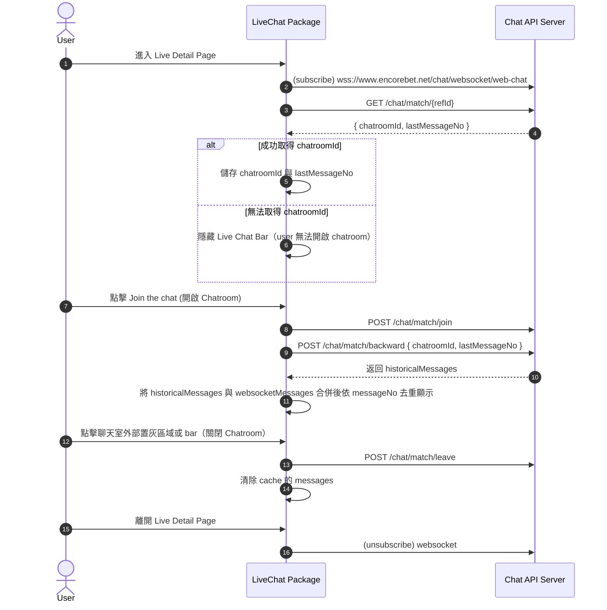

```mermaid
sequenceDiagram
    autonumber
    actor User
    participant LiveChat as LiveChat Package
    participant Chat as Chat API Server

    %% 進入頁面
    User->>LiveChat: 進入 Live Detail Page
    LiveChat->>Chat: (subscribe) wss://www.encorebet.net/chat/websocket/web-chat

    %% 取得 chatroomId 與 lastMessageNo
    LiveChat->>Chat: GET /chat/match/{refId}
    Chat-->>LiveChat: { chatroomId, lastMessageNo }

    alt 成功取得 chatroomId
        LiveChat->>LiveChat: 儲存 chatroomId 與 lastMessageNo
    else 無法取得 chatroomId
        LiveChat->>LiveChat: 隱藏 Live Chat Bar（user 無法開啟 chatroom）
    end

    %% 使用者開啟聊天視窗
    User->>LiveChat: 點擊 Join the chat (開啟 Chatroom)
    LiveChat->>Chat: POST /chat/match/join

    %% backward API：補舊訊息
    LiveChat->>Chat: POST /chat/match/backward { chatroomId, lastMessageNo }
    Chat-->>LiveChat: 返回 historicalMessages
    LiveChat->>LiveChat: 將 historicalMessages 與 websocketMessages 合併後依 messageNo 去重顯示

    %% 使用者關閉聊天視窗
    User->>LiveChat: 點擊聊天室外部置灰區域或 bar（關閉 Chatroom）
    LiveChat->>Chat: POST /chat/match/leave
    LiveChat->>LiveChat: 清除 cache 的 messages

    %% 使用者離開 Live Detail Page
    User->>LiveChat: 離開 Live Detail Page
    LiveChat->>Chat: (unsubscribe) websocket
```