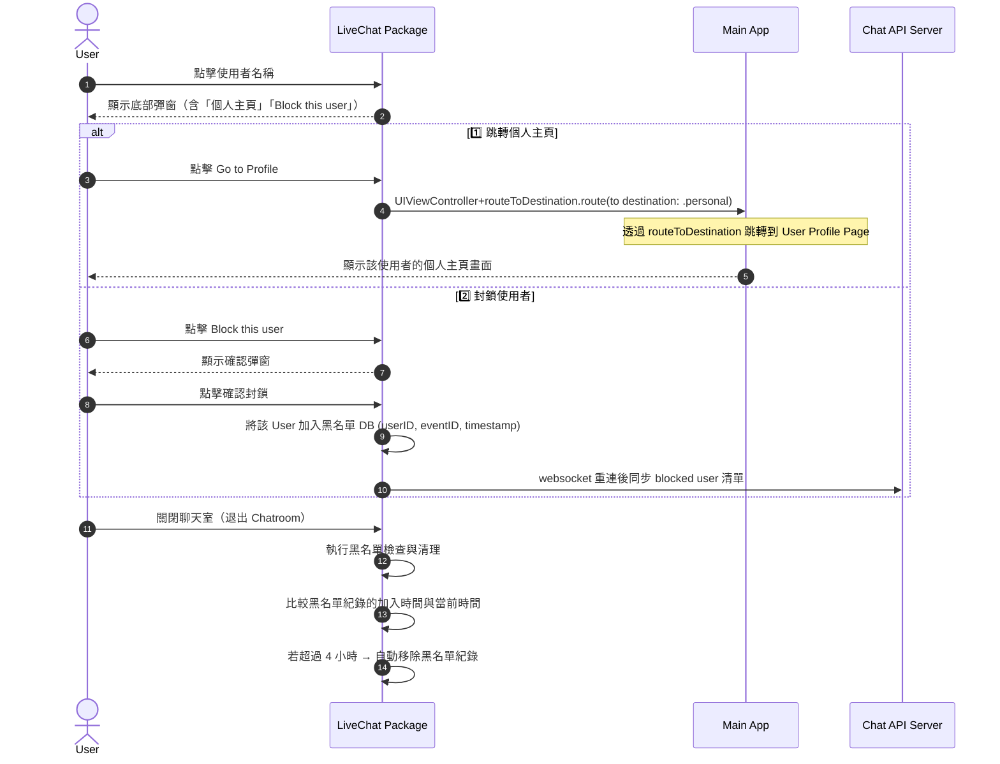

```mermaid
sequenceDiagram
    autonumber
    actor User
    participant LiveChat as LiveChat Package
    participant MainApp as Main App
    participant Chat as Chat API Server

    %% 使用者點擊使用者名稱
    User->>LiveChat: 點擊使用者名稱
    LiveChat-->>User: 顯示底部彈窗（含「個人主頁」「Block this user」）

    alt 1️⃣ 跳轉個人主頁
        User->>LiveChat: 點擊 Go to Profile
        LiveChat->>MainApp: UIViewController+routeToDestination.route(to destination: .personal)
        note over MainApp: 透過 routeToDestination 跳轉到 User Profile Page
        MainApp-->>User: 顯示該使用者的個人主頁畫面

    else 2️⃣ 封鎖使用者
        User->>LiveChat: 點擊 Block this user
        LiveChat-->>User: 顯示確認彈窗
        User->>LiveChat: 點擊確認封鎖

        %% 加入黑名單
        LiveChat->>LiveChat: 將該 User 加入黑名單 DB (userID, eventID, timestamp)

        %% websocket 行為
        LiveChat->>Chat: websocket 重連後同步 blocked user 清單
    end

    %% 使用者關閉 Chatroom
    User->>LiveChat: 關閉聊天室（退出 Chatroom）
    LiveChat->>LiveChat: 執行黑名單檢查與清理

    %% 四小時清除邏輯
    LiveChat->>LiveChat: 比較黑名單紀錄的加入時間與當前時間
    LiveChat->>LiveChat: 若超過 4 小時 → 自動移除黑名單紀錄
```
