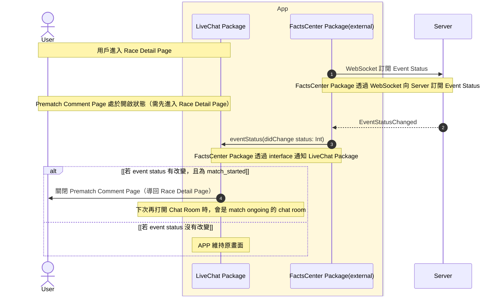

```mermaid
sequenceDiagram
    autonumber
    actor User
    box rgb(255, 248, 220) App
        participant LiveChat as LiveChat Package
        participant FactsCenter as FactsCenter Package(external)
    end
    participant Server as Server

    %% Event status 訂閱（在進入 Race Detail Page 時）
    note over User,LiveChat: 用戶進入 Race Detail Page
    FactsCenter->>Server: WebSocket 訂閱 Event Status
    note over FactsCenter,Server: FactsCenter Package 透過 WebSocket 向 Server 訂閱 Event Status

    %% Event status 變化時，自動關閉 Prematch Comment Page
    note over User,LiveChat: Prematch Comment Page 處於開啟狀態（需先進入 Race Detail Page）
    Server-->>FactsCenter: EventStatusChanged
    FactsCenter->>LiveChat: eventStatus(didChange status: Int)
    note over FactsCenter,LiveChat: FactsCenter Package 透過 interface 通知 LiveChat Package
    alt [若 event status 有改變，且為 match_started]
        LiveChat->>User: 關閉 Prematch Comment Page（導回 Race Detail Page）
        note over LiveChat: 下次再打開 Chat Room 時，會是 match ongoing 的 chat room
    else [若 event status 沒有改變]
        note over LiveChat: APP 維持原畫面
    end

```

