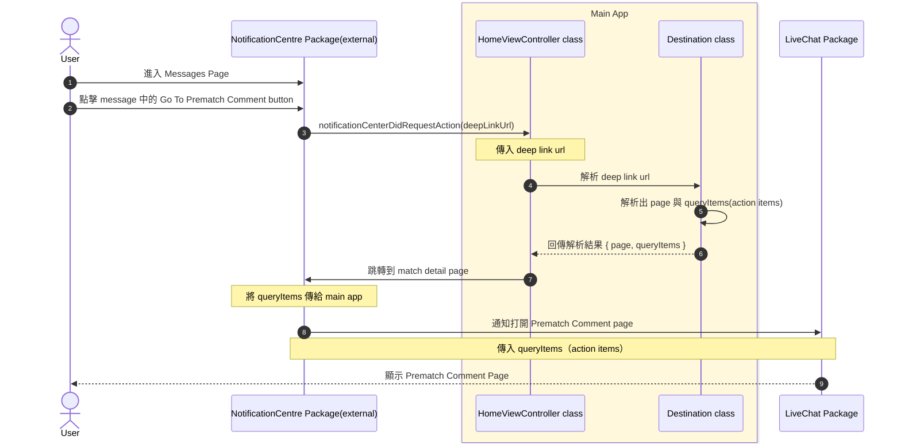

```mermaid
sequenceDiagram
    autonumber
    actor User
    participant NotificationCentre as NotificationCentre Package(external)
    box rgb(255, 248, 220) Main App
        participant HomeVC as HomeViewController class
        participant Destination as Destination class
    end
    participant LiveChat as LiveChat Package

    %% User 收到 In-Site message 並點擊
    User->>NotificationCentre: 進入 Messages Page
    User->>NotificationCentre: 點擊 message 中的 Go To Prematch Comment button

    %% NotificationCentre 調用 HomeViewController 處理 deep link
    NotificationCentre->>HomeVC: notificationCenterDidRequestAction(deepLinkUrl)
    note over HomeVC: 傳入 deep link url

    %% Destination class 解析 URL
    HomeVC->>Destination: 解析 deep link url
    Destination->>Destination: 解析出 page 與 queryItems(action items)
    Destination-->>HomeVC: 回傳解析結果 { page, queryItems }

    %% 跳轉到 Match Detail Page
    HomeVC->>NotificationCentre: 跳轉到 match detail page
    note over NotificationCentre: 將 queryItems 傳給 main app

    %% NotificationCentre 通知 LiveChat Package 打開 Prematch Comment Page
    NotificationCentre->>LiveChat: 通知打開 Prematch Comment page
    note over NotificationCentre,LiveChat: 傳入 queryItems（action items）
    LiveChat-->>User: 顯示 Prematch Comment Page
```

