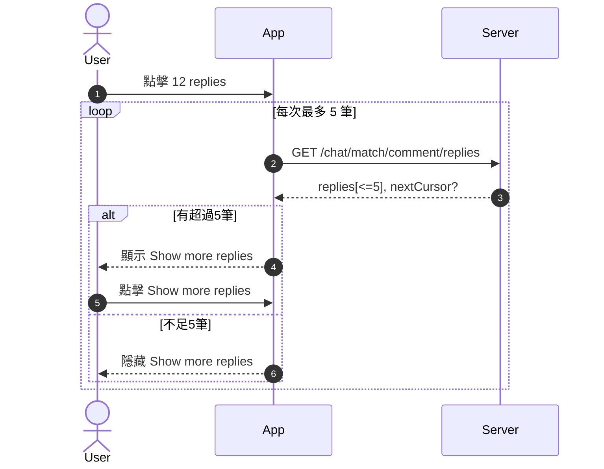

```mermaid
sequenceDiagram
  autonumber
  actor User
  participant App
  participant Server as Server

  User->>App: 點擊 12 replies
  loop 每次最多 5 筆
    App->>Server: GET /chat/match/comment/replies
    Server-->>App: replies[<=5], nextCursor?
    alt 有超過5筆
      App-->>User: 顯示 Show more replies
      User->>App: 點擊 Show more replies
    else 不足5筆
      App-->>User: 隱藏 Show more replies
    end
  end
```
