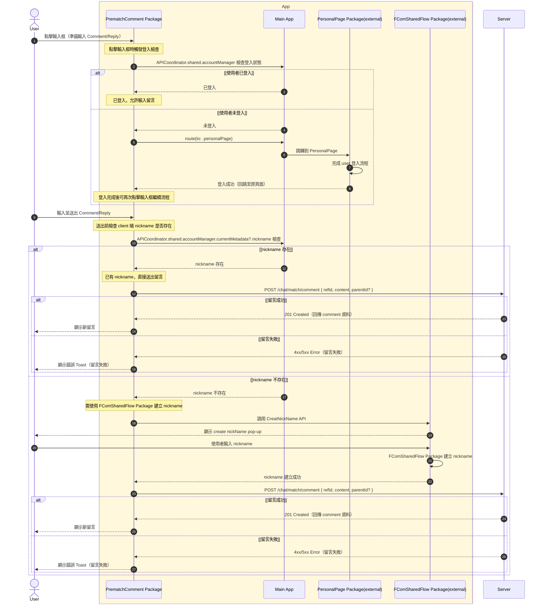

```mermaid
sequenceDiagram
    autonumber
    actor User
    box rgb(255, 248, 220) App
        participant PrematchComment as PrematchComment Package
        participant MainApp as Main App
        participant PersonalPage as PersonalPage Package(external)
        participant FComSharedFlow as FComSharedFlow Package(external)
    end
    participant Chat as Server

    %% 使用者點擊輸入框 → 先做登入檢查
    User->>PrematchComment: 點擊輸入框（準備輸入 Comment/Reply）
    note over PrematchComment: 點擊輸入框時觸發登入檢查
    PrematchComment->>MainApp: APICoordinator.shared.accountManager 檢查登入狀態

    alt [使用者已登入]
        MainApp-->>PrematchComment: 已登入
        note over PrematchComment: 已登入，允許輸入留言
    else [使用者未登入]
        MainApp-->>PrematchComment: 未登入
        PrematchComment->>MainApp: route(to: .personalPage)
        MainApp->>PersonalPage: 跳轉到 PersonalPage
        PersonalPage->>PersonalPage: 完成 user 登入流程
        PersonalPage-->>PrematchComment: 登入成功（回跳至原頁面）
        note over PrematchComment: 登入完成後可再次點擊輸入框繼續流程
    end

    %% 使用者輸入並送出 Comment/Reply
    User->>PrematchComment: 輸入並送出 Comment/Reply

    %% nickname 檢查（透過 Main App 的 accountManager）
    note over PrematchComment: 送出前檢查 client 端 nickname 是否存在
    PrematchComment->>MainApp: APICoordinator.shared.accountManager.currentMetadata?.nickname 檢查

    alt [nickname 存在]
        MainApp-->>PrematchComment: nickname 存在
        note over PrematchComment: 已有 nickname，直接送出留言
        PrematchComment->>Chat: POST /chat/match/comment { refId, content, parentId? }

        alt [留言成功]
            Chat-->>PrematchComment: 201 Created（回傳 comment 資料）
            PrematchComment-->>User: 顯示新留言
        else [留言失敗]
            Chat-->>PrematchComment: 4xx/5xx Error（留言失敗）
            PrematchComment-->>User: 顯示錯誤 Toast（留言失敗）
        end

    else [nickname 不存在]
        MainApp-->>PrematchComment: nickname 不存在
        note over PrematchComment: 需使用 FComSharedFlow Package 建立 nickname
        
        %% App 端 nickname 建立流程（透過 FComSharedFlow Package）
        PrematchComment->>FComSharedFlow: 調用 CreatNickName API
        FComSharedFlow-->>User: 顯示 create nickName pop-up
        User->>FComSharedFlow: 使用者輸入 nickname
        FComSharedFlow->>FComSharedFlow: FComSharedFlow Package 建立 nickname
        FComSharedFlow-->>PrematchComment: nickname 建立成功

        PrematchComment->>Chat: POST /chat/match/comment { refId, content, parentId? }

        alt [留言成功]
            Chat-->>PrematchComment: 201 Created（回傳 comment 資料）
            PrematchComment-->>User: 顯示新留言
        else [留言失敗]
            Chat-->>PrematchComment: 4xx/5xx Error（留言失敗）
            PrematchComment-->>User: 顯示錯誤 Toast（留言失敗）
        end
    end
```
