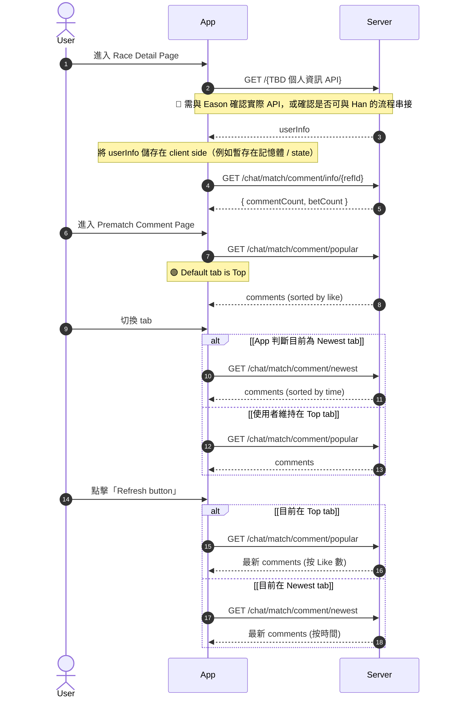

```mermaid
sequenceDiagram
    autonumber
    actor User
    participant App
    participant Server as Server

    %% 進入頁面 & 取得個人資訊
    User->>App: 進入 Race Detail Page
    App->>Server: GET /{TBD 個人資訊 API}
    note over App,Server: 🚨 需與 Eason 確認實際 API，或確認是否可與 Han 的流程串接
    Server-->>App: userInfo
    note over App: 將 userInfo 儲存在 client side（例如暫存在記憶體 / state）

    %% 取得賽事留言與投注資訊
    App->>Server: GET /chat/match/comment/info/{refId}
    Server-->>App: { commentCount, betCount }

    %% 預設 Top tab
    User->>App: 進入 Prematch Comment Page
    App->>Server: GET /chat/match/comment/popular
    note over App: 🟢 Default tab is Top
    Server-->>App: comments (sorted by like)

    %% 切換 tab
    User->>App: 切換 tab
    alt [App 判斷目前為 Newest tab]
        App->>Server: GET /chat/match/comment/newest
        Server-->>App: comments (sorted by time)
    else [使用者維持在 Top tab]
        App->>Server: GET /chat/match/comment/popular
        Server-->>App: comments
    end

    %% 使用者手動刷新
    User->>App: 點擊「Refresh button」
    alt [目前在 Top tab]
        App->>Server: GET /chat/match/comment/popular
        Server-->>App: 最新 comments (按 Like 數)
    else [目前在 Newest tab]
        App->>Server: GET /chat/match/comment/newest
        Server-->>App: 最新 comments (按時間)
    end

```