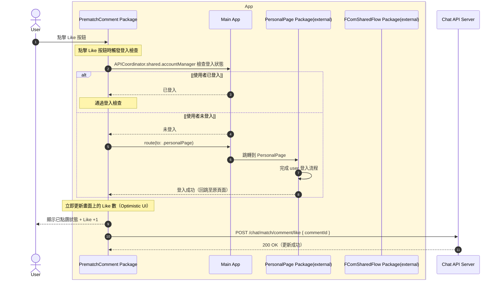

```mermaid
sequenceDiagram
    autonumber
    actor User
    box rgb(255, 248, 220) App
        participant PrematchComment as PrematchComment Package
        participant MainApp as Main App
        participant PersonalPage as PersonalPage Package(external)
        participant FComSharedFlow as FComSharedFlow Package(external)
    end
    participant Chat as Chat API Server
    
    User->>PrematchComment: 點擊 Like 按鈕
    note over PrematchComment: 點擊 Like 按鈕時觸發登入檢查
    PrematchComment->>MainApp: APICoordinator.shared.accountManager 檢查登入狀態
    
    alt [使用者已登入]
        MainApp-->>PrematchComment: 已登入
        note over PrematchComment: 通過登入檢查
    else [使用者未登入]
        MainApp-->>PrematchComment: 未登入
        PrematchComment->>MainApp: route(to: .personalPage)
        MainApp->>PersonalPage: 跳轉到 PersonalPage
        PersonalPage->>PersonalPage: 完成 user 登入流程
        PersonalPage-->>PrematchComment: 登入成功（回跳至原頁面）
    end
    
    note over PrematchComment: 立即更新畫面上的 Like 數（Optimistic UI）
    PrematchComment-->>User: 顯示已點讚狀態 + Like +1
    PrematchComment->>Chat: POST /chat/match/comment/like { commentId }
    Chat-->>PrematchComment: 200 OK（更新成功）
```
