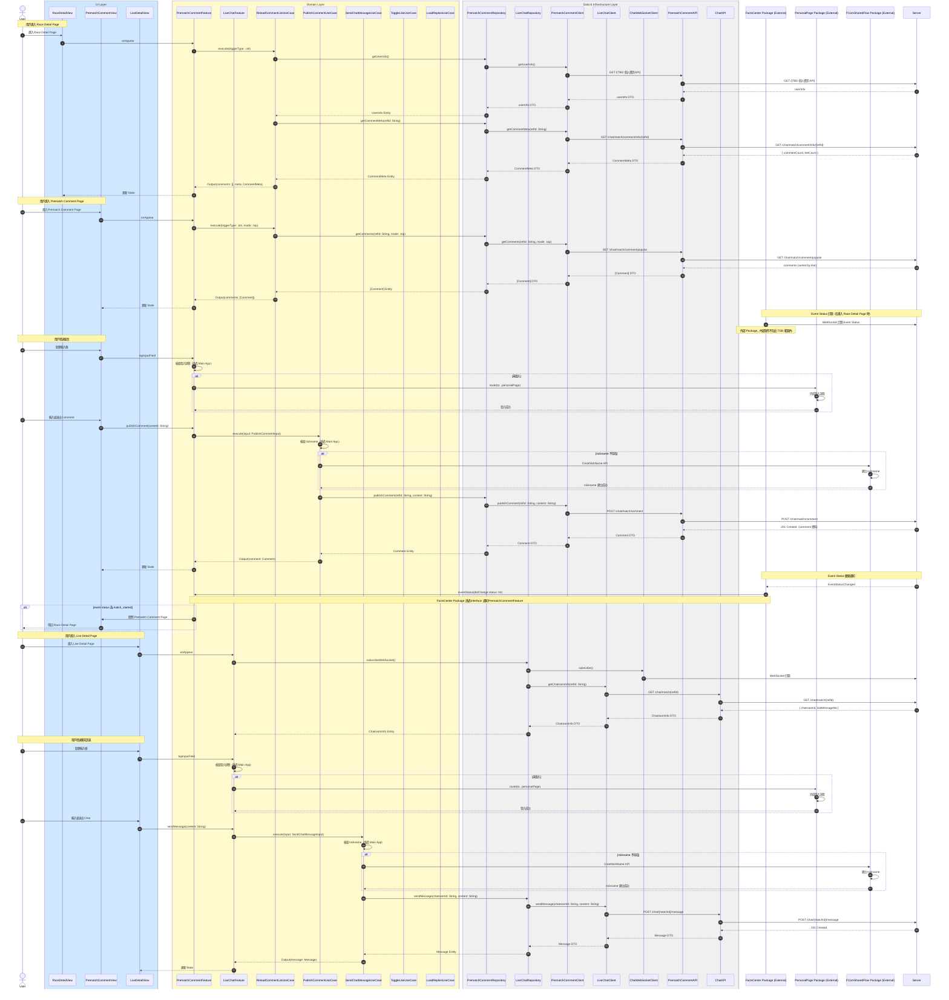

# 完整整合流程序列圖

## 說明

本序列圖展示 LiveChat 和 PrematchComment 兩個 Feature 的整合流程，包括：

1. 用戶進入頁面時的初始化流程
2. 登入與 Nickname 檢查流程
3. 留言/聊天訊息的發送流程
4. Event Status 訂閱與通知流程
5. 用戶互動流程（Like、封鎖、跳轉個人主頁）

## 整合序列圖



**Mermaid 語法（可複製）：**

```
sequenceDiagram
    autonumber
    actor User
    box rgb(207,232,255) UI Layer
        participant RaceDetailView
        participant PrematchCommentView
        participant LiveDetailView
    end
    box rgb(255,250,205) Domain Layer
        participant PrematchCommentFeature
        participant LiveChatFeature
        participant ReloadCommentListUseCase
        participant PublishCommentUseCase
        participant SendChatMessageUseCase
        participant ToggleLikeUseCase
        participant LoadRepliesUseCase
    end
    box rgb(240,240,240) Data & Infrastructure Layer
        participant PrematchCommentRepository
        participant LiveChatRepository
        participant PrematchCommentClient
        participant LiveChatClient
        participant ChatWebSocketClient
        participant PrematchCommentAPI
        participant ChatAPI
    end
    participant FactsCenterPackage as FactsCenter Package (External)
    participant PersonalPagePackage as PersonalPage Package (External)
    participant FComSharedFlowPackage as FComSharedFlow Package (External)
    participant Server

    Note over User,RaceDetailView: 用戶進入 Race Detail Page
    User->>RaceDetailView: 進入 Race Detail Page
    RaceDetailView->>PrematchCommentFeature: onAppear
    PrematchCommentFeature->>ReloadCommentListUseCase: execute(triggerType: .init)
    ReloadCommentListUseCase->>PrematchCommentRepository: getUserInfo()
    PrematchCommentRepository->>PrematchCommentClient: getUserInfo()
    PrematchCommentClient->>PrematchCommentAPI: GET /{TBD 個人資訊 API}
    PrematchCommentAPI->>Server: GET /{TBD 個人資訊 API}
    Server-->>PrematchCommentAPI: userInfo
    PrematchCommentAPI-->>PrematchCommentClient: userInfo DTO
    PrematchCommentClient-->>PrematchCommentRepository: userInfo DTO
    PrematchCommentRepository-->>ReloadCommentListUseCase: UserInfo Entity
    ReloadCommentListUseCase->>PrematchCommentRepository: getCommentMeta(refId: String)
    PrematchCommentRepository->>PrematchCommentClient: getCommentMeta(refId: String)
    PrematchCommentClient->>PrematchCommentAPI: GET /chat/match/comment/info/{refId}
    PrematchCommentAPI->>Server: GET /chat/match/comment/info/{refId}
    Server-->>PrematchCommentAPI: { commentCount, betCount }
    PrematchCommentAPI-->>PrematchCommentClient: CommentMeta DTO
    PrematchCommentClient-->>PrematchCommentRepository: CommentMeta DTO
    PrematchCommentRepository-->>ReloadCommentListUseCase: CommentMeta Entity
    ReloadCommentListUseCase-->>PrematchCommentFeature: Output(comments: [], meta: CommentMeta)
    PrematchCommentFeature-->>RaceDetailView: 更新 State

    Note over User,PrematchCommentView: 用戶進入 Prematch Comment Page
    User->>PrematchCommentView: 進入 Prematch Comment Page
    PrematchCommentView->>PrematchCommentFeature: onAppear
    PrematchCommentFeature->>ReloadCommentListUseCase: execute(triggerType: .init, mode: .top)
    ReloadCommentListUseCase->>PrematchCommentRepository: getComments(refId: String, mode: .top)
    PrematchCommentRepository->>PrematchCommentClient: getComments(refId: String, mode: .top)
    PrematchCommentClient->>PrematchCommentAPI: GET /chat/match/comment/popular
    PrematchCommentAPI->>Server: GET /chat/match/comment/popular
    Server-->>PrematchCommentAPI: comments (sorted by like)
    PrematchCommentAPI-->>PrematchCommentClient: [Comment] DTO
    PrematchCommentClient-->>PrematchCommentRepository: [Comment] DTO
    PrematchCommentRepository-->>ReloadCommentListUseCase: [Comment] Entity
    ReloadCommentListUseCase-->>PrematchCommentFeature: Output(comments: [Comment])
    PrematchCommentFeature-->>PrematchCommentView: 更新 State

    Note over FactsCenterPackage,Server: Event Status 訂閱（在進入 Race Detail Page 時）
    FactsCenterPackage->>Server: WebSocket 訂閱 Event Status
    Note over FactsCenterPackage: 外部 Package，內部實作不在此 TDD 範圍內

    Note over User,PrematchCommentView: 用戶發送留言
    User->>PrematchCommentView: 點擊輸入框
    PrematchCommentView->>PrematchCommentFeature: tapInputField
    PrematchCommentFeature->>PrematchCommentFeature: 檢查登入狀態（透過 Main App）
    alt 未登入
        PrematchCommentFeature->>PersonalPagePackage: route(to: .personalPage)
        PersonalPagePackage->>PersonalPagePackage: 完成登入流程
        PersonalPagePackage-->>PrematchCommentFeature: 登入成功
    end
    User->>PrematchCommentView: 輸入並送出 Comment
    PrematchCommentView->>PrematchCommentFeature: publishComment(content: String)
    PrematchCommentFeature->>PublishCommentUseCase: execute(input: PublishCommentInput)
    PublishCommentUseCase->>PublishCommentUseCase: 檢查 nickname（透過 Main App）
    alt nickname 不存在
        PublishCommentUseCase->>FComSharedFlowPackage: CreatNickName API
        FComSharedFlowPackage->>FComSharedFlowPackage: 建立 nickname
        FComSharedFlowPackage-->>PublishCommentUseCase: nickname 建立成功
    end
    PublishCommentUseCase->>PrematchCommentRepository: publishComment(refId: String, content: String)
    PrematchCommentRepository->>PrematchCommentClient: publishComment(refId: String, content: String)
    PrematchCommentClient->>PrematchCommentAPI: POST /chat/match/comment
    PrematchCommentAPI->>Server: POST /chat/match/comment
    Server-->>PrematchCommentAPI: 201 Created（comment 資料）
    PrematchCommentAPI-->>PrematchCommentClient: Comment DTO
    PrematchCommentClient-->>PrematchCommentRepository: Comment DTO
    PrematchCommentRepository-->>PublishCommentUseCase: Comment Entity
    PublishCommentUseCase-->>PrematchCommentFeature: Output(comment: Comment)
    PrematchCommentFeature-->>PrematchCommentView: 更新 State

    Note over Server,FactsCenterPackage: Event Status 變更通知
    Server-->>FactsCenterPackage: EventStatusChanged
    FactsCenterPackage->>PrematchCommentFeature: eventStatus(didChange status: Int)
    Note over FactsCenterPackage,PrematchCommentFeature: FactsCenter Package 透過 interface 通知 PrematchCommentFeature
    alt event status 為 match_started
        PrematchCommentFeature->>PrematchCommentView: 關閉 Prematch Comment Page
        PrematchCommentView-->>User: 導回 Race Detail Page
    end

    Note over User,LiveDetailView: 用戶進入 Live Detail Page
    User->>LiveDetailView: 進入 Live Detail Page
    LiveDetailView->>LiveChatFeature: onAppear
    LiveChatFeature->>LiveChatRepository: subscribeWebSocket()
    LiveChatRepository->>ChatWebSocketClient: subscribe()
    ChatWebSocketClient->>Server: WebSocket 訂閱
    LiveChatRepository->>LiveChatClient: getChatroomInfo(refId: String)
    LiveChatClient->>ChatAPI: GET /chat/match/{refId}
    ChatAPI->>Server: GET /chat/match/{refId}
    Server-->>ChatAPI: { chatroomId, lastMessageNo }
    ChatAPI-->>LiveChatClient: ChatroomInfo DTO
    LiveChatClient-->>LiveChatRepository: ChatroomInfo DTO
    LiveChatRepository-->>LiveChatFeature: ChatroomInfo Entity

    Note over User,LiveDetailView: 用戶發送聊天訊息
    User->>LiveDetailView: 點擊輸入框
    LiveDetailView->>LiveChatFeature: tapInputField
    LiveChatFeature->>LiveChatFeature: 檢查登入狀態（透過 Main App）
    alt 未登入
        LiveChatFeature->>PersonalPagePackage: route(to: .personalPage)
        PersonalPagePackage->>PersonalPagePackage: 完成登入流程
        PersonalPagePackage-->>LiveChatFeature: 登入成功
    end
    User->>LiveDetailView: 輸入並送出 Chat
    LiveDetailView->>LiveChatFeature: sendMessage(content: String)
    LiveChatFeature->>SendChatMessageUseCase: execute(input: SendChatMessageInput)
    SendChatMessageUseCase->>SendChatMessageUseCase: 檢查 nickname（透過 Main App）
    alt nickname 不存在
        SendChatMessageUseCase->>FComSharedFlowPackage: CreatNickName API
        FComSharedFlowPackage->>FComSharedFlowPackage: 建立 nickname
        FComSharedFlowPackage-->>SendChatMessageUseCase: nickname 建立成功
    end
    SendChatMessageUseCase->>LiveChatRepository: sendMessage(chatroomId: String, content: String)
    LiveChatRepository->>LiveChatClient: sendMessage(chatroomId: String, content: String)
    LiveChatClient->>ChatAPI: POST /chat/{matchId}/message
    ChatAPI->>Server: POST /chat/{matchId}/message
    Server-->>ChatAPI: 201 Created
    ChatAPI-->>LiveChatClient: Message DTO
    LiveChatClient-->>LiveChatRepository: Message DTO
    LiveChatRepository-->>SendChatMessageUseCase: Message Entity
    SendChatMessageUseCase-->>LiveChatFeature: Output(message: Message)
    LiveChatFeature-->>LiveDetailView: 更新 State
```

## 流程說明

### 1. 進入頁面初始化流程

| 流程步驟 | 說明 |
|---------|------|
| **1. 進入 Race Detail Page** | 1. 用戶進入 Race Detail Page<br>2. 自動取得用戶個人資訊<br>3. 自動取得賽事留言統計資訊 |
| **2. 進入 Prematch Comment Page** | 1. 用戶進入 Prematch Comment Page<br>2. 預設顯示 Top 標籤<br>3. 載入熱門留言列表 |
| **3. Event Status 訂閱** | 1. FactsCenter Package（外部）自動訂閱 Event Status<br>2. 透過 WebSocket 接收事件狀態變更通知 |

### 2. 發送留言流程

| 流程步驟 | 說明 |
|---------|------|
| **1. 登入檢查** | 1. 點擊輸入框時觸發登入檢查<br>2. 未登入則跳轉到 PersonalPage 完成登入<br>3. 登入成功後回跳至原頁面 |
| **2. Nickname 檢查** | 1. 送出前檢查 client 端 nickname 是否存在<br>2. 若不存在則調用 FComSharedFlow Package 建立 nickname |
| **3. 發送留言** | 1. 向伺服器發送 POST /chat/match/comment 請求<br>2. 收到回應後更新 UI 顯示新留言 |

### 3. Event Status 通知流程

| 流程步驟 | 說明 |
|---------|------|
| **1. 接收通知** | 1. Server 透過 WebSocket 推送 EventStatusChanged 事件<br>2. FactsCenter Package 接收事件並透過 interface 通知 PrematchCommentFeature |
| **2. 處理通知** | 1. PrematchCommentFeature 判斷 event status<br>2. 若為 match_started 則自動關閉 Prematch Comment Page<br>3. 導回 Race Detail Page |

### 4. 即時聊天流程

| 流程步驟 | 說明 |
|---------|------|
| **1. 進入 Live Detail Page** | 1. 用戶進入 Live Detail Page<br>2. 自動建立 WebSocket 連線<br>3. 取得聊天室資訊（chatroomId, lastMessageNo） |
| **2. 發送聊天訊息** | 1. 登入檢查（同留言流程）<br>2. Nickname 檢查（同留言流程）<br>3. 發送訊息並更新 UI |

## 跨 Feature 互動

### Shared Modules 使用

| Shared Module | 使用場景 | 說明 |
|--------------|---------|------|
| **PersonalPage Package（External）** | 登入流程 | 1. PrematchCommentFeature 和 LiveChatFeature 都會使用<br>2. 未登入時跳轉到 PersonalPage 完成登入 |
| **FComSharedFlow Package（External）** | Nickname 建立 | 1. PrematchCommentFeature 和 LiveChatFeature 都會使用<br>2. 當用戶沒有 nickname 時調用 CreatNickName API |
| **FactsCenter Package（External）** | Event Status 訂閱 | 1. 僅 PrematchCommentFeature 使用<br>2. 透過 interface 接收 Event Status 變更通知 |

### 資料流向

1. **User Info**：透過 PrematchCommentRepository → PrematchCommentClient → PrematchCommentAPI 取得
2. **Comment Data**：透過 PrematchCommentRepository → PrematchCommentClient → PrematchCommentAPI 取得和發送
3. **Chat Message**：透過 LiveChatRepository → LiveChatClient → ChatAPI 發送，透過 WebSocket 接收
4. **Event Status**：透過 FactsCenter Package（外部）訂閱和接收

