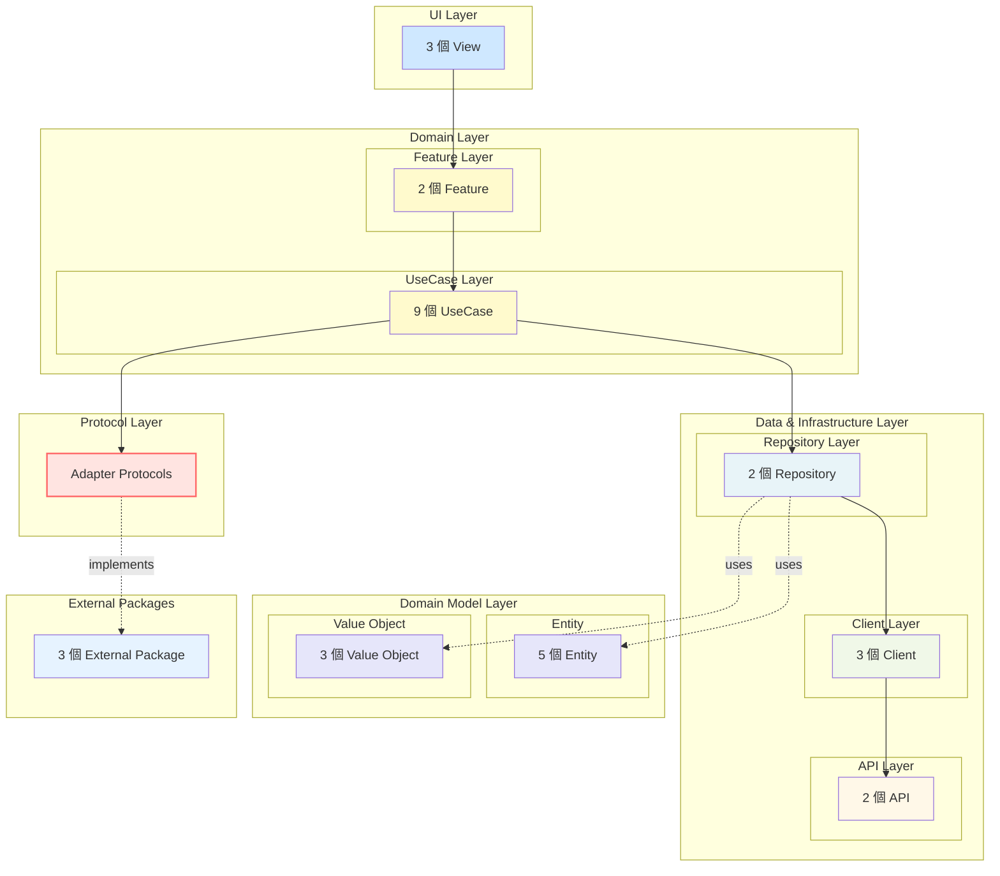

# Clean Architecture 架構圖

## 高階架構圖（概覽）



**Mermaid 語法（可複製）：**

```
flowchart TD
    subgraph UILayer["UI Layer"]
        UILayerPlaceholder["3 個 View"]
    end

    subgraph DomainLayer["Domain Layer"]
        subgraph FeatureLayer["Feature Layer"]
            FeatureLayerPlaceholder["2 個 Feature"]
        end
        subgraph UseCaseLayer["UseCase Layer"]
            UseCaseLayerPlaceholder["9 個 UseCase"]
        end
    end

    subgraph DataInfraLayer["Data & Infrastructure Layer"]
        subgraph RepositoryLayer["Repository Layer"]
            RepositoryLayerPlaceholder["2 個 Repository"]
        end
        subgraph ClientLayer["Client Layer"]
            ClientLayerPlaceholder["3 個 Client"]
        end
        subgraph APILayer["API Layer"]
            APILayerPlaceholder["2 個 API"]
        end
    end

    subgraph DomainModelLayer["Domain Model Layer"]
        subgraph EntityLayer["Entity"]
            EntityLayerPlaceholder["5 個 Entity"]
        end
        subgraph ValueObjectLayer["Value Object"]
            ValueObjectLayerPlaceholder["3 個 Value Object"]
        end
    end

    subgraph ProtocolLayer["Protocol Layer"]
        ProtocolLayerPlaceholder["Adapter Protocols"]
    end

    subgraph ExternalPackages["External Packages"]
        ExternalPackagesPlaceholder["3 個 External Package"]
    end

    %% 依賴關係
    UILayerPlaceholder --> FeatureLayerPlaceholder
    FeatureLayerPlaceholder --> UseCaseLayerPlaceholder
    UseCaseLayerPlaceholder --> RepositoryLayerPlaceholder
    UseCaseLayerPlaceholder --> ProtocolLayerPlaceholder
    RepositoryLayerPlaceholder --> ClientLayerPlaceholder
    ClientLayerPlaceholder --> APILayerPlaceholder
    RepositoryLayerPlaceholder -.->|uses| EntityLayerPlaceholder
    RepositoryLayerPlaceholder -.->|uses| ValueObjectLayerPlaceholder
    ProtocolLayerPlaceholder -.->|implements| ExternalPackagesPlaceholder

    %% Styling
    classDef uiLayer fill:#CFE8FF
    classDef domainLayer fill:#FFFACD
    classDef protocolLayer fill:#FFE4E1,stroke:#FF6B6B,stroke-width:2px
    classDef repositoryLayer fill:#E8F4F8
    classDef clientLayer fill:#F0F8E8
    classDef apiLayer fill:#FFF8E8
    classDef domainModel fill:#E6E6FA
    classDef externalPackage fill:#E6F3FF

    class UILayerPlaceholder uiLayer
    class FeatureLayerPlaceholder,UseCaseLayerPlaceholder domainLayer
    class ProtocolLayerPlaceholder protocolLayer
    class RepositoryLayerPlaceholder repositoryLayer
    class ClientLayerPlaceholder clientLayer
    class APILayerPlaceholder apiLayer
    class EntityLayerPlaceholder,ValueObjectLayerPlaceholder domainModel
    class ExternalPackagesPlaceholder externalPackage
```

## 高階架構說明

| Layer | 子層級 | 模組數量 | 職責 |
|-------|--------|---------|------|
| **UI Layer** | - | **3 個 View** | 1. 接收使用者互動<br>2. 顯示 UI<br>3. 觸發 Feature Action |
| **Domain Layer** | Feature Layer | **2 個 Feature** | 1. UI orchestration<br>2. Action 轉換<br>3. State 管理 |
| **Domain Layer** | UseCase Layer | **9 個 UseCase** | 1. 執行商業邏輯<br>2. 整合 Repository<br>3. 處理跨 Feature 的共用邏輯<br>4. 處理路由跳轉邏輯 |
| **Data & Infrastructure Layer** | Repository Layer | **2 個 Repository** | 1. Domain 資料來源的抽象介面<br>2. 呼叫 Client 取得資料<br>3. DTO → Domain Model 轉換 |
| **Data & Infrastructure Layer** | Client Layer | **3 個 Client** | 1. HTTP 通訊<br>2. WebSocket 通訊<br>3. Request / Response 編解碼 |
| **Data & Infrastructure Layer** | API Layer | **2 個 API** | 1. 定義後端 endpoint<br>2. URL / HTTP method / payload 形狀 |
| **Domain Model Layer** | Entity | **5 個 Entity** | 1. 有唯一識別碼的業務物件<br>2. 純資料結構，無商業邏輯 |
| **Domain Model Layer** | Value Object | **3 個 Value Object** | 1. 沒有唯一識別碼，透過值比較<br>2. 完全不可變 |
| **Protocol Layer** | - | **Adapter Protocols** | 1. 定義外部 Package 的依賴介面<br>2. 由 UseCase 依賴<br>3. 實現放在 Main App 中 |
| **External Packages** | - | **3 個 External Package** | 1. 外部 Swift Package<br>2. 透過 Adapter Protocol 整合 |

## 依賴方向（高階）

```
UI Layer (3 Views)
    ↓
Domain Layer - Feature Layer (2 Features)
    ↓
Domain Layer - UseCase Layer (7 UseCases)
    ↓
Data & Infrastructure Layer - Repository Layer (2 Repositories)
    ↓
Data & Infrastructure Layer - Client Layer (3 Clients)
    ↓
Data & Infrastructure Layer - API Layer (2 APIs)
```

**Domain Model Layer** 被 Repository Layer 使用（不作為 participant）

**Protocol Layer** 由 UseCase Layer 依賴，Adapter Implementation 在 Main App 中實現並使用 External Packages

---

## 詳細架構圖

**相關文件**：[HLD UML](https://yjpkzjwmw8en.jp.larksuite.com/wiki/ZqS1wNGgMiOB8AknhrmjCYdtpIh?from=from_copylink)

```mermaid
flowchart TD
    subgraph UILayer["UI Layer"]
        RaceDetailView["RaceDetailView"]
        PrematchCommentView["PrematchCommentView"]
        LiveDetailView["LiveDetailView"]
    end

    subgraph DomainLayer["Domain Layer"]
        subgraph FeatureLayer["Feature Layer"]
            PrematchCommentFeature["PrematchCommentFeature"]
            LiveChatFeature["LiveChatFeature"]
        end
        subgraph UseCaseLayer["UseCase Layer"]
            ReloadCommentListUseCase["ReloadCommentListUseCase"]
            PublishCommentUseCase["PublishCommentUseCase"]
            ToggleLikeUseCase["ToggleLikeUseCase"]
            LoadRepliesUseCase["LoadRepliesUseCase"]
            NavigateToProfileUseCase["NavigateToProfileUseCase"]
            SendChatMessageUseCase["SendChatMessageUseCase"]
            JoinChatroomUseCase["JoinChatroomUseCase"]
            LeaveChatroomUseCase["LeaveChatroomUseCase"]
            BlockUserUseCase["BlockUserUseCase"]
        end
    end

    subgraph DataInfraLayer["Data & Infrastructure Layer"]
        subgraph RepositoryLayer["Repository Layer"]
            PrematchCommentRepository["PrematchCommentRepository"]
            LiveChatRepository["LiveChatRepository"]
        end
        subgraph ClientLayer["Client Layer"]
            PrematchCommentClient["PrematchCommentClient (HTTP)"]
            LiveChatClient["LiveChatClient (HTTP)"]
            ChatWebSocketClient["ChatWebSocketClient (WebSocket)"]
        end
        subgraph APILayer["API Layer"]
            PrematchCommentAPI["PrematchCommentAPI"]
            ChatAPI["ChatAPI"]
        end
    end

    subgraph DomainModelLayer["Domain Model Layer"]
        Comment["Comment (Entity)"]
        CommentMeta["CommentMeta (Entity)"]
        UserInfo["UserInfo (Entity)"]
        Message["Message (Entity)"]
        ChatroomInfo["ChatroomInfo (Entity)"]
        SortMode["SortMode (Value Object)"]
        Cursor["Cursor (Value Object)"]
        PagingInfo["PagingInfo (Value Object)"]
    end

    subgraph ProtocolLayer["Protocol Layer"]
        FComSharedFlowAdapterProtocol["&lt;FComSharedFlowAdapter&gt;"]
        PersonalPageAdapterProtocol["&lt;PersonalPageAdapter&gt;"]
        EventStatusNotifiableProtocol["&lt;EventStatusNotifiable&gt;"]
    end

    subgraph ExternalPackages["External Packages"]
        FactsCenterPackage["FactsCenter Package (External)"]
        PersonalPagePackage["PersonalPage Package (External)"]
        FComSharedFlowPackage["FComSharedFlow Package (External)"]
    end

    %% UI to Feature
    RaceDetailView --> PrematchCommentFeature
    PrematchCommentView --> PrematchCommentFeature
    LiveDetailView --> LiveChatFeature

    %% Feature to UseCase
    PrematchCommentFeature --> ReloadCommentListUseCase
    PrematchCommentFeature --> PublishCommentUseCase
    PrematchCommentFeature --> ToggleLikeUseCase
    PrematchCommentFeature --> LoadRepliesUseCase
    PrematchCommentFeature --> NavigateToProfileUseCase
    LiveChatFeature --> SendChatMessageUseCase
    LiveChatFeature --> JoinChatroomUseCase
    LiveChatFeature --> LeaveChatroomUseCase
    LiveChatFeature --> NavigateToProfileUseCase
    LiveChatFeature --> BlockUserUseCase

    %% UseCase to Repository
    ReloadCommentListUseCase --> PrematchCommentRepository
    PublishCommentUseCase --> PrematchCommentRepository
    ToggleLikeUseCase --> PrematchCommentRepository
    LoadRepliesUseCase --> PrematchCommentRepository
    SendChatMessageUseCase --> LiveChatRepository
    JoinChatroomUseCase --> LiveChatRepository
    LeaveChatroomUseCase --> LiveChatRepository

    %% Repository to Client
    PrematchCommentRepository --> PrematchCommentClient
    LiveChatRepository --> LiveChatClient
    LiveChatRepository --> ChatWebSocketClient

    %% Client to API
    PrematchCommentClient --> PrematchCommentAPI
    LiveChatClient --> ChatAPI
    ChatWebSocketClient --> ChatAPI

    %% Repository uses Domain Model
    PrematchCommentRepository -.->|uses| Comment
    PrematchCommentRepository -.->|uses| CommentMeta
    PrematchCommentRepository -.->|uses| UserInfo
    PrematchCommentRepository -.->|uses| SortMode
    PrematchCommentRepository -.->|uses| Cursor
    PrematchCommentRepository -.->|uses| PagingInfo
    LiveChatRepository -.->|uses| Message
    LiveChatRepository -.->|uses| ChatroomInfo

    %% UseCase to Protocol
    PublishCommentUseCase --> FComSharedFlowAdapterProtocol
    PublishCommentUseCase --> PersonalPageAdapterProtocol
    SendChatMessageUseCase --> FComSharedFlowAdapterProtocol
    SendChatMessageUseCase --> PersonalPageAdapterProtocol
    ToggleLikeUseCase --> PersonalPageAdapterProtocol
    NavigateToProfileUseCase --> PersonalPageAdapterProtocol
    PrematchCommentFeature --> EventStatusNotifiableProtocol

    %% Protocol to External Package (Adapter Implementation in Main App)
    FComSharedFlowAdapterProtocol -.->|implements| FComSharedFlowPackage
    PersonalPageAdapterProtocol -.->|implements| PersonalPagePackage
    EventStatusNotifiableProtocol -.->|implements| FactsCenterPackage

    %% Styling
    classDef uiLayer fill:#CFE8FF
    classDef domainLayer fill:#FFFACD
    classDef protocolLayer fill:#FFE4E1,stroke:#FF6B6B,stroke-width:2px
    classDef repositoryLayer fill:#E8F4F8
    classDef clientLayer fill:#F0F8E8
    classDef apiLayer fill:#FFF8E8
    classDef domainModel fill:#E6E6FA
    classDef externalPackage fill:#E6F3FF

    class RaceDetailView,PrematchCommentView,LiveDetailView uiLayer
    class PrematchCommentFeature,LiveChatFeature,ReloadCommentListUseCase,PublishCommentUseCase,ToggleLikeUseCase,LoadRepliesUseCase,NavigateToProfileUseCase,SendChatMessageUseCase,JoinChatroomUseCase,LeaveChatroomUseCase,BlockUserUseCase domainLayer
    class FComSharedFlowAdapterProtocol,PersonalPageAdapterProtocol,EventStatusNotifiableProtocol protocolLayer
    class PrematchCommentRepository,LiveChatRepository repositoryLayer
    class PrematchCommentClient,LiveChatClient,ChatWebSocketClient clientLayer
    class PrematchCommentAPI,ChatAPI apiLayer
    class Comment,CommentMeta,UserInfo,Message,ChatroomInfo,SortMode,Cursor,PagingInfo domainModel
    class FactsCenterPackage,PersonalPagePackage,FComSharedFlowPackage externalPackage
```



**Mermaid 語法（可複製）：**

```
flowchart TD
    subgraph UILayer["UI Layer"]
        RaceDetailView["RaceDetailView"]
        PrematchCommentView["PrematchCommentView"]
        LiveDetailView["LiveDetailView"]
    end

    subgraph DomainLayer["Domain Layer"]
        subgraph FeatureLayer["Feature Layer"]
            PrematchCommentFeature["PrematchCommentFeature"]
            LiveChatFeature["LiveChatFeature"]
        end
        subgraph UseCaseLayer["UseCase Layer"]
            ReloadCommentListUseCase["ReloadCommentListUseCase"]
            PublishCommentUseCase["PublishCommentUseCase"]
            ToggleLikeUseCase["ToggleLikeUseCase"]
            LoadRepliesUseCase["LoadRepliesUseCase"]
            NavigateToProfileUseCase["NavigateToProfileUseCase"]
            SendChatMessageUseCase["SendChatMessageUseCase"]
            JoinChatroomUseCase["JoinChatroomUseCase"]
            LeaveChatroomUseCase["LeaveChatroomUseCase"]
            BlockUserUseCase["BlockUserUseCase"]
        end
    end

    subgraph DataInfraLayer["Data & Infrastructure Layer"]
        subgraph RepositoryLayer["Repository Layer"]
            PrematchCommentRepository["PrematchCommentRepository"]
            LiveChatRepository["LiveChatRepository"]
        end
        subgraph ClientLayer["Client Layer"]
            PrematchCommentClient["PrematchCommentClient (HTTP)"]
            LiveChatClient["LiveChatClient (HTTP)"]
            ChatWebSocketClient["ChatWebSocketClient (WebSocket)"]
        end
        subgraph APILayer["API Layer"]
            PrematchCommentAPI["PrematchCommentAPI"]
            ChatAPI["ChatAPI"]
        end
    end

    subgraph DomainModelLayer["Domain Model Layer"]
        Comment["Comment (Entity)"]
        CommentMeta["CommentMeta (Entity)"]
        UserInfo["UserInfo (Entity)"]
        Message["Message (Entity)"]
        ChatroomInfo["ChatroomInfo (Entity)"]
        SortMode["SortMode (Value Object)"]
        Cursor["Cursor (Value Object)"]
        PagingInfo["PagingInfo (Value Object)"]
    end

    subgraph ProtocolLayer["Protocol Layer"]
        FComSharedFlowAdapterProtocol["&lt;FComSharedFlowAdapter&gt;"]
        PersonalPageAdapterProtocol["&lt;PersonalPageAdapter&gt;"]
        EventStatusNotifiableProtocol["&lt;EventStatusNotifiable&gt;"]
    end

    subgraph ExternalPackages["External Packages"]
        FactsCenterPackage["FactsCenter Package (External)"]
        PersonalPagePackage["PersonalPage Package (External)"]
        FComSharedFlowPackage["FComSharedFlow Package (External)"]
    end

    %% UI to Feature
    RaceDetailView --> PrematchCommentFeature
    PrematchCommentView --> PrematchCommentFeature
    LiveDetailView --> LiveChatFeature

    %% Feature to UseCase
    PrematchCommentFeature --> ReloadCommentListUseCase
    PrematchCommentFeature --> PublishCommentUseCase
    PrematchCommentFeature --> ToggleLikeUseCase
    PrematchCommentFeature --> LoadRepliesUseCase
    PrematchCommentFeature --> NavigateToProfileUseCase
    LiveChatFeature --> SendChatMessageUseCase
    LiveChatFeature --> JoinChatroomUseCase
    LiveChatFeature --> LeaveChatroomUseCase
    LiveChatFeature --> NavigateToProfileUseCase
    LiveChatFeature --> BlockUserUseCase

    %% UseCase to Repository
    ReloadCommentListUseCase --> PrematchCommentRepository
    PublishCommentUseCase --> PrematchCommentRepository
    ToggleLikeUseCase --> PrematchCommentRepository
    LoadRepliesUseCase --> PrematchCommentRepository
    SendChatMessageUseCase --> LiveChatRepository
    JoinChatroomUseCase --> LiveChatRepository
    LeaveChatroomUseCase --> LiveChatRepository

    %% Repository to Client
    PrematchCommentRepository --> PrematchCommentClient
    LiveChatRepository --> LiveChatClient
    LiveChatRepository --> ChatWebSocketClient

    %% Client to API
    PrematchCommentClient --> PrematchCommentAPI
    LiveChatClient --> ChatAPI
    ChatWebSocketClient --> ChatAPI

    %% Repository uses Domain Model
    PrematchCommentRepository -.->|uses| Comment
    PrematchCommentRepository -.->|uses| CommentMeta
    PrematchCommentRepository -.->|uses| UserInfo
    PrematchCommentRepository -.->|uses| SortMode
    PrematchCommentRepository -.->|uses| Cursor
    PrematchCommentRepository -.->|uses| PagingInfo
    LiveChatRepository -.->|uses| Message
    LiveChatRepository -.->|uses| ChatroomInfo

    %% UseCase to Protocol
    PublishCommentUseCase --> FComSharedFlowAdapterProtocol
    PublishCommentUseCase --> PersonalPageAdapterProtocol
    SendChatMessageUseCase --> FComSharedFlowAdapterProtocol
    SendChatMessageUseCase --> PersonalPageAdapterProtocol
    ToggleLikeUseCase --> PersonalPageAdapterProtocol
    NavigateToProfileUseCase --> PersonalPageAdapterProtocol
    PrematchCommentFeature --> EventStatusNotifiableProtocol

    %% Protocol to External Package (Adapter Implementation in Main App)
    FComSharedFlowAdapterProtocol -.->|implements| FComSharedFlowPackage
    PersonalPageAdapterProtocol -.->|implements| PersonalPagePackage
    EventStatusNotifiableProtocol -.->|implements| FactsCenterPackage

    %% Styling
    classDef uiLayer fill:#CFE8FF
    classDef domainLayer fill:#FFFACD
    classDef protocolLayer fill:#FFE4E1,stroke:#FF6B6B,stroke-width:2px
    classDef repositoryLayer fill:#E8F4F8
    classDef clientLayer fill:#F0F8E8
    classDef apiLayer fill:#FFF8E8
    classDef domainModel fill:#E6E6FA
    classDef externalPackage fill:#E6F3FF

    class RaceDetailView,PrematchCommentView,LiveDetailView uiLayer
    class PrematchCommentFeature,LiveChatFeature,ReloadCommentListUseCase,PublishCommentUseCase,ToggleLikeUseCase,LoadRepliesUseCase,NavigateToProfileUseCase,SendChatMessageUseCase,JoinChatroomUseCase,LeaveChatroomUseCase,BlockUserUseCase domainLayer
    class FComSharedFlowAdapterProtocol,PersonalPageAdapterProtocol,EventStatusNotifiableProtocol protocolLayer
    class PrematchCommentRepository,LiveChatRepository repositoryLayer
    class PrematchCommentClient,LiveChatClient,ChatWebSocketClient clientLayer
    class PrematchCommentAPI,ChatAPI apiLayer
    class Comment,CommentMeta,UserInfo,Message,ChatroomInfo,SortMode,Cursor,PagingInfo domainModel
    class FactsCenterPackage,PersonalPagePackage,FComSharedFlowPackage externalPackage
```

## 層級說明

| Layer | 子層級 | 職責 | 包含模組 |
|-------|--------|------|----------|
| **UI Layer** | - | 1. 接收使用者互動<br>2. 顯示 UI<br>3. 觸發 Feature Action | 1. RaceDetailView<br>2. PrematchCommentView<br>3. LiveDetailView |
| **Domain Layer** | Feature Layer | 1. UI orchestration<br>2. Action 轉換<br>3. State 管理 | 1. PrematchCommentFeature<br>2. LiveChatFeature |
| **Domain Layer** | UseCase Layer | 1. 執行商業邏輯<br>2. 整合 Repository<br>3. 處理跨 Feature 的共用邏輯<br>4. 處理路由跳轉邏輯 | 1. ReloadCommentListUseCase<br>2. PublishCommentUseCase<br>3. ToggleLikeUseCase<br>4. LoadRepliesUseCase<br>5. NavigateToProfileUseCase<br>6. SendChatMessageUseCase<br>7. JoinChatroomUseCase<br>8. LeaveChatroomUseCase<br>9. BlockUserUseCase |
| **Data & Infrastructure Layer** | Repository Layer | 1. Domain 資料來源的抽象介面<br>2. 呼叫 Client 取得資料<br>3. DTO → Domain Model 轉換 | 1. PrematchCommentRepository<br>2. LiveChatRepository |
| **Data & Infrastructure Layer** | Client Layer | 1. HTTP 通訊<br>2. WebSocket 通訊<br>3. Request / Response 編解碼 | 1. PrematchCommentClient (HTTP)<br>2. LiveChatClient (HTTP)<br>3. ChatWebSocketClient (WebSocket) |
| **Data & Infrastructure Layer** | API Layer | 1. 定義後端 endpoint<br>2. URL / HTTP method / payload 形狀 | 1. PrematchCommentAPI<br>2. ChatAPI |
| **Domain Model Layer** | Entity | 1. 有唯一識別碼的業務物件<br>2. 純資料結構，無商業邏輯 | 1. Comment<br>2. CommentMeta<br>3. UserInfo<br>4. Message<br>5. ChatroomInfo |
| **Domain Model Layer** | Value Object | 1. 沒有唯一識別碼，透過值比較<br>2. 完全不可變 | 1. SortMode<br>2. Cursor<br>3. PagingInfo |

### Domain Layer 設計原則：Feature 與 UseCase 的拆分

#### Feature Layer 與 UseCase Layer 的職責分離

**Feature Layer（Thin Reducer）**：
- ✅ **優點**：
  - 保持 Feature 輕量，專注於 UI orchestration
  - 易於測試和維護
  - 商業邏輯集中在 UseCase，職責清晰
- ⚠️ **缺點**：
  - 需要額外的 UseCase 層，增加架構複雜度
  - 簡單操作也需要經過 UseCase，可能過度設計

**UseCase Layer（Business Logic）**：
- ✅ **優點**：
  - 商業邏輯集中管理，易於測試
  - 可重用性高，多個 Feature 可共用 UseCase
  - 符合 Clean Architecture 原則
- ⚠️ **缺點**：
  - 簡單操作也需要建立 UseCase，可能增加代碼量
  - 需要明確的 Input/Output Model 定義

#### 拆分原則

1. **Feature 負責**：
   - UI event 轉換為 Action
   - Action 轉換為 UseCase Input
   - UseCase Output 轉換為 State 更新
   - 不包含任何商業邏輯

2. **UseCase 負責**：
   - 所有商業邏輯
   - 資料驗證與流程控制
   - Repository 整合
   - 跨 Feature 共用邏輯
   - 路由跳轉邏輯

3. **何時需要 UseCase**：
   - ✅ 涉及商業邏輯或驗證
   - ✅ 需要整合多個 Repository
   - ✅ 需要處理跨 Feature 共用邏輯
   - ✅ 需要路由跳轉
   - ❌ 純 UI 狀態更新（可在 Feature 中處理）

## 依賴方向

| 依賴方向 | 說明 | 關係類型 |
|---------|------|---------|
| **UI → Feature** | View 觸發 Feature Action | 依賴 |
| **Feature → UseCase** | Feature 呼叫 UseCase 執行商業邏輯 | 依賴 |
| **UseCase → Repository** | UseCase 呼叫 Repository 取得資料 | 依賴 |
| **Repository → Client** | Repository 呼叫 Client 進行網路通訊 | 依賴 |
| **Client → API** | Client 呼叫 API 定義的 endpoint | 依賴 |
| **Repository → Domain Model** | Repository 使用 Domain Model 作為回傳類型 | 使用 |
| **UseCase → Protocol** | UseCase 依賴 Protocol 來使用外部 Package 功能 | 依賴 |
| **Protocol → External Package** | Protocol 的實現（Adapter）使用 External Package | 實現 |

## 禁止的依賴方向

以下依賴方向**一律禁止**：

- ❌ Feature 直接呼叫 Repository 或 Client
- ❌ UseCase 依賴 UI / View / Feature
- ❌ Repository 依賴 UI / Feature / UseCase
- ❌ Client 直接被 View / Feature 使用
- ❌ API 被 UseCase / Feature 直接呼叫

## Protocol Layer 說明

| Protocol | 定義位置 | 被使用的 UseCase | 實現位置 | 使用的 External Package |
|---------|---------|-----------------|---------|----------------------|
| **&lt;FComSharedFlowAdapter&gt;** | PrematchComment Package<br>LiveChat Package | PublishCommentUseCase<br>SendChatMessageUseCase | Main App | FComSharedFlow Package |
| **&lt;PersonalPageAdapter&gt;** | PrematchComment Package<br>LiveChat Package | PublishCommentUseCase<br>SendChatMessageUseCase<br>ToggleLikeUseCase<br>NavigateToProfileUseCase | Main App | PersonalPage Package |
| **&lt;EventStatusNotifiable&gt;** | PrematchComment Package | PrematchCommentFeature | Main App | FactsCenter Package |

## 外部 Package 整合

| External Package | 類型 | 使用場景 | 整合方式 |
|-----------------|------|---------|---------|
| **FactsCenter Package** | External | Event Status 訂閱與通知 | 透過 &lt;EventStatusNotifiable&gt; Protocol（Feature 層接收通知） |
| **PersonalPage Package** | External | 登入流程 | 透過 &lt;PersonalPageAdapter&gt; Protocol（UseCase 層使用） |
| **FComSharedFlow Package** | External | Nickname 建立 | 透過 &lt;FComSharedFlowAdapter&gt; Protocol（UseCase 層使用） |

**注意**：
- Protocol 定義在 PrematchComment Package 或 LiveChat Package 中
- Protocol 的實現（Adapter Implementation）放在 Main App 中
- UseCase 依賴 Protocol，而不是直接依賴 External Package
- FactsCenter Package 的特殊情況：Event Status 通知是從外部主動推送，因此 Feature 層實現 Protocol 來接收通知

## 模組說明

### UI Layer 模組

| 模組名稱 | 職責 |
|---------|------|
| **RaceDetailView** | 賽事詳情頁面，顯示賽事資訊和留言統計 |
| **PrematchCommentView** | 賽前留言頁面，顯示留言列表和互動功能 |
| **LiveDetailView** | 直播詳情頁面，顯示即時聊天室 |

### Domain Layer 模組

| 模組名稱 | 層級 | 職責 |
|---------|------|------|
| **PrematchCommentFeature** | Feature Layer | TCA Reducer，管理評論相關的 State 和 Action |
| **LiveChatFeature** | Feature Layer | TCA Reducer，管理聊天室相關的 State 和 Action |
| **ReloadCommentListUseCase** | UseCase Layer | 載入評論列表（支援 top/newest 模式） |
| **PublishCommentUseCase** | UseCase Layer | 發送留言或回覆 |
| **ToggleLikeUseCase** | UseCase Layer | 切換 Like 狀態（Optimistic UI） |
| **LoadRepliesUseCase** | UseCase Layer | 載入回覆列表（分頁） |
| **NavigateToProfileUseCase** | UseCase Layer | 處理跳轉到個人主頁的邏輯 |
| **SendChatMessageUseCase** | UseCase Layer | 發送聊天訊息 |
| **JoinChatroomUseCase** | UseCase Layer | 加入聊天室並載入歷史訊息 |
| **LeaveChatroomUseCase** | UseCase Layer | 離開聊天室並清理快取 |
| **BlockUserUseCase** | UseCase Layer | 處理封鎖用戶的邏輯 |

### UseCase 拆分與合併原則

#### 拆分原則（何時應該拆分 UseCase）

以下情況**必須拆分**為不同的 UseCase：

1. **Domain 規則不同**
   - 不同的驗證邏輯
   - 不同的前後條件
   - 不同的風險控管（如金融交易 vs 內容編輯）

2. **副作用（Side-effect）不同**
   - 寫入不同的資源
   - 觸發不同的通知或事件
   - 變更不同的上下文狀態

3. **跨 Bounded Context**
   - 不同的 Domain boundary
   - 不同的業務領域（如使用者 Domain vs 訂單 Domain）

4. **技術模型不同**
   - HTTP API vs WebSocket
   - Local Storage vs Remote API
   - Background Task vs Real-time

#### 合併原則（何時應該合併 UseCase）

以下情況**應該合併**為同一個 UseCase：

1. **同一資源、同一技術行為**
   - 操作的 Domain 資源相同（如同一 List、同一 Item）
   - 行為型態相同（都是讀取或都是修改）
   - 意圖一致，僅 UI 觸發方式不同（init、refresh、switch、retry）

2. **使用 Input Model 表達差異**
   - 透過 `triggerType`（init / refresh / switch / retry）區分
   - 透過 `mode`（排序方式、來源）區分
   - 透過 `filterType`、`contextInfo` 等欄位區分

#### 命名原則

✅ **正確命名**（以 Domain 行為命名）：
- `ReloadCommentListUseCase`（載入評論列表）
- `PublishCommentUseCase`（發送留言）
- `ToggleLikeUseCase`（切換 Like 狀態）
- `NavigateToProfileUseCase`（跳轉個人主頁）

❌ **錯誤命名**（以 UI 行為命名）：
- `InitLoadUseCase`（應合併到 ReloadCommentListUseCase）
- `RefreshButtonUseCase`（應合併到 ReloadCommentListUseCase）
- `TabSwitchUseCase`（應合併到 ReloadCommentListUseCase）

#### 本專案 UseCase 拆分範例

**合併範例**：
- `ReloadCommentListUseCase`：合併了初始化載入、手動刷新、切換標籤（top/newest）等行為，透過 Input Model 的 `triggerType` 和 `mode` 區分

**拆分範例**：
- `PublishCommentUseCase` vs `ToggleLikeUseCase`：雖然都是操作 Comment，但 Domain 規則不同（發送留言 vs 切換狀態），因此拆分
- `JoinChatroomUseCase` vs `LeaveChatroomUseCase`：雖然都是聊天室操作，但副作用不同（加入並載入歷史訊息 vs 離開並清理快取），因此拆分

### Data & Infrastructure Layer 模組

| 模組名稱 | 層級 | 職責 | 使用的 Client / API |
|---------|------|------|-------------------|
| **PrematchCommentRepository** | Repository Layer | Domain 資料來源的抽象介面（評論相關） | PrematchCommentClient → PrematchCommentAPI |
| **LiveChatRepository** | Repository Layer | Domain 資料來源的抽象介面（聊天室相關） | LiveChatClient → ChatAPI<br>ChatWebSocketClient → ChatAPI |
| **PrematchCommentClient** | Client Layer | HTTP 通訊（評論相關） | PrematchCommentAPI |
| **LiveChatClient** | Client Layer | HTTP 通訊（聊天室相關） | ChatAPI |
| **ChatWebSocketClient** | Client Layer | WebSocket 通訊（即時訊息） | ChatAPI |
| **PrematchCommentAPI** | API Layer | 後端 endpoint 定義（評論相關） | - |
| **ChatAPI** | API Layer | 後端 endpoint 定義（聊天室相關） | - |

### Domain Model Layer 模組

| 模組名稱 | 類型 | 職責 |
|---------|------|------|
| **Comment** | Entity | 留言實體，包含 id、content、likeCount 等 |
| **CommentMeta** | Entity | 留言統計資訊實體，包含 commentCount、betCount 等 |
| **UserInfo** | Entity | 用戶資訊實體，包含 id、nickname 等 |
| **Message** | Entity | 聊天訊息實體，包含 id、content、messageNo 等 |
| **ChatroomInfo** | Entity | 聊天室資訊實體，包含 chatroomId、lastMessageNo 等 |
| **SortMode** | Value Object | 排序模式（top / newest） |
| **Cursor** | Value Object | 分頁游標 |
| **PagingInfo** | Value Object | 分頁資訊，包含 hasMore、nextCursor 等 |

