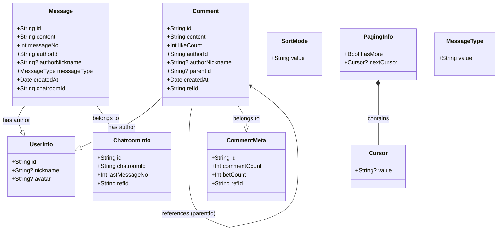
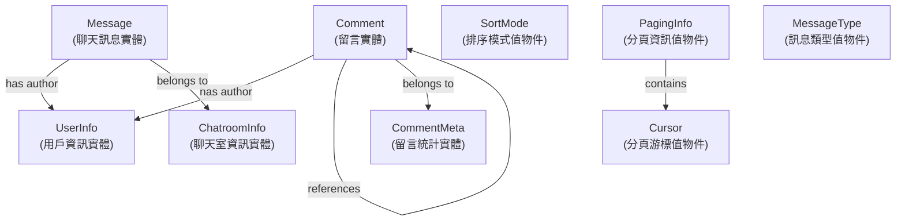

# Domain Model UML 標準關係圖

## 標準 UML 關係圖



**Mermaid 語法（可複製）：**

```
classDiagram
    class Comment {
        +String id
        +String content
        +Int likeCount
        +String authorId
        +String? authorNickname
        +String? parentId
        +Date createdAt
        +String refId
    }
    
    class CommentMeta {
        +String id
        +Int commentCount
        +Int betCount
        +String refId
    }
    
    class UserInfo {
        +String id
        +String? nickname
        +String? avatar
    }
    
    class Message {
        +String id
        +String content
        +Int messageNo
        +String authorId
        +String? authorNickname
        +MessageType messageType
        +Date createdAt
        +String chatroomId
    }
    
    class ChatroomInfo {
        +String id
        +String chatroomId
        +Int lastMessageNo
        +String refId
    }
    
    class SortMode {
        +String value
    }
    
    class Cursor {
        +String? value
    }
    
    class PagingInfo {
        +Bool hasMore
        +Cursor? nextCursor
    }
    
    class MessageType {
        +String value
    }
    
    Comment --|> UserInfo : has author
    Comment --> Comment : references (parentId)
    Comment --|> CommentMeta : belongs to
    Message --|> UserInfo : has author
    Message --|> ChatroomInfo : belongs to
    PagingInfo *-- Cursor : contains
```

## 關係說明

### Association（關聯）

- **Comment → UserInfo**：留言有作者（透過 `authorId` 引用）
- **Comment → Comment**：回覆引用父留言（透過 `parentId` 引用）
- **Comment → CommentMeta**：留言屬於留言統計（透過 `refId` 關聯）
- **Message → UserInfo**：訊息有作者（透過 `authorId` 引用）
- **Message → ChatroomInfo**：訊息屬於聊天室（透過 `chatroomId` 引用）

### Composition（組合）

- **PagingInfo → Cursor**：分頁資訊包含游標（直接包含 `nextCursor: Cursor?`）

## 語意化關係圖



**Mermaid 語法（可複製）：**

```
flowchart TD
    Comment["Comment<br/>(留言實體)"]
    CommentMeta["CommentMeta<br/>(留言統計實體)"]
    UserInfo["UserInfo<br/>(用戶資訊實體)"]
    Message["Message<br/>(聊天訊息實體)"]
    ChatroomInfo["ChatroomInfo<br/>(聊天室資訊實體)"]
    SortMode["SortMode<br/>(排序模式值物件)"]
    Cursor["Cursor<br/>(分頁游標值物件)"]
    PagingInfo["PagingInfo<br/>(分頁資訊值物件)"]
    MessageType["MessageType<br/>(訊息類型值物件)"]
    
    Comment -->|has author| UserInfo
    Comment -->|references| Comment
    Comment -->|belongs to| CommentMeta
    Message -->|has author| UserInfo
    Message -->|belongs to| ChatroomInfo
    PagingInfo -->|contains| Cursor
```

## 關係詳細說明

| 關係 | 語意化關係 | 標準 UML 關係 | 關係說明 | 實作方式 | 方向 |
|------|-----------|-------------|---------|---------|------|
| Comment → UserInfo | has author | Association | 留言有作者 | `authorId: String`（引用 UserInfo.id） | 單向 |
| Comment → Comment | references | Association | 回覆引用父留言 | `parentId: String?`（引用 Comment.id） | 單向 |
| Comment → CommentMeta | belongs to | Association | 留言屬於留言統計 | `refId: String`（引用 CommentMeta.refId） | 單向 |
| Message → UserInfo | has author | Association | 訊息有作者 | `authorId: String`（引用 UserInfo.id） | 單向 |
| Message → ChatroomInfo | belongs to | Association | 訊息屬於聊天室 | `chatroomId: String`（引用 ChatroomInfo.chatroomId） | 單向 |
| PagingInfo → Cursor | contains | Composition | 分頁資訊包含游標 | `nextCursor: Cursor?`（直接包含） | 單向 |

