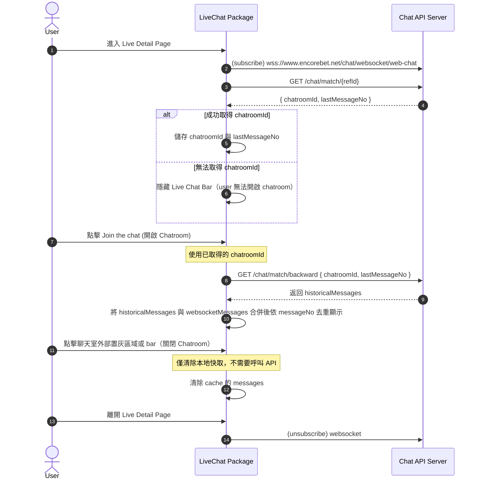
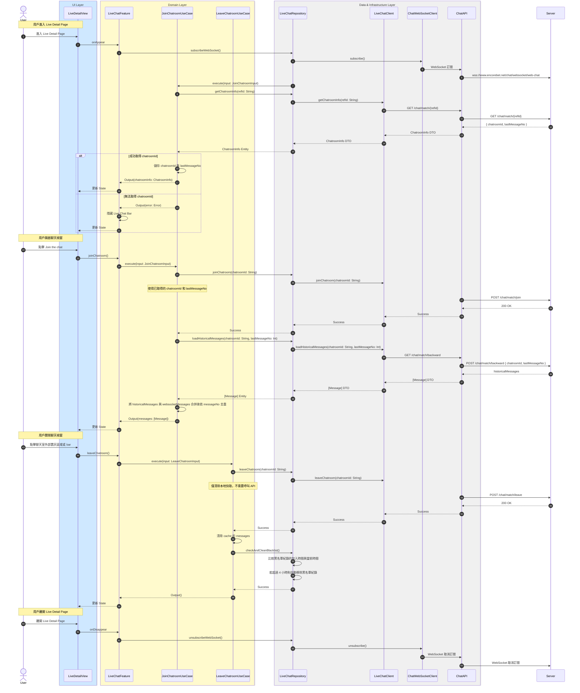

# 初始化聊天室流程

## Flow 資訊

| 欄位 | 值 |
|------|-----|
| **feature** | LiveChat |
| **flow_id** | LC-FULL-001 |
| **flow_type** | Full |
| **flow_name** | 用戶進入與離開聊天室（含 WebSocket 相依） |
| **parent_flow_id** | null |
| **parent_flow_name** | null |
| **original_annotation** | @flow: Full |

## 模組說明

| 模組名稱 | 職責 |
|---------|------|
| **LiveDetailView** | 直播詳情頁面 |
| **LiveChatFeature** | TCA Reducer，管理聊天室相關的 State 和 Action |
| **JoinChatroomUseCase** | 加入聊天室並載入歷史訊息 |
| **LeaveChatroomUseCase** | 離開聊天室並清理快取 |
| **LiveChatRepository** | Domain 資料來源的抽象介面（聊天室相關） |
| **LiveChatClient** | HTTP 通訊（聊天室相關） |
| **ChatWebSocketClient** | WebSocket 通訊（即時訊息） |
| **ChatAPI** | 後端 endpoint 定義（聊天室相關） |

## 流程說明

| 流程步驟 | 說明 |
|---------|------|
| **1. 進入頁面與 WebSocket 訂閱** | 1. 用戶進入 Live Detail Page<br>2. 自動建立 WebSocket 連線 |
| **2. 取得聊天室資訊** | 1. 向伺服器請求聊天室 ID 和最後訊息編號<br>2. 成功則儲存資訊，失敗則隱藏 Live Chat Bar |
| **3. 開啟聊天視窗** | 1. 用戶點擊 Join the chat 按鈕<br>2. 使用已取得的 chatroomId 載入歷史訊息 |
| **4. 載入歷史訊息** | 1. 透過 backward API 載入舊訊息<br>2. 將歷史訊息與 WebSocket 訊息合併並去重 |
| **5. 關閉聊天視窗** | 1. 用戶關閉聊天室<br>2. 清除本地快取的訊息（不需要呼叫 API） |
| **6. 離開頁面** | 1. 用戶離開 Live Detail Page<br>2. 取消 WebSocket 訂閱 |

## 場景序列圖（原始業務流程）

以下為原始業務流程的序列圖，展示從業務角度的完整流程：



**Mermaid 語法（可複製）：**

```
sequenceDiagram
    autonumber
    actor User
    participant LiveChat as LiveChat Package
    participant Chat as Chat API Server

    %% 進入頁面
    User->>LiveChat: 進入 Live Detail Page
    LiveChat->>Chat: (subscribe) wss://www.encorebet.net/chat/websocket/web-chat

    %% 取得 chatroomId 與 lastMessageNo
    LiveChat->>Chat: GET /chat/match/{refId}
    Chat-->>LiveChat: { chatroomId, lastMessageNo }

    alt 成功取得 chatroomId
        LiveChat->>LiveChat: 儲存 chatroomId 與 lastMessageNo
    else 無法取得 chatroomId
        LiveChat->>LiveChat: 隱藏 Live Chat Bar（user 無法開啟 chatroom）
    end

    %% 使用者開啟聊天視窗
    User->>LiveChat: 點擊 Join the chat (開啟 Chatroom)
    Note over LiveChat: 使用已取得的 chatroomId

    %% backward API：補舊訊息
    LiveChat->>Chat: GET /chat/match/backward { chatroomId, lastMessageNo }
    Chat-->>LiveChat: 返回 historicalMessages
    LiveChat->>LiveChat: 將 historicalMessages 與 websocketMessages 合併後依 messageNo 去重顯示

    %% 使用者關閉聊天視窗
    User->>LiveChat: 點擊聊天室外部置灰區域或 bar（關閉 Chatroom）
    Note over LiveChat: 僅清除本地快取，不需要呼叫 API
    LiveChat->>LiveChat: 清除 cache 的 messages

    %% 使用者離開 Live Detail Page
    User->>LiveChat: 離開 Live Detail Page
    LiveChat->>Chat: (unsubscribe) websocket
```

## 模組序列圖（架構設計）

以下為轉換後的模組序列圖，展示 Clean Architecture 各層級的互動：



**Mermaid 語法（可複製）：**

```
sequenceDiagram
    autonumber
    actor User
    box rgb(207,232,255) UI Layer
        participant LiveDetailView
    end
    box rgb(255,250,205) Domain Layer
        participant LiveChatFeature
        participant JoinChatroomUseCase
        participant LeaveChatroomUseCase
    end
    box rgb(240,240,240) Data & Infrastructure Layer
        participant LiveChatRepository
        participant LiveChatClient
        participant ChatWebSocketClient
        participant ChatAPI
    end
    participant Server

    Note over User,LiveDetailView: 用戶進入 Live Detail Page
    User->>LiveDetailView: 進入 Live Detail Page
    LiveDetailView->>LiveChatFeature: onAppear
    LiveChatFeature->>LiveChatRepository: subscribeWebSocket()
    LiveChatRepository->>ChatWebSocketClient: subscribe()
    ChatWebSocketClient->>ChatAPI: WebSocket 訂閱
    ChatAPI->>Server: wss://www.encorebet.net/chat/websocket/web-chat
    LiveChatRepository->>JoinChatroomUseCase: execute(input: JoinChatroomInput)
    JoinChatroomUseCase->>LiveChatRepository: getChatroomInfo(refId: String)
    LiveChatRepository->>LiveChatClient: getChatroomInfo(refId: String)
    LiveChatClient->>ChatAPI: GET /chat/match/{refId}
    ChatAPI->>Server: GET /chat/match/{refId}
    Server-->>ChatAPI: { chatroomId, lastMessageNo }
    ChatAPI-->>LiveChatClient: ChatroomInfo DTO
    LiveChatClient-->>LiveChatRepository: ChatroomInfo DTO
    LiveChatRepository-->>JoinChatroomUseCase: ChatroomInfo Entity
    alt 成功取得 chatroomId
        JoinChatroomUseCase->>JoinChatroomUseCase: 儲存 chatroomId 與 lastMessageNo
        JoinChatroomUseCase-->>LiveChatFeature: Output(chatroomInfo: ChatroomInfo)
        LiveChatFeature-->>LiveDetailView: 更新 State
    else 無法取得 chatroomId
        JoinChatroomUseCase-->>LiveChatFeature: Output(error: Error)
        LiveChatFeature->>LiveChatFeature: 隱藏 Live Chat Bar
        LiveChatFeature-->>LiveDetailView: 更新 State
    end

    Note over User,LiveDetailView: 用戶開啟聊天視窗
    User->>LiveDetailView: 點擊 Join the chat
    LiveDetailView->>LiveChatFeature: joinChatroom()
    LiveChatFeature->>JoinChatroomUseCase: execute(input: JoinChatroomInput)
    JoinChatroomUseCase->>LiveChatRepository: joinChatroom(chatroomId: String)
    LiveChatRepository->>LiveChatClient: joinChatroom(chatroomId: String)
    Note over JoinChatroomUseCase: 使用已取得的 chatroomId 和 lastMessageNo
    ChatAPI->>Server: POST /chat/match/join
    Server-->>ChatAPI: 200 OK
    ChatAPI-->>LiveChatClient: Success
    LiveChatClient-->>LiveChatRepository: Success
    LiveChatRepository-->>JoinChatroomUseCase: Success
    JoinChatroomUseCase->>LiveChatRepository: loadHistoricalMessages(chatroomId: String, lastMessageNo: Int)
    LiveChatRepository->>LiveChatClient: loadHistoricalMessages(chatroomId: String, lastMessageNo: Int)
    LiveChatClient->>ChatAPI: GET /chat/match/backward
    ChatAPI->>Server: POST /chat/match/backward { chatroomId, lastMessageNo }
    Server-->>ChatAPI: historicalMessages
    ChatAPI-->>LiveChatClient: [Message] DTO
    LiveChatClient-->>LiveChatRepository: [Message] DTO
    LiveChatRepository-->>JoinChatroomUseCase: [Message] Entity
    JoinChatroomUseCase->>JoinChatroomUseCase: 將 historicalMessages 與 websocketMessages 合併後依 messageNo 去重
    JoinChatroomUseCase-->>LiveChatFeature: Output(messages: [Message])
    LiveChatFeature-->>LiveDetailView: 更新 State

    Note over User,LiveDetailView: 用戶關閉聊天視窗
    User->>LiveDetailView: 點擊聊天室外部置灰區域或 bar
    LiveDetailView->>LiveChatFeature: leaveChatroom()
    LiveChatFeature->>LeaveChatroomUseCase: execute(input: LeaveChatroomInput)
    LeaveChatroomUseCase->>LiveChatRepository: leaveChatroom(chatroomId: String)
    LiveChatRepository->>LiveChatClient: leaveChatroom(chatroomId: String)
    Note over LeaveChatroomUseCase: 僅清除本地快取，不需要呼叫 API
    ChatAPI->>Server: POST /chat/match/leave
    Server-->>ChatAPI: 200 OK
    ChatAPI-->>LiveChatClient: Success
    LiveChatClient-->>LiveChatRepository: Success
    LiveChatRepository-->>LeaveChatroomUseCase: Success
    LeaveChatroomUseCase->>LeaveChatroomUseCase: 清除 cache 的 messages
    LeaveChatroomUseCase->>LiveChatRepository: checkAndCleanBlacklist()
    LiveChatRepository->>LiveChatRepository: 比較黑名單紀錄的加入時間與當前時間
    LiveChatRepository->>LiveChatRepository: 若超過 4 小時則自動移除黑名單紀錄
    LiveChatRepository-->>LeaveChatroomUseCase: Success
    LeaveChatroomUseCase-->>LiveChatFeature: Output()
    LiveChatFeature-->>LiveDetailView: 更新 State

    Note over User,LiveDetailView: 用戶離開 Live Detail Page
    User->>LiveDetailView: 離開 Live Detail Page
    LiveDetailView->>LiveChatFeature: onDisappear
    LiveChatFeature->>LiveChatRepository: unsubscribeWebSocket()
    LiveChatRepository->>ChatWebSocketClient: unsubscribe()
    ChatWebSocketClient->>ChatAPI: WebSocket 取消訂閱
    ChatAPI->>Server: WebSocket 取消訂閱
```

