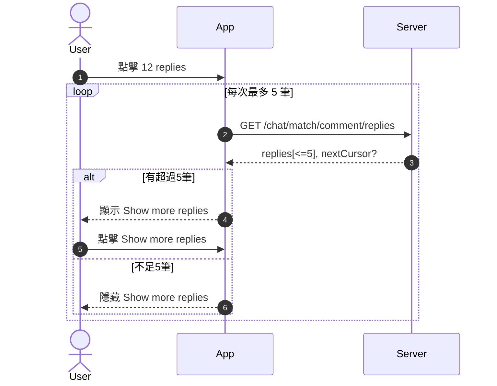
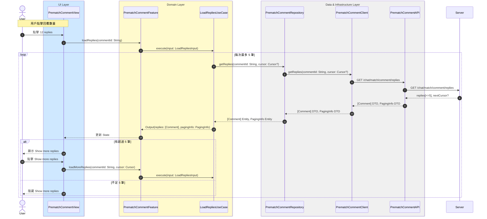

# 載入回覆列表流程

## Flow 資訊

| 欄位 | 值 |
|------|-----|
| **feature** | PrematchComment |
| **flow_id** | PC-SUB-003 |
| **flow_type** | Sub |
| **flow_name** | 用戶查看 replies（含分頁載入） |
| **parent_flow_id** | PC-FULL-001 |
| **parent_flow_name** | 用戶進入 Upcoming Race Page, Prematch Comment Page 與 Top |
| **original_annotation** | @flow: Sub |

## 模組說明

| 模組名稱 | 職責 |
|---------|------|
| **PrematchCommentView** | 賽前留言頁面 |
| **PrematchCommentFeature** | TCA Reducer，管理評論相關的 State 和 Action |
| **LoadRepliesUseCase** | 載入回覆列表（分頁） |
| **PrematchCommentRepository** | Domain 資料來源的抽象介面（評論相關） |
| **PrematchCommentClient** | HTTP 通訊（評論相關） |
| **PrematchCommentAPI** | 後端 endpoint 定義（評論相關） |

## 流程說明

| 流程步驟 | 說明 |
|---------|------|
| **1. 點擊回覆數量** | 1. 用戶點擊留言的回覆數量（例如「12 replies」）<br>2. 開始載入回覆列表 |
| **2. 分頁載入回覆** | 1. 每次最多載入 5 筆回覆<br>2. 使用 cursor 機制追蹤分頁位置 |
| **3. 顯示「Show more replies」按鈕** | 1. 有超過 5 筆回覆時顯示按鈕<br>2. 不足 5 筆回覆時隱藏按鈕<br>3. 用戶可持續點擊載入更多回覆 |

## 場景序列圖（原始業務流程）

以下為原始業務流程的序列圖，展示從業務角度的完整流程：



**Mermaid 語法（可複製）：**

```
sequenceDiagram
  autonumber
  actor User
  participant App
  participant Server as Server

  User->>App: 點擊 12 replies
  loop 每次最多 5 筆
    App->>Server: GET /chat/match/comment/replies
    Server-->>App: replies[<=5], nextCursor?
    alt 有超過5筆
      App-->>User: 顯示 Show more replies
      User->>App: 點擊 Show more replies
    else 不足5筆
      App-->>User: 隱藏 Show more replies
    end
  end
```

## 模組序列圖（架構設計）

以下為轉換後的模組序列圖，展示 Clean Architecture 各層級的互動：



**Mermaid 語法（可複製）：**

```
sequenceDiagram
    autonumber
    actor User
    box rgb(207,232,255) UI Layer
        participant PrematchCommentView
    end
    box rgb(255,250,205) Domain Layer
        participant PrematchCommentFeature
        participant LoadRepliesUseCase
    end
    box rgb(240,240,240) Data & Infrastructure Layer
        participant PrematchCommentRepository
        participant PrematchCommentClient
        participant PrematchCommentAPI
    end
    participant Server

    Note over User,PrematchCommentView: 用戶點擊回覆數量
    User->>PrematchCommentView: 點擊 12 replies
    PrematchCommentView->>PrematchCommentFeature: loadReplies(commentId: String)
    PrematchCommentFeature->>LoadRepliesUseCase: execute(input: LoadRepliesInput)
    
    loop 每次最多 5 筆
        LoadRepliesUseCase->>PrematchCommentRepository: getReplies(commentId: String, cursor: Cursor?)
        PrematchCommentRepository->>PrematchCommentClient: getReplies(commentId: String, cursor: Cursor?)
        PrematchCommentClient->>PrematchCommentAPI: GET /chat/match/comment/replies
        PrematchCommentAPI->>Server: GET /chat/match/comment/replies
        Server-->>PrematchCommentAPI: replies[<=5], nextCursor?
        PrematchCommentAPI-->>PrematchCommentClient: [Comment] DTO, PagingInfo DTO
        PrematchCommentClient-->>PrematchCommentRepository: [Comment] DTO, PagingInfo DTO
        PrematchCommentRepository-->>LoadRepliesUseCase: [Comment] Entity, PagingInfo Entity
        LoadRepliesUseCase-->>PrematchCommentFeature: Output(replies: [Comment], pagingInfo: PagingInfo)
        PrematchCommentFeature-->>PrematchCommentView: 更新 State
        alt 有超過 5 筆
            PrematchCommentView-->>User: 顯示 Show more replies
            User->>PrematchCommentView: 點擊 Show more replies
            PrematchCommentView->>PrematchCommentFeature: loadMoreReplies(commentId: String, cursor: Cursor)
            PrematchCommentFeature->>LoadRepliesUseCase: execute(input: LoadRepliesInput)
        else 不足 5 筆
            PrematchCommentView-->>User: 隱藏 Show more replies
        end
    end
```

