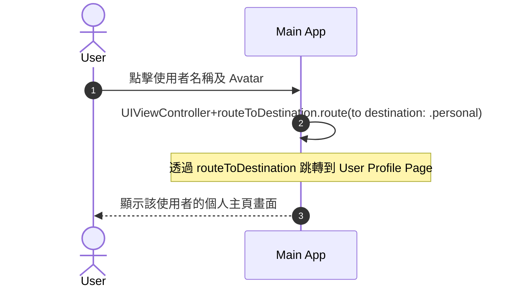
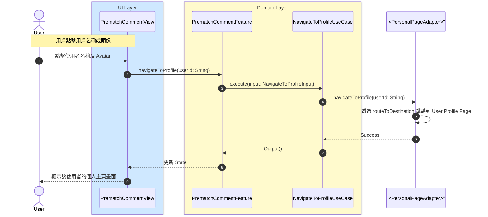

# 跳轉個人主頁流程

## Flow 資訊

| 欄位 | 值 |
|------|-----|
| **feature** | PrematchComment |
| **flow_id** | PC-SUB-005 |
| **flow_type** | Sub |
| **flow_name** | 用戶點擊用戶名稱 → 跳轉個人主頁 |
| **parent_flow_id** | PC-FULL-001 |
| **parent_flow_name** | 用戶進入 Upcoming Race Page, Prematch Comment Page 與 Top |
| **original_annotation** | @flow: Sub |

## 模組說明

| 模組名稱 | 職責 |
|---------|------|
| **PrematchCommentView** | 賽前留言頁面 |
| **PrematchCommentFeature** | TCA Reducer，管理評論相關的 State 和 Action |
| **NavigateToProfileUseCase** | 處理跳轉到個人主頁的邏輯 |
| **PersonalPageAdapter Protocol** | 個人主頁路由跳轉的 Protocol（定義在 PrematchComment Package 中） |

## 流程說明

| 流程步驟 | 說明 |
|---------|------|
| **1. 點擊用戶名稱或頭像** | 1. 用戶點擊留言中的用戶名稱或頭像<br>2. 觸發跳轉個人主頁流程 |
| **2. 跳轉個人主頁** | 1. Feature 呼叫 NavigateToProfileUseCase<br>2. UseCase 透過 PersonalPageAdapter Protocol 執行路由跳轉<br>3. 顯示該使用者的個人主頁畫面 |

## 場景序列圖（原始業務流程）

以下為原始業務流程的序列圖，展示從業務角度的完整流程：



**Mermaid 語法（可複製）：**

```
sequenceDiagram
    autonumber
    actor User
    participant MainApp as Main App

    User->>MainApp: 點擊使用者名稱及 Avatar

    MainApp->>MainApp: UIViewController+routeToDestination.route(to destination: .personal)
    note over MainApp: 透過 routeToDestination 跳轉到 User Profile Page
    MainApp-->>User: 顯示該使用者的個人主頁畫面
```

## 模組序列圖（架構設計）

以下為轉換後的模組序列圖，展示 Clean Architecture 各層級的互動：



**Mermaid 語法（可複製）：**

```
sequenceDiagram
    autonumber
    actor User
    box rgb(207,232,255) UI Layer
        participant PrematchCommentView
    end
    box rgb(255,250,205) Domain Layer
        participant PrematchCommentFeature
        participant NavigateToProfileUseCase
    end
    participant PersonalPageAdapterProtocol as "<PersonalPageAdapter>"

    Note over User,PrematchCommentView: 用戶點擊用戶名稱或頭像
    User->>PrematchCommentView: 點擊使用者名稱及 Avatar
    PrematchCommentView->>PrematchCommentFeature: navigateToProfile(userId: String)
    PrematchCommentFeature->>NavigateToProfileUseCase: execute(input: NavigateToProfileInput)
    NavigateToProfileUseCase->>PersonalPageAdapterProtocol: navigateToProfile(userId: String)
    PersonalPageAdapterProtocol->>PersonalPageAdapterProtocol: 透過 routeToDestination 跳轉到 User Profile Page
    PersonalPageAdapterProtocol-->>NavigateToProfileUseCase: Success
    NavigateToProfileUseCase-->>PrematchCommentFeature: Output()
    PrematchCommentFeature-->>PrematchCommentView: 更新 State
    PrematchCommentView-->>User: 顯示該使用者的個人主頁畫面
```

