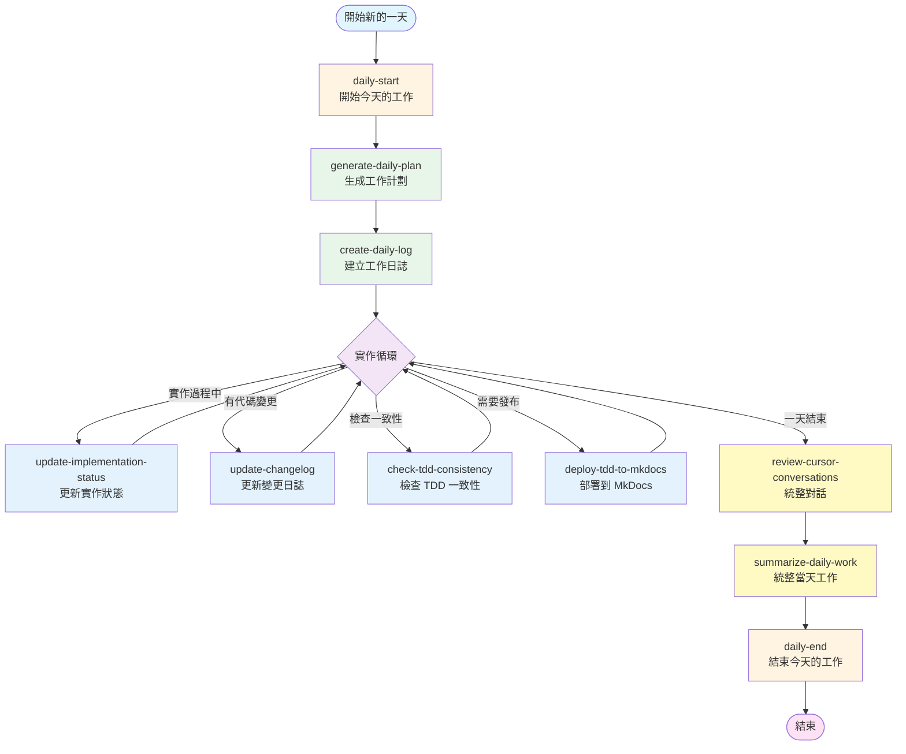

# Cursor Commands 工作流程圖與使用時機

## 📊 完整工作流程圖



## 🕐 使用時機詳細說明

### 🌅 每天開始時（Morning Routine）

#### 1. **daily-start** - 開始今天的工作
**使用時機**: 每天開始工作時的第一個命令

**功能**:
- 自動執行 `generate-daily-plan` 和 `create-daily-log`
- 提供當天的實作建議
- 檢查依賴關係

**觸發方式**:
```
在 Cursor 中說：「開始今天的工作」或「@daily-start」
```

---

#### 2. **generate-daily-plan** - 生成今天的工作計劃
**使用時機**: 
- 每天開始工作時
- 需要查看當天計劃時
- 計劃變更需要重新生成時

**功能**:
- 根據今天的日期找出對應的 Jira tickets
- 識別 parent tickets 和 child tickets
- 生成包含 Jira 連結、估時、狀態的工作計劃

**觸發方式**:
```
在 Cursor 中說：「生成今天的工作計劃」或「@generate-daily-plan」
```

**生成文件**: `16_Cursor_Workflow/daily_plans/YYYY-MM-DD.md`

---

#### 3. **create-daily-log** - 建立今天的工作日誌
**使用時機**:
- 每天開始工作時
- 需要記錄當天工作時

**功能**:
- 使用預設模板建立工作日誌
- 包含日期、計劃、完成項目等欄位

**觸發方式**:
```
在 Cursor 中說：「建立今天的工作日誌」或「@create-daily-log」
```

**生成文件**: `15_Daily_Logs/YYYY-MM-DD.md`

---

### 💻 實作過程中（During Development）

#### 4. **update-implementation-status** - 更新實作狀態
**使用時機**:
- 完成一個 ticket 的實作後
- 需要追蹤實作進度時
- 定期檢查實作狀態時（建議每天至少一次）

**功能**:
- 檢查實作進度
- 更新狀態追蹤表
- 檢查 TDD 一致性

**觸發方式**:
```
在 Cursor 中說：「更新實作狀態」或「@update-implementation-status」
```

**更新文件**: `13_Implementation_Status/implementation_status.md`

---

#### 5. **update-changelog** - 更新變更日誌
**使用時機**:
- 完成一個功能或修復後
- 有代碼變更需要記錄時
- 準備 commit 前

**功能**:
- 根據 git commits 生成變更記錄
- 更新 CHANGELOG.md
- 對應到相關的 TDD ticket

**觸發方式**:
```
在 Cursor 中說：「更新變更日誌」或「@update-changelog」
```

**更新文件**: `14_Changelog/CHANGELOG.md`

---

#### 6. **check-tdd-consistency** - 檢查 TDD 一致性
**使用時機**:
- 實作完成後需要驗證時
- 定期檢查時（建議每週一次）
- 準備提交 PR 前

**功能**:
- 檢查實作檔案是否存在
- 檢查是否符合 TDD 規範
- 提供改進建議

**觸發方式**:
```
在 Cursor 中說：「檢查 TDD 一致性」或「@check-tdd-consistency」
```

---

#### 7. **deploy-tdd-to-mkdocs** - 部署 TDD 到 MkDocs
**使用時機**:
- 完成重要章節的更新後
- 需要發布最新文檔時
- 準備分享 TDD 給團隊時
- 定期發布時（建議每週一次）

**功能**:
- 建置 MkDocs 文檔
- 部署到 GitHub Pages (gh-pages branch)
- 顯示部署狀態和網站 URL

**觸發方式**:
```
在 Cursor 中說：「部署 TDD 到 MkDocs」或「發布 TDD 文檔」或「@deploy-tdd-to-mkdocs」
```

**網站 URL**: `https://hsinchunghan.github.io/LiveChatAndCommentOngoingFeature/`

---

### 🌙 每天結束時（Evening Routine）

#### 8. **review-cursor-conversations** - 統整對話
**使用時機**:
- 每天結束工作前
- 需要提取重要決策時
- 需要記錄學習要點時

**功能**:
- 提取重要決策
- 提取學習要點
- 生成對話摘要

**觸發方式**:
```
在 Cursor 中說：「統整對話」或「@review-cursor-conversations」
```

---

#### 9. **summarize-daily-work** - 統整當天工作
**使用時機**:
- 每天結束工作時
- 需要生成工作報告時

**功能**:
- 生成工作統整文件
- 包含對話統整模板
- 更新實作狀態和變更日誌

**觸發方式**:
```
在 Cursor 中說：「統整當天工作」或「@summarize-daily-work」
```

---

#### 10. **daily-end** - 結束今天的工作
**使用時機**: 每天結束工作時的最後一個命令

**功能**:
- 自動執行 `summarize-daily-work` 和 `review-cursor-conversations`
- 更新實作狀態
- 更新變更日誌
- 統整對話

**觸發方式**:
```
在 Cursor 中說：「結束今天的工作」或「@daily-end」
```

---

## 📅 典型工作日流程

### 早上（9:00 AM）
```
1. @daily-start
   └─> 自動執行 generate-daily-plan 和 create-daily-log
   └─> 查看今天的工作計劃
```

### 實作過程中（9:30 AM - 5:00 PM）
```
2. 實作功能 A
   └─> @update-implementation-status (完成後)
   └─> @update-changelog (有代碼變更時)

3. 實作功能 B
   └─> @check-tdd-consistency (實作完成後)
   └─> @update-implementation-status

4. 完成重要章節
   └─> @deploy-tdd-to-mkdocs (需要發布時)
```

### 晚上（5:30 PM）
```
5. @daily-end
   └─> 自動執行 summarize-daily-work 和 review-cursor-conversations
   └─> 統整當天工作
```

---

## 🎯 快速參考表

| 時機 | 命令 | 頻率 | 說明 |
|------|------|------|------|
| **每天開始** | `daily-start` | 每天 1 次 | 開始工作 |
| **每天開始** | `generate-daily-plan` | 每天 1 次 | 生成計劃 |
| **每天開始** | `create-daily-log` | 每天 1 次 | 建立日誌 |
| **實作中** | `update-implementation-status` | 完成 ticket 後 | 更新狀態 |
| **實作中** | `update-changelog` | 有變更時 | 記錄變更 |
| **實作中** | `check-tdd-consistency` | 完成功能後 | 檢查一致性 |
| **實作中** | `deploy-tdd-to-mkdocs` | 需要發布時 | 部署文檔 |
| **每天結束** | `review-cursor-conversations` | 每天 1 次 | 統整對話 |
| **每天結束** | `summarize-daily-work` | 每天 1 次 | 統整工作 |
| **每天結束** | `daily-end` | 每天 1 次 | 結束工作 |

---

## 💡 最佳實踐建議

### 1. 建立習慣
- 每天早上執行 `daily-start`
- 每天晚上執行 `daily-end`
- 形成固定的工作節奏

### 2. 及時更新
- 完成功能後立即更新狀態
- 有代碼變更時立即記錄
- 不要累積到最後才更新

### 3. 定期檢查
- 每週至少檢查一次 TDD 一致性
- 每週至少發布一次文檔
- 保持文檔與代碼同步

### 4. 善用對話統整
- 每天結束時統整重要決策
- 記錄學習要點
- 方便後續查閱

---

## 🔗 相關文件

- **命令目錄**: `~/.cursor/commands/`
- **工作流程指南**: `/Users/reedhsin/Documents/codebase/fcom-iOS/TDDs/LiveChat&PrematchComment/16_Cursor_Workflow/WORKFLOW_GUIDE.md`
- **快速開始**: `/Users/reedhsin/Documents/codebase/fcom-iOS/TDDs/LiveChat&PrematchComment/16_Cursor_Workflow/QUICK_START.md`

