# MermaidToTDD

一個自動化工具，將 Mermaid Sequence Diagram 轉換為符合 **TCA (The Composable Architecture) + Clean Architecture** 的 iOS 技術設計文件（TDD）。

## 📋 目錄

- [專案簡介](#專案簡介)
- [功能特色](#功能特色)
- [快速開始](#快速開始)
- [教學範例](#教學範例)
- [專案結構](#專案結構)
- [規範文件](#規範文件)
- [輸出格式](#輸出格式)
- [常用指令](#常用指令)
- [安裝 Markdown Preview 插件](#安裝-markdown-preview-插件)

---

## 專案簡介

本專案提供一套完整的規範和工具，幫助 iOS 開發團隊將業務流程的 Mermaid Sequence Diagram 自動轉換為結構化的技術設計文件（TDD）。

### 核心價值

- ✅ **自動化轉換**：從 Mermaid 流程圖自動生成完整的 TDD 文件
- ✅ **架構規範**：嚴格遵循 TCA + Clean Architecture 原則
- ✅ **模組化設計**：自動識別並收斂相關模組
- ✅ **標準化輸出**：統一的文件格式和結構

---

## 功能特色

### 1. 自動化分析與轉換

- 解析 Mermaid Sequence Diagram
- 識別各層級（UI Layer、Domain Layer、Data & Infrastructure Layer）
- 自動收斂相關模組（Feature、UseCase、Repository、Client、API）

### 2. 完整的 TDD 文件生成

自動生成以下章節：

1. **Integrated Service-Level Sequence Diagram (ISSD)**
   - 高層級的服務整合流程圖

2. **Architecture（架構圖）**
   - Clean Architecture 分層架構圖

3. **Module Responsibility（模組職責）**
   - 所有模組的職責說明（表格格式）

4. **Domain Model（領域模型）**
   - Entity 和 Value Object 定義
   - Domain Model 關係圖（語意化 + 標準 UML）

5. **Module Sequence Diagrams（模組序列圖）**
   - 詳細的模組互動序列圖
   - 按功能分類組織

---

## 快速開始

### 1. 準備 Mermaid Sequence Diagram

準備你的 Mermaid Sequence Diagram，格式如下：

```mermaid
sequenceDiagram
    autonumber
    actor User
    participant App
    participant Server as Server
    
    User->>App: 進入 Race Detail Page
    App->>Server: GET /{TBD 個人資訊 API}
    Server-->>App: userInfo
```



**重要標註**：
- 使用 `@feature: FeatureName` 標註功能名稱
- 使用 `@flow: Full/Sub` 標註流程類型

### 2. 使用 Cursor Agent

在 Cursor IDE 中，將你的 Mermaid 流程圖和 `tdd_main_prompt.md` 提供給 AI Agent，Agent 會自動：

1. 解析 Mermaid 流程圖
2. 識別各層級和模組
3. 生成完整的 TDD 文件
4. 輸出到 `output/` 資料夾

### 3. 查看輸出結果

生成的 TDD 文件會自動組織在 `output/` 資料夾中，按功能分類。

---

## 教學範例

以下是一個完整的教學範例，展示如何從 Mermaid 流程圖生成 TDD 文件。

### 範例：PrematchComment Feature

#### 輸入：Mermaid Sequence Diagram

**注意**：在實際使用時，你可以提供多個 `sequenceDiagram`，每個都需要獨立的 Mermaid 代碼塊。以下是完整的輸入範例：

**主流程：**

```mermaid
%% @feature: PrematchComment
%% @flow: Full
%% Prematch Comment – 主流程
sequenceDiagram
    autonumber
    actor User
    participant App
    participant Server as Server
    
    User->>App: 進入 Race Detail Page
    App->>Server: GET /{TBD 個人資訊 API}
    Server-->>App: userInfo
    App->>Server: GET /chat/match/comment/info/{refId}
    Server-->>App: { commentCount, betCount }
    User->>App: 進入 Prematch Comment Page
    App->>Server: GET /chat/match/comment/popular
    Server-->>App: comments (top)
    User->>App: 切換 tab
    alt Newest tab
        App->>Server: GET /chat/match/comment/newest
        Server-->>App: comments (sorted by time)
    else Top tab
        App->>Server: GET /chat/match/comment/popular
        Server-->>App: comments
    end
    User->>App: 點擊 Refresh
    alt Top tab
        App->>Server: GET /chat/match/comment/popular
        Server-->>App: 最新 comments
    else Newest tab
        App->>Server: GET /chat/match/comment/newest
        Server-->>App: 最新 comments
    end
```



**子流程範例（Replies Pagination）：**

```mermaid
%% @feature: PrematchComment
%% @flow: Sub
%% Prematch Comment – Replies Pagination
sequenceDiagram
    autonumber
    participant App
    participant CommentAPI as CommentAPI
    
    App->>CommentAPI: 點擊 12 replies → GET /chat/match/comment/replies
    loop 每次最多 5 筆
        App->>CommentAPI: GET /chat/match/comment/replies {cursor?}
        CommentAPI-->>App: replies[<=5], nextCursor?
        alt 有更多
            App-->>App: 顯示 Show more replies
        else
            App-->>App: 隱藏 Show more replies
        end
    end
```



**其他子流程：**

你還可以提供其他子流程，例如：
- Like Flow（點讚流程）
- Comment / Reply Publish（發布評論/回覆）
- Profile Navigation（個人資料導航）

每個流程都應該使用獨立的 Mermaid 代碼塊，並標註 `@feature` 和 `@flow` 標籤。

#### 輸出：自動生成的 TDD 文件

系統會自動生成完整的 TDD 文件，包含以下章節：

##### 必需章節（6 個）

1. **01. Overview（概述）**
   - 整體描述 Feature 或 Module 的目的
   - 包含 scope / goal / 主要使用者互動

2. **02. Integrated Service-Level Sequence Diagram (ISSD)**
   - 高層級的服務整合序列圖
   - 顯示跨 Feature、跨 UseCase 的整合流程

3. **03. Architecture（架構）**
   - Clean Architecture 分層架構圖
   - 說明各層級的責任與依賴方向

4. **04. Module Responsibility（模組職責）**
   - 所有模組的職責說明（表格格式）
   - 包含 Feature、UseCase、Repository、Client、API、Shared Modules

5. **05. Domain Model（領域模型）**
   - Entity 和 Value Object 定義
   - Domain Model 關係圖（語意化 + 標準 UML）
   - DTO → Domain Model Mapping 規則

6. **06. Module Sequence Diagram（模組序列圖）**
   - 詳細的模組互動序列圖
   - 按功能分類組織（Data Initialization、Data Interaction、Structural Navigation）

##### 可選章節（Optional）

7. **07. Feature State & Action (TCA)** ⚠️ Optional
   - 每個 Feature 的 State 結構定義
   - 所有 Action 及其語意
   - 哪些 Action 會觸發哪些 UseCase

8. **08. UseCase Input & Output Model** ⚠️ Optional
   - 每個 UseCase 的 Input Model 定義
   - 每個 UseCase 的 Output Model 定義
   - 與 Domain Model、DTO 的關係

9. **09. API Spec & Mapping** ⚠️ Optional
   - URL / Method 定義
   - Request DTO / Response DTO 定義
   - 所屬 Repository / Client / UseCase
   - DTO → Domain Model Mapping 規則

10. **10. Error Handling** ⚠️ Optional
    - 每個 UseCase 的錯誤分類（Validation / Network / Backend）
    - UI 呈現方式
    - 是否自動 retry / reconnect

11. **11. Test Scenarios** ⚠️ Optional
    - 依照 alt / opt / loop 推導所有測試案例
    - 包含 Basic、Branch、Optional、Loop、Error、Recover、Edge Case

12. **12. Ticket 生成與估時** ⚠️ Optional
    - 根據 TDD 文件自動生成開發 Ticket
    - 根據模組類型和複雜度進行開發時間估算
    - 使用 Story Point 和工程師等級轉換為實際工時

13. **13. Risks & Questions** ⚠️ Optional
    - 未定義的需求
    - 不確定的 Backend 行為
    - 時序 / 效能 / TTL / retry policy 的風險
    - TODO / 需後端確認項

#### 完整輸出結構範例

```
output/
└── [FeatureName]/
    ├── 01_Overview/
    │   ├── README.md
    │   └── 01_overview.md
    ├── 02_Integrated Service-Level Sequence Diagram/
    │   ├── README.md
    │   └── 01_full_integration_flow.md
    ├── 03_Architecture/
    │   ├── README.md
    │   └── 01_clean_architecture_diagram.md
    ├── 04_Module Responsibility/
    │   ├── README.md
    │   └── 01_module_responsibility.md
    ├── 05_Domain Model/
    │   ├── README.md
    │   ├── 01_domain_model.md
    │   └── 02_domain_model_uml_standard.md
    ├── 06_Module Sequence Diagram/
    │   └── [FeatureName]/
    │       └── Module Sequence Diagrams/
    │           ├── README.md
    │           ├── 01_data_initialization_refresh.md
    │           ├── 02_data_interaction_load_replies.md
    │           ├── 03_data_interaction_toggle_like.md
    │           ├── 04_data_interaction_publish_comment.md
    │           └── 05_structural_navigation_profile.md
    ├── 07_Feature State & Action (TCA)/ ⚠️ Optional
    │   ├── README.md
    │   └── 01_feature_state_action.md
    └── 08_UseCase Input & Output Model/ ⚠️ Optional
        ├── README.md
        └── 01_usecase_input_output.md
```

#### 各章節輸出範例

**1. Overview（概述）**

整體描述 Feature 的目的、範圍和主要使用者互動：

| 項目 | 說明 |
|------|------|
| **Feature 名稱** | PrematchComment / LiveChat |
| **目的** | 提供賽事前評論功能和即時聊天功能 |
| **範圍** | 評論列表、點讚、發布評論、即時聊天訊息 |
| **主要使用者互動** | 瀏覽評論、點讚、發布評論、發送聊天訊息 |

**2. Integrated Service-Level Sequence Diagram (ISSD)**

高層級的整合序列圖，顯示多個 Feature 之間的協作：

```mermaid
sequenceDiagram
    autonumber
    actor User
    box rgb(207,232,255) UI Layer
    participant PrematchCommentFeature
    participant LiveChatFeature
    end
    box rgb(255,250,205) Domain Layer
    participant ReloadCommentListUseCase
    participant InitializeChatroomUseCase
    end
    Note over PrematchCommentFeature,LiveChatFeature: 跨 Feature 協作
```



**3. Architecture（架構圖）**

Clean Architecture 分層架構圖，展示各層級的依賴關係。

**4. Module Responsibility（模組職責表格）**

以表格形式列出所有模組的職責：

| 模組名稱 | 層級 | 職責 | 使用的 UseCase |
|---------|------|------|---------------|
| **PrematchCommentFeature** | Domain Layer - Feature Layer | 1. UI orchestration<br>2. 將 Action 轉為 UseCase Input<br>3. 呼叫 UseCase | 1. ReloadCommentListUseCase<br>2. LoadCommentMetaUseCase |

**5. Domain Model（領域模型）**

定義 Entity 和 Value Object：

| Entity 名稱 | 說明 | 屬性 |
|------------|------|------|
| **Comment** | 評論實體 | 1. `id: String`<br>2. `content: String`<br>3. `authorId: String` |

**6. Module Sequence Diagram（模組序列圖）**

詳細的模組互動序列圖，符合規範的格式（User actor 獨立、Layer box 分色、Repository/Client/API 相鄰排列）：

```mermaid
sequenceDiagram
    autonumber
    actor User
    box rgb(207,232,255) UI Layer
    participant PrematchCommentFeature
    end
    box rgb(255,250,205) Domain Layer
    participant ReloadCommentListUseCase
    participant LoadCommentMetaUseCase
    end
    box rgb(240,240,240) Data & Infrastructure Layer
    participant PrematchCommentRepository
    participant PrematchCommentClient
    participant PrematchCommentAPI
    end
    
    User->>PrematchCommentFeature: 進入 Prematch Comment Page
    PrematchCommentFeature->>ReloadCommentListUseCase: execute(input)
    ReloadCommentListUseCase->>PrematchCommentRepository: getComments(refId, mode)
    PrematchCommentRepository->>PrematchCommentClient: getComments(refId, mode)
    PrematchCommentClient->>PrematchCommentAPI: GET /chat/match/comment/popular
    PrematchCommentAPI-->>PrematchCommentClient: Response DTO
    PrematchCommentClient-->>PrematchCommentRepository: Response DTO
    PrematchCommentRepository-->>ReloadCommentListUseCase: Comments Domain Model
    ReloadCommentListUseCase-->>PrematchCommentFeature: Output Model
    PrematchCommentFeature-->>User: 顯示評論列表
```



**每個序列圖文件包含：**
- 符合規範的 Mermaid Sequence Diagram
- 模組說明
- 流程說明

---

## 專案結構

```
MermaidToTDD/
├── README.md                          # 本文件
├── tdd_main_prompt.md                 # 主要提示文件（給 AI Agent 使用）
├── .gitignore                         # Git 忽略設定
├── TDD_rules/                         # 規範文件目錄
│   ├── tdd_layers_and_responsibilities.md
│   ├── tdd_module_consolidation_rules.md
│   ├── tdd_usecase_consolidation_rules.md
│   ├── tdd_sequence_and_mermaid_rules.md
│   └── tdd_domain_api_test_and_structure.md
└── output/                            # 生成的 TDD 文件（已加入 .gitignore）
    └── [FeatureName]/
        ├── 01_Integrated Service-Level Sequence Diagram/
        ├── 02_Architecture/
        ├── 03_Module Responsibility/
        ├── 04_Domain Model/
        └── [FeatureName]/
            └── Module Sequence Diagrams/
```

---

## 規範文件

本專案包含 5 個核心規範文件，定義了完整的轉換規則：

### 1. TDD Layers & Responsibilities

定義各層級的職責和依賴方向：
- UI Layer
- Domain Layer (Feature + UseCase)
- Domain Model Layer
- Data & Infrastructure Layer (Repository + Client + API)

### 2. TDD Module Consolidation Rules

定義模組收斂規則：
- 同一資源、同一 bounded context 的模組應合併
- Repository / Client / API 的分層規則

### 3. TDD UseCase Consolidation Rules

定義 UseCase 收斂規則：
- 何時合併多個 UseCase
- UseCase 命名規範

### 4. TDD Sequence & Mermaid Rules

定義序列圖生成規則：
- Layer box 配置和顏色
- User actor 獨立顯示
- Data Infrastructure Layer 的相鄰排列規則
- Note 使用中文

### 5. TDD Domain, API, Test & TDD Structure

定義完整的 TDD 文件結構：
- Domain Model 定義（Entity / Value Object）
- DTO 轉換規則
- 表格格式規範
- 完整 TDD 章節結構

---

## 輸出格式

### 文件組織

生成的 TDD 文件按以下結構組織。**詳細規則請參考《TDD Domain, API, Test & TDD Structure》第 5.13 節「輸出文件存放規則」。**

#### 完整輸出結構

```
output/
└── {Feature組合名稱}/              # 根據 @feature 標籤命名
    ├── 00_Overview/
    │   ├── README.md
    │   └── 01_overview.md
    ├── 01_Integrated Service-Level Sequence Diagram/
    │   ├── README.md
    │   └── 01_full_integration_flow.md
    ├── 02_Architecture/
    │   ├── README.md
    │   └── 01_clean_architecture_diagram.md
    ├── 03_Module Responsibility/
    │   ├── README.md
    │   └── 01_module_responsibility.md
    ├── 04_Domain Model/
    │   ├── README.md
    │   ├── 01_domain_model.md
    │   └── 02_domain_model_uml_standard.md
    ├── 05. Module Sequence Diagram（模組序列圖）/
    │   ├── {Feature1}/              # 若有多個 Feature，按 Feature 分組
    │   │   └── Module Sequence Diagrams/
    │   │       ├── README.md
    │   │       ├── 01_data_initialization_*.md
    │   │       ├── 02_data_interaction_*.md
    │   │       └── 03_structural_navigation_*.md
    │   └── {Feature2}/
    │       └── Module Sequence Diagrams/
    │           ├── README.md
    │           └── ...
    ├── 06_Feature State & Action (TCA)/        # Optional
    │   ├── README.md
    │   └── 01_feature_state_action.md
    └── 07_UseCase Input & Output Model/        # Optional
        ├── README.md
        └── 01_usecase_input_output.md
```

### 輸出文件存放規則

#### Feature 組合命名規則

| 情況 | 命名規則 | 範例 |
|------|---------|------|
| **單一 Feature** | 直接使用 Feature 名稱 | `PrematchComment` |
| **多個 Feature** | 使用 `&` 連接 | `LiveChat&PrematchComment` |
| **無 @feature 標籤** | 使用預設名稱 | `Feature1`, `Feature2` |

#### 章節資料夾命名規則

- **必需章節**：使用 `{兩位數字}_{章節名稱}` 格式
  - `00_Overview`
  - `01_Integrated Service-Level Sequence Diagram`
  - `02_Architecture`
  - `03_Module Responsibility`
  - `04_Domain Model`
  - `05. Module Sequence Diagram（模組序列圖）`

- **可選章節**：使用 `{兩位數字}_{章節名稱}` 格式
  - `06_Feature State & Action (TCA)`
  - `07_UseCase Input & Output Model`
  - `08_API Spec & Mapping`
  - `09_Error Handling`
  - `10_Test Scenarios`
  - `11_Risks & Questions`

#### 章節資料夾內容結構

每個章節資料夾必須包含：

1. **README.md**（統整文件）
   - 說明該章節的目的
   - 列出該章節下的所有文件

2. **具體內容文件**（.md 文件）
   - 命名格式：`{序號}_{描述}.md`
   - 序號：01, 02, 03...（兩位數字）
   - 描述：簡短描述（使用英文或中文）

#### Module Sequence Diagram 特殊結構

- **單一 Feature**：直接在 `05. Module Sequence Diagram（模組序列圖）/` 下建立 `Module Sequence Diagrams/` 資料夾
- **多個 Feature**：為每個 Feature 建立獨立資料夾，每個資料夾下再建立 `Module Sequence Diagrams/` 資料夾

**序列圖文件命名規則**：
- 格式：`{序號}_{類型}_{描述}.md`
- 序號：01, 02, 03...（兩位數字）
- 類型：
  - `data_initialization_refresh` - 資料初始化/刷新
  - `data_interaction` - 資料互動（會變動資料或打 API）
  - `structural_navigation` - 結構導航（會觸發其他 Feature）
- 描述：簡短描述（使用英文）

**範例**：
- `01_data_initialization_refresh.md`
- `02_data_interaction_load_replies.md`
- `03_data_interaction_toggle_like.md`
- `04_data_interaction_publish_comment.md`
- `05_structural_navigation_profile.md`

### 表格格式規範

所有表格中的分行內容使用 **number list（數字列表）** 格式：

```
| 屬性 | 1. `id: String` - 評論 ID<br>2. `content: String` - 評論內容 |
```

---

## 常用指令

本專案提供以下常用指令，方便使用者快速操作。**如果使用者詢問「這個專案有什麼指令可以用」，請從本節輸出相關指令。**

### 初始化指令

#### 1. 安裝 Markdown Preview 插件

**指令**：
```
請幫我安裝 Mermaid Preview 插件到 Cursor IDE，讓 Markdown Preview 可以渲染 Mermaid 圖表。請執行以下步驟：

1. 先找到 Cursor 的可執行文件路徑：
   which cursor

2. 使用找到的路徑安裝 Markdown Preview Mermaid Support 插件（推薦）：
   cursor --install-extension bierner.markdown-mermaid

3. 安裝完成後，請驗證插件是否已安裝：
   cursor --list-extensions | grep mermaid

4. 驗證 Mermaid 預覽功能：
   - 打開任何包含 Mermaid 代碼的 .md 文件
   - 使用 Cmd+Shift+V (macOS) 或 Ctrl+Shift+V (Windows/Linux) 打開預覽
   - 確認 Mermaid 圖表可以正常渲染
```

**說明**：安裝 Mermaid 支援插件，讓 Cursor 的 Markdown Preview 可以渲染 Mermaid 圖表。

---

### 生成 TDD 文件指令

#### 2. 生成完整的 TDD 文件

**指令**：
```
請根據我提供的 Mermaid Sequence Diagram，按照 tdd_main_prompt.md 中的規範，生成完整的 TDD 文件。

請包含以下章節：
1. Overview（概述）
2. Integrated Service-Level Sequence Diagram (ISSD)
3. Architecture（架構）
4. Module Responsibility（模組職責）
5. Domain Model（領域模型）
6. Module Sequence Diagram（模組序列圖）

可選章節：
7. Feature State & Action (TCA)
8. UseCase Input & Output Model
9. API Spec & Mapping
10. Error Handling
11. Test Scenarios
12. Risks & Questions

請將輸出文件放在 output/[FeatureName]/ 資料夾下。
```

**說明**：根據 Mermaid 流程圖生成完整的 TDD 文件。

---

#### 3. 生成特定章節

**指令範例 - 生成 Domain Model**：
```
請根據現有的 Mermaid Sequence Diagram，生成 Domain Model 章節，包含：
- 所有 Entity 和 Value Object 的定義
- Domain Model 關係圖（語意化 + 標準 UML）
- DTO → Domain Model Mapping 規則

請使用表格格式呈現，並將輸出放在 output/[FeatureName]/04_Domain Model/ 資料夾下。
```

**指令範例 - 生成 Module Sequence Diagram**：
```
請根據 Mermaid Sequence Diagram，生成 Module Sequence Diagram，包含：
- Data Initialization / Refresh 流程
- Data Interaction 流程
- Structural Navigation 流程

請確保符合以下規範：
- User actor 獨立於所有 box 之外
- Data Infrastructure Layer 中，同一組的 Repository、Client、API 必須相鄰排列
- 使用正確的 Layer box 顏色

請將輸出放在 output/[FeatureName]/[FeatureName]/Module Sequence Diagrams/ 資料夾下。
```

---

### 檢查與驗證指令

#### 4. 檢查 Mermaid 流程圖覆蓋率

**指令**：
```
請檢查我提供的 Mermaid Sequence Diagram 是否已經全部轉換為 Module Sequence Diagram。

請比對：
1. 原始 Mermaid 流程圖中的所有流程
2. 已生成的 Module Sequence Diagram

列出尚未轉換的流程。
```

**說明**：檢查是否所有流程都已轉換為 Module Sequence Diagram。

---

#### 5. 驗證 Domain Model 定義

**指令**：
```
請檢查 Domain Model 定義是否符合規範：
1. Entity 是否有唯一識別碼（id）
2. Value Object 是否完全不可變
3. 是否正確區分 Entity 和 Value Object
4. 表格格式是否使用 number list

請列出不符合規範的項目。
```

**說明**：驗證 Domain Model 定義是否符合規範。

---

### 更新與維護指令

#### 6. 更新表格格式

**指令**：
```
請將所有表格中的分行內容改為 number list 格式。

例如：
- 錯誤：• `id: String`<br>• `content: String`
- 正確：1. `id: String`<br>2. `content: String`
```

**說明**：將表格中的 bullet point 改為 number list 格式。

---

#### 7. 重新生成特定章節

**指令範例**：
```
請重新生成 Module Responsibility 章節，使用表格格式呈現。

請包含：
- Feature Modules 表格
- UseCase Modules 表格
- Repository Modules 表格
- Client Modules 表格
- API Modules 表格
- Shared Modules 表格

所有表格中的分行內容請使用 number list 格式。
```

**說明**：重新生成特定章節，確保符合最新規範。

---

### 快速查詢指令

#### 8. 查詢專案結構

**指令**：
```
請告訴我這個專案的結構：
1. 有哪些規範文件？
2. 輸出文件應該放在哪裡？
3. TDD 文件包含哪些章節？
```

**說明**：快速了解專案結構和文件組織方式。

---

#### 9. 查詢規範說明

**指令範例**：
```
請解釋以下規範：
- Domain Model 和 DTO 的區別
- Entity 和 Value Object 的區別
- Module Consolidation Rules
- UseCase Consolidation Rules
```

**說明**：查詢特定規範的說明。

---

### 使用提示

**如何詢問 Cursor Agent**：

1. **直接複製指令**：將上述指令直接複製並貼上給 Cursor Agent
2. **修改參數**：根據你的需求修改指令中的參數（如 FeatureName）
3. **組合使用**：可以將多個指令組合使用，例如先生成 Domain Model，再生成 Module Sequence Diagram

**注意事項**：

- 所有指令都應該在 Cursor IDE 中使用
- 確保已閱讀 `tdd_main_prompt.md` 了解完整規範
- 生成的文件會自動放在 `output/` 資料夾下（已加入 .gitignore）

---

## 安裝 Markdown Preview 插件

### Cursor 內建的 Markdown Preview

**好消息！** Cursor 已經內建了 Markdown Preview 功能，你可以直接使用：

- **快捷鍵**：
  - macOS: `Cmd+Shift+V`（側邊預覽）或 `Cmd+K V`（分屏預覽）
  - Windows/Linux: `Ctrl+Shift+V`（側邊預覽）或 `Ctrl+K V`（分屏預覽）

- **右鍵選單**：在編輯器中右鍵點擊 Markdown 檔案，選擇「Open Preview」

### 安裝 Mermaid 支援插件

雖然 Cursor 有內建的 Markdown Preview，但預設可能不支援 Mermaid 圖表渲染。建議安裝以下插件來啟用 Mermaid 支援：

#### 使用 Cursor Agent 自動安裝

在 Cursor IDE 中，將以下指令提供給 AI Agent：

```
請幫我安裝 Mermaid Preview 插件到 Cursor IDE，讓 Markdown Preview 可以渲染 Mermaid 圖表。請執行以下步驟：

1. 先找到 Cursor 的可執行文件路徑：
   which cursor

2. 使用找到的路徑安裝 Markdown Preview Mermaid Support 插件（推薦）：
   cursor --install-extension bierner.markdown-mermaid

3. 安裝完成後，請驗證插件是否已安裝：
   cursor --list-extensions | grep mermaid

4. 驗證 Mermaid 預覽功能：
   - 打開任何包含 Mermaid 代碼的 .md 文件
   - 使用 Cmd+Shift+V (macOS) 或 Ctrl+Shift+V (Windows/Linux) 打開預覽
   - 確認 Mermaid 圖表可以正常渲染
```

#### 手動安裝

1. 打開 Cursor IDE
2. 按 `Cmd+Shift+X` (macOS) 或 `Ctrl+Shift+X` (Windows/Linux) 打開擴展面板
3. 搜尋 "Markdown Preview Mermaid Support" 或 "bierner.markdown-mermaid"
4. 安裝 **Markdown Preview Mermaid Support** 插件

### 驗證安裝

安裝完成後：

1. 打開任何包含 Mermaid 代碼的 `.md` 文件
2. 使用 `Cmd+Shift+V` (macOS) 或 `Ctrl+Shift+V` (Windows/Linux) 打開 Markdown Preview
3. 確認 Mermaid 圖表可以正常渲染

---

## 使用建議

### 1. 準備 Mermaid 流程圖

- 使用清晰的 participant 命名
- 標註 `@feature` 和 `@flow` 標籤
- 保持流程邏輯清晰

### 2. 與 AI Agent 互動

- 提供完整的 Mermaid 代碼
- 參考 `tdd_main_prompt.md` 中的指示
- 檢查生成的輸出是否符合預期

### 3. 檢查輸出

- 確認所有模組都已正確識別
- 檢查序列圖是否符合規範
- 驗證 Domain Model 定義是否完整

---

## 貢獻

歡迎提交 Issue 或 Pull Request 來改進這個專案。

---

## 授權

本專案採用 MIT 授權。

---

## 相關資源

- [TCA (The Composable Architecture)](https://github.com/pointfreeco/swift-composable-architecture)
- [Clean Architecture](https://blog.cleancoder.com/uncle-bob/2012/08/13/the-clean-architecture.html)
- [Mermaid Documentation](https://mermaid.js.org/)

