# 常見 Mermaid 修改指南

本文件說明常見的 Mermaid 流程圖修改情境和對應的語法，幫助你快速找到需要的修改方式。

---

## 1. 使用 Box 語法分組 Participants

### 語法

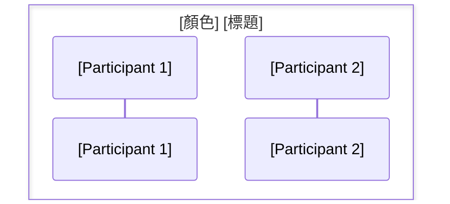

### 使用情境

#### 情境 1：表示架構層級關係

**何時使用：**
- 當你需要明確表示多個 participants 屬於同一個架構層級時
- 例如：多個 Package 都屬於 App 層級
- 例如：多個 Repository 都屬於 Data Infrastructure Layer

**範例：**

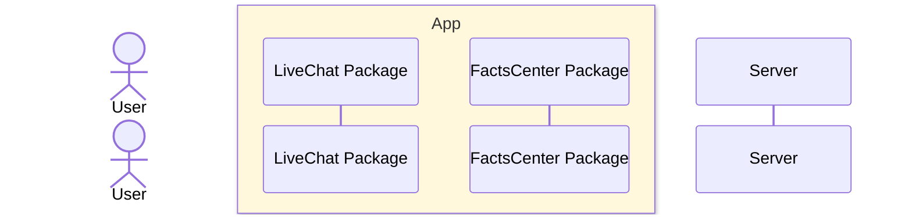

**說明：**
- 使用 `box` 語法將 `LiveChat Package` 和 `FactsCenter Package` 包在 "App" 框內
- 清楚表示這兩個 Package 都屬於 App 層級
- 使用黃色背景（rgb(255, 248, 220)）來視覺化區分

**Prompt 範例：**
```
幫我使用 box 語法將 LiveChat Package 和 FactsCenter Package 包在 "App" 框內
```
```
我需要表示架構層級關係，請使用 box 語法將這些 Package 包在 App 框內
```
```
請參考 common_mermaid_modifications.md，使用 box 語法將這些 participants 分組，表示它們屬於 App 層級
```

#### 情境 2：表示模組分組

**何時使用：**
- 當流程圖中有多個相關的模組，需要分組展示時
- 例如：UI Layer、Domain Layer、Data Infrastructure Layer 等分層架構

**範例：**

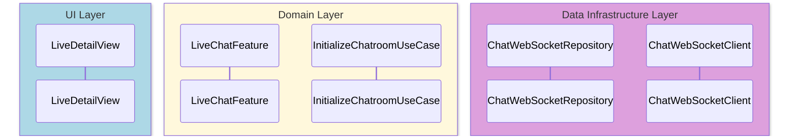

**說明：**
- 使用不同顏色的 box 來區分不同的架構層級
- 每個 box 內包含該層級的相關 participants
- 清楚展示分層架構的關係

**Prompt 範例：**
```
請使用 box 語法將 participants 按照 UI Layer、Domain Layer、Data Infrastructure Layer 分組
```
```
我需要展示分層架構，請使用不同顏色的 box 來區分不同的層級
```
```
請參考 common_mermaid_modifications.md，使用 box 語法建立分層架構，包含 UI Layer、Domain Layer 和 Data Infrastructure Layer
```

#### 情境 3：表示服務邊界

**何時使用：**
- 當需要表示微服務架構中的服務邊界時
- 當需要區分不同的系統或服務時

**範例：**

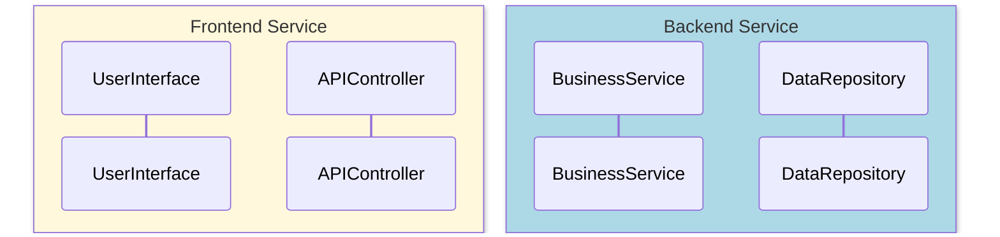

**Prompt 範例：**
```
請使用 box 語法將 Frontend Service 和 Backend Service 的 participants 分組
```
```
我需要表示微服務架構的服務邊界，請使用 box 語法區分不同的服務
```
```
請參考 common_mermaid_modifications.md，使用 box 語法表示服務邊界，區分 Frontend Service 和 Backend Service
```

### 顏色建議

- **App/Domain Layer**：`rgb(255, 248, 220)`（淺黃色）
- **UI Layer**：`rgb(173, 216, 230)`（淺藍色）
- **Data Infrastructure Layer**：`rgb(221, 160, 221)`（淺紫色）
- **External Service**：`rgb(255, 228, 225)`（淺粉紅色）

### 注意事項

1. **Box 位置**：`box` 語法必須放在 `participant` 定義之前
2. **Box 範圍**：Box 只會包住 participants 的定義，不會包住互動流程
3. **顏色格式**：使用 `rgb(r, g, b)` 格式指定顏色
4. **標題**：Box 的標題會顯示在框框上方

---

## 2. 使用 Rect 語法標註時間段

### 語法

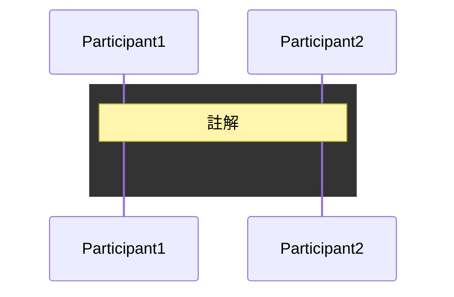

### 使用情境

**何時使用：**
- 當需要標註特定時間段內發生的事情時
- 當需要強調某個流程階段時
- 當需要為一組互動添加背景色時

**範例：**

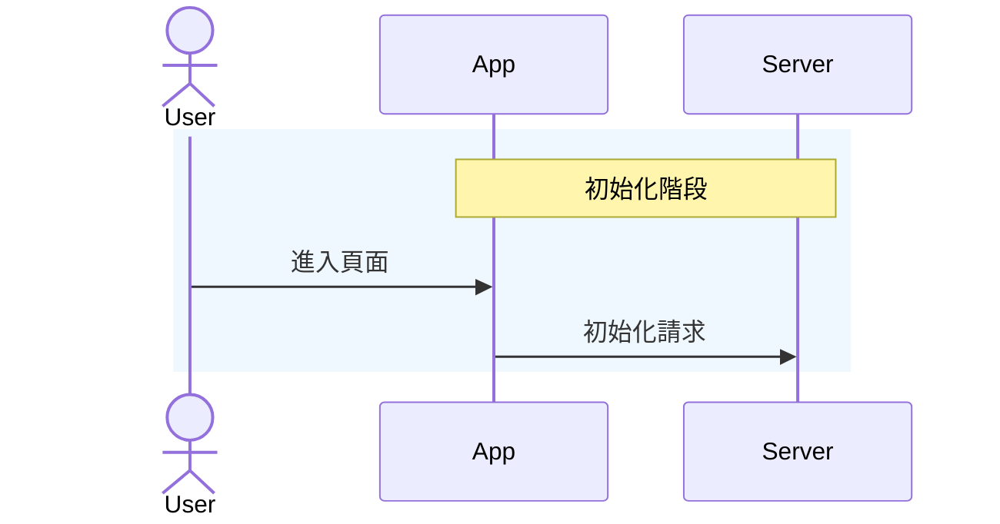

**Prompt 範例：**
```
請使用 rect 語法標註「初始化階段」這個時間段，並為相關的互動添加背景色
```
```
我需要強調某個流程階段，請使用 rect 語法為這組互動添加背景色
```
```
請參考 common_mermaid_modifications.md，使用 rect 語法標註特定時間段內發生的事情
```

---

## 3. 新增 Participants

### 語法

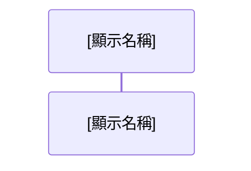

### 使用情境

**何時使用：**
- 當流程中需要新增參與者時
- 當需要為 participant 設定更清晰的顯示名稱時

**範例：**

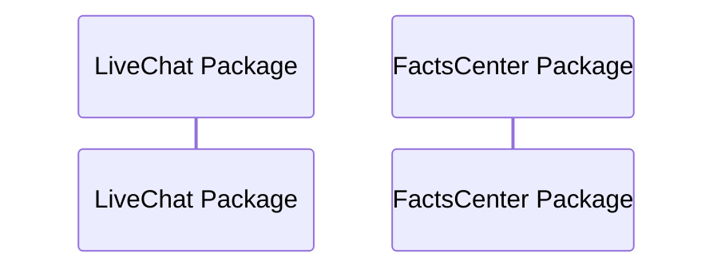

**Prompt 範例：**
```
請新增一個 participant，名稱為 "LiveChat Package"
```
```
我需要為 participant 設定更清晰的顯示名稱，請使用 "as" 語法
```
```
請參考 common_mermaid_modifications.md，新增一個 participant，別名為 LiveChat，顯示名稱為 "LiveChat Package"
```

---

## 4. 新增條件分支

### 語法

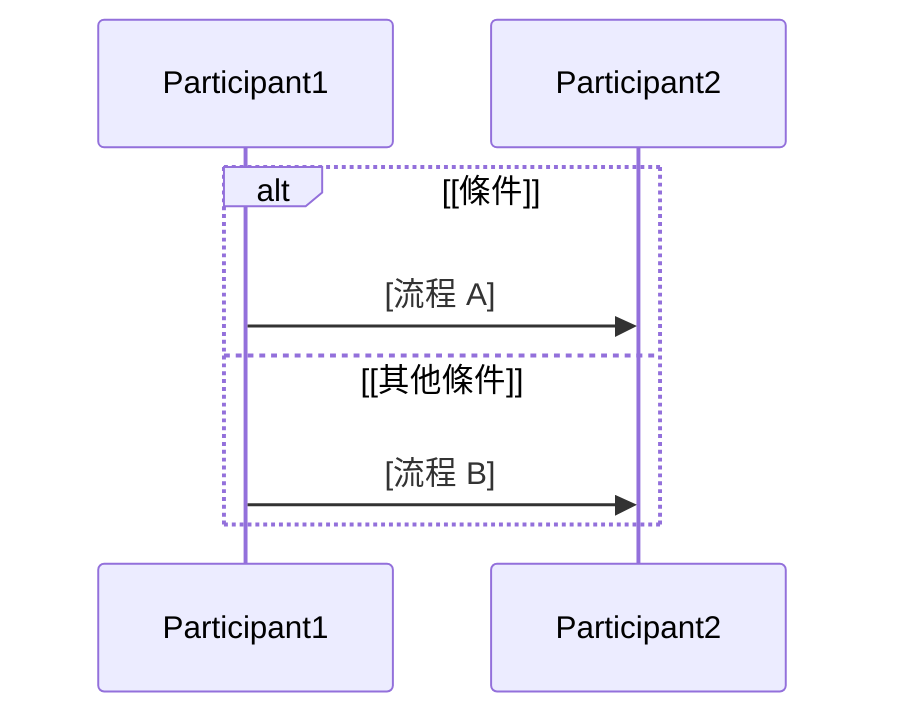

### 使用情境

**何時使用：**
- 當流程中有條件判斷時
- 當需要展示不同的執行路徑時

**範例：**

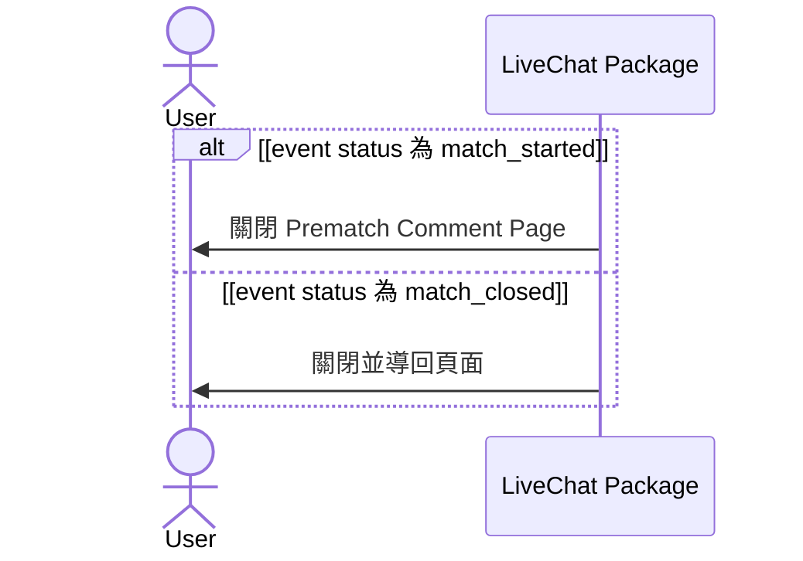

**Prompt 範例：**
```
請加入條件分支，當 event status 為 match_started 時執行一個流程，為 match_closed 時執行另一個流程
```
```
我需要展示不同的執行路徑，請使用 alt/else 語法加入條件分支
```
```
請參考 common_mermaid_modifications.md，使用 alt 語法加入條件判斷，根據不同的 event status 執行不同的流程
```

---

## 5. 新增註解

### 語法

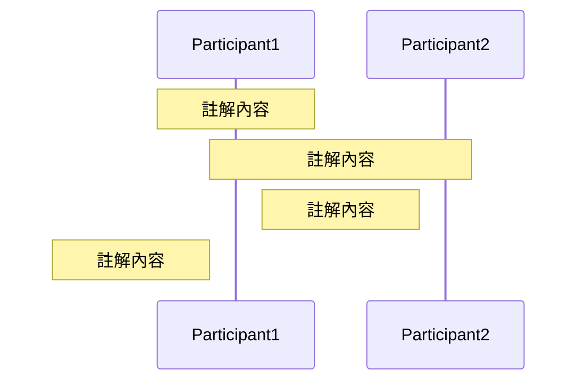

### 使用情境

**何時使用：**
- 當需要為流程添加說明時
- 當需要標註重要提醒時
- 當需要說明技術細節時

**範例：**

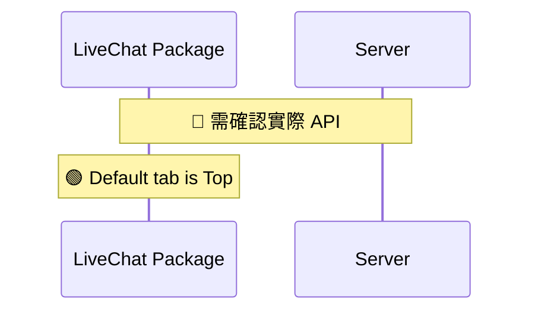

**Prompt 範例：**
```
請在 LiveChat 和 Server 之間添加一個註解，說明「需確認實際 API」
```
```
我需要標註重要提醒，請使用 note 語法添加註解
```
```
請參考 common_mermaid_modifications.md，使用 note over 語法為流程添加說明和技術細節
```

---

## 6. 修改訊息方向

### 語法

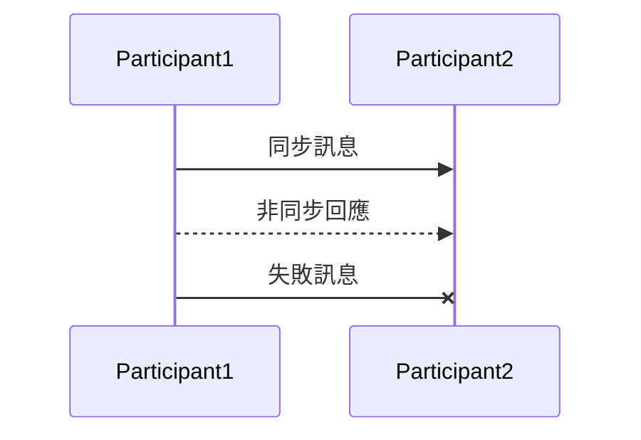

### 使用情境

**何時使用：**
- 當需要區分同步和非同步呼叫時
- 當需要表示訊息失敗時

**Prompt 範例：**
```
請將這個訊息改為非同步回應，使用 -->> 語法
```
```
我需要表示訊息失敗，請使用 -x 語法
```
```
請參考 common_mermaid_modifications.md，使用不同的箭頭語法區分同步、非同步和失敗訊息
```

---

## 快速參考表

| 需求 | 語法 | 使用情境 |
|------|------|----------|
| 分組 Participants | `box [顏色] [標題]` | 表示架構層級、模組分組、服務邊界 |
| 標註時間段 | `rect rgb(顏色)` | 標註特定階段、強調流程 |
| 新增 Participant | `participant [別名] as [名稱]` | 新增參與者 |
| 條件分支 | `alt [條件] ... else ... end` | 條件判斷、不同路徑 |
| 添加註解 | `note over/right of/left of` | 說明、提醒、技術細節 |
| 訊息方向 | `->>`, `-->>`, `-x` | 同步、非同步、失敗 |

---

## 實際應用範例

### 範例 1：完整的分層架構

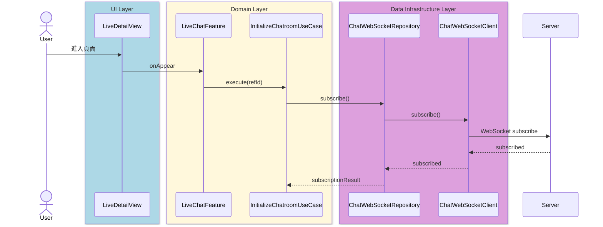

### 範例 2：Package 分組

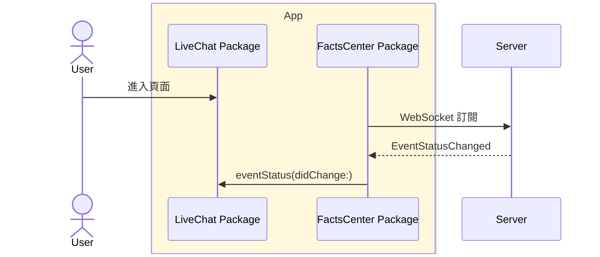

---

## 如何告訴 AI 進行修改

### 方式 1：直接描述需求

```
幫我使用 box 語法將 LiveChat Package 和 FactsCenter Package 包在 "App" 框內
```

### 方式 2：參考本文件

```
請參考 common_mermaid_modifications.md，使用 box 語法將這些 participants 分組
```

### 方式 3：提供具體情境

```
我需要表示架構層級關係，請使用 box 語法將這些 Package 包在 App 框內
```

---

## 注意事項

1. **Box vs Rect**：
   - `box`：用於分組 participants（定義階段）
   - `rect`：用於標註時間段（流程階段）

2. **Box 位置**：必須放在 participant 定義之後、互動流程之前

3. **顏色選擇**：建議使用淺色系，避免影響可讀性

4. **標題命名**：使用清晰、簡潔的標題，例如 "App"、"UI Layer" 等

---

## 相關文件

- `mermaid_to_description_spec.md`：Mermaid 轉自然語言描述規範
- `mermaid_yaml_classification_guide.md`：資訊分類指南

