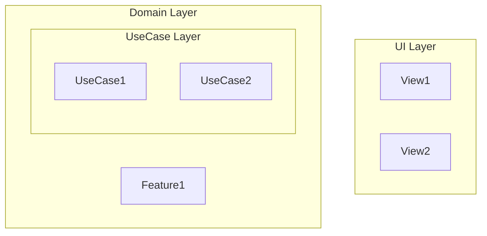
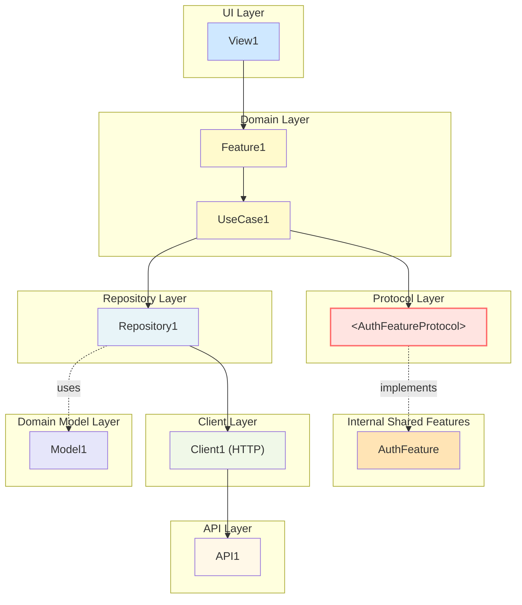

# TDD Architecture Diagram Rules（架構圖拆解與呈現規則）

本文件定義：

1. **架構圖拆解規則**：如何將大型架構圖拆解為多個可管理的子圖
2. **圖表呈現規則**：Mermaid flowchart 的格式、樣式、Protocol 標記方式

---

## 1. 架構圖拆解規則

### 1.1 拆解原則

當架構圖過於龐大、難以閱讀時，應拆解為多個子圖：

1. **按層級拆分**：將不同層級的詳細資訊分開呈現
2. **按 Feature 拆分**：每個 Feature 有獨立的完整架構圖
3. **按模組類型拆分**：Shared Modules、Data Infrastructure 等獨立呈現
4. **概覽 + 詳細**：提供高層級概覽圖和詳細子圖

### 1.2 標準拆解結構

架構圖應按以下結構組織：

```
02_Architecture/
├── README.md                              # 架構圖索引和說明
├── 01_clean_architecture_overview.md      # 整體架構概覽（高層級）
├── 02_{feature}_feature_architecture.md   # 各 Feature 完整架構
├── 03_{feature}_feature_architecture.md   # （多個 Feature 時）
├── 04_shared_modules_architecture.md      # Shared Modules 概覽
├── 04a_internal_shared_modules.md         # 內部 Shared Modules 詳細圖
├── 04b_external_package_integration.md    # 外部 Swift Package 整合詳細圖
├── 05_data_infrastructure_layer.md        # Data & Infrastructure Layer 詳細圖
└── 01_clean_architecture_diagram.md       # 完整架構圖（所有模組，可選）
```

### 1.3 各類型圖表的職責

#### 1.3.1 整體架構概覽（01_clean_architecture_overview.md）

- **目的**：提供高層級的架構視圖
- **內容**：
  - 主要 Layer（UI、Domain、Data & Infrastructure、Domain Model）
  - 各 Layer 的模組數量或代表性模組
  - 層級間的依賴關係
- **特點**：不顯示所有細節，只顯示結構和數量

#### 1.3.2 Feature 完整架構（02_{feature}_feature_architecture.md）

- **目的**：展示單一 Feature 的完整依賴鏈
- **內容**：
  - 相關的 View
  - Feature 和所有 UseCase
  - 使用的 Shared Features
  - 相關的 Repository、Client、API
  - 使用的 Domain Model
- **特點**：完整展示一個 Feature 的所有依賴

#### 1.3.3 Shared Modules 概覽（04_shared_modules_architecture.md）

- **目的**：展示 Shared Modules 的整體架構
- **內容**：
  - 內部 Shared Modules 和外部 Swift Package 的對比
  - Protocol 層的作用
  - 高層級的依賴關係
- **特點**：概覽性質，引用詳細子圖

#### 1.3.4 內部 Shared Modules 詳細圖（04a_internal_shared_modules.md）

- **目的**：詳細展示內部 Shared Modules 的架構
- **內容**：
  - 所有內部 Shared Features（AuthFeature、NicknameFeature 等）
  - Shared Repositories（UserInfoRepository、BlacklistRepository 等）
  - 相關的 Protocol 定義
  - 完整的依賴關係鏈（UseCase → Protocol → Implementation → Client → API）
- **特點**：專注於內部實現

#### 1.3.5 外部 Swift Package 整合詳細圖（04b_external_package_integration.md）

- **目的**：詳細展示外部 Swift Package 的整合方式
- **內容**：
  - 外部 Swift Package
  - Adapter 層（Feature Adapter、Repository Adapter、Client Adapter）
  - Protocol 實現關係
  - 整合流程和資料流向
- **特點**：專注於外部 Package 整合

#### 1.3.6 Data & Infrastructure Layer 詳細圖（05_data_infrastructure_layer.md）

- **目的**：詳細展示數據層和基礎設施層的結構
- **內容**：
  - 所有 Repository、Client、API
  - 它們之間的依賴關係
  - 與 Domain Model 的關係
- **特點**：專注於數據層

### 1.4 拆解時機

以下情況應考慮拆解：

1. **圖表過大**：單一圖表包含超過 20 個節點
2. **關係複雜**：依賴關係過多，難以追蹤
3. **關注點分離**：不同關注點（如內部 vs 外部）混在一起
4. **可讀性差**：圖表難以理解或維護

### 1.5 README.md 組織

`02_Architecture/README.md` 應包含：

1. **說明**：架構圖的組織方式
2. **架構圖列表**：所有架構圖的連結和簡短說明
3. **建議閱讀順序**：引導讀者按順序閱讀

---

## 2. 圖表呈現規則

### 2.1 Mermaid 圖表類型

**必須使用 `flowchart TD` 格式**（Top-Down 流程圖），不使用 `classDiagram`。

### 2.2 Layer 分層（垂直呈現）

圖表應從上到下按 Layer 分層：

1. **UI Layer**（最上層）
2. **Domain Layer**（Feature + UseCase）
3. **Protocol Layer**（如有 Shared Modules）
4. **Internal Implementation Layer**（內部實現）
5. **Adapter Layer**（外部 Package 整合時）
6. **Repository Layer**
7. **Client Layer**
8. **API Layer**
9. **Domain Model Layer**（最下層）

### 2.3 subgraph 使用規範

使用 `subgraph` 來組織不同 Layer：



**注意**：
- subgraph 標籤使用中文（如 `["UI Layer"]`）
- 可以嵌套 subgraph（如 Domain Layer 內包含 UseCase Layer）

### 2.4 Protocol 標記方式

**Protocol 必須使用 HTML 實體編碼**來顯示角括號：

```mermaid
AuthFeatureProtocol["&lt;AuthFeatureProtocol&gt;"]
```

**規則**：
- 使用 `&lt;` 表示 `<`
- 使用 `&gt;` 表示 `>`
- Protocol 名稱完整顯示在角括號內
- **禁止**使用 `["<AuthFeatureProtocol>"]`（會導致文字不顯示）
- **禁止**使用 `["AuthFeatureProtocol<br/>&lt;Protocol&gt;"]`（過於複雜）

### 2.5 關係箭頭規範

#### 2.5.1 依賴關係（Dependency）

- **符號**：`-->` （實線箭頭）
- **方向**：從依賴者指向被依賴者
- **語意**：A 依賴 B，表示 A 使用 B 但 B 不是 A 的一部分
- **範例**：
  ```mermaid
  UseCase --> Repository
  Repository --> Client
  ```

#### 2.5.2 實現關係（Realization/Implementation）

- **符號**：`-.->` （虛線箭頭）
- **方向**：從 Protocol 指向實現類
- **語意**：A 實現了 Protocol B，表示 `A conforms to B`
- **標籤**：可加上 `|implements|` 標籤
- **範例**：
  ```mermaid
  AuthFeatureProtocol -.->|implements| AuthFeature
  ```

#### 2.5.3 使用關係（Usage）

- **符號**：`-.->` （虛線箭頭）
- **語意**：A 使用 B，通常用於表示使用 Domain Model
- **標籤**：可加上 `|uses|` 標籤
- **範例**：
  ```mermaid
  Repository -.->|uses| DomainModel
  ```

### 2.6 樣式規範（classDef）

使用 `classDef` 定義各 Layer 的樣式：

```mermaid
%% Styling
classDef uiLayer fill:#CFE8FF
classDef domainLayer fill:#FFFACD
classDef protocolLayer fill:#FFE4E1,stroke:#FF6B6B,stroke-width:2px
classDef internalFeature fill:#FFE4B5
classDef repositoryLayer fill:#E8F4F8
classDef clientLayer fill:#F0F8E8
classDef apiLayer fill:#FFF8E8
classDef domainModel fill:#E6E6FA
classDef adapterLayer fill:#DDA0DD
classDef externalPackage fill:#E6F3FF

%% 應用樣式
class View1,View2 uiLayer
class Feature1,UseCase1,UseCase2 domainLayer
class AuthFeatureProtocol protocolLayer
```

**標準顏色定義**：

| Layer | 顏色 | 說明 |
|-------|------|------|
| UI Layer | `#CFE8FF` | 淺藍色 |
| Domain Layer | `#FFFACD` | 淺黃色 |
| Protocol Layer | `#FFE4E1` | 淺紅色，紅色邊框 |
| Internal Feature | `#FFE4B5` | 淺橙色 |
| Repository Layer | `#E8F4F8` | 淺青色 |
| Client Layer | `#F0F8E8` | 淺綠色 |
| API Layer | `#FFF8E8` | 淺米色 |
| Domain Model | `#E6E6FA` | 淺紫色 |
| Adapter Layer | `#DDA0DD` | 淺紫色 |
| External Package | `#E6F3FF` | 淺藍色 |

### 2.7 節點命名規範

#### 2.7.1 節點 ID

- 使用駝峰命名（CamelCase）
- 與實際類名或模組名一致
- 範例：`AuthFeatureProtocol`、`PrematchCommentRepository`

#### 2.7.2 節點顯示文字

- 使用實際類名或模組名
- Protocol 使用 `&lt;ProtocolName&gt;` 格式
- 可加上額外說明（用括號或換行）：
  ```mermaid
  UserInfoClient["UserInfoClient (HTTP)"]
  PersonalPageFeature["PersonalPageFeature<br/>(Adapter)"]
  ```

### 2.8 註解規範

在 Mermaid 代碼中使用註解說明：

```mermaid
%% UseCase 依賴 Protocol
PublishCommentUseCase --> AuthFeatureProtocol

%% 內部 Shared Features 實現 Protocol
AuthFeatureProtocol -.->|implements| AuthFeature

%% Repository 使用 Domain Model
UserInfoRepository -.->|uses| UserInfo
```

**註解規則**：
- 使用 `%%` 開頭
- 用中文說明關係的語意
- 在相關關係前添加註解

---

## 3. 架構文件內容呈現規則

### 3.1 表格優先原則

**架構文件中的所有說明性內容，應盡可能使用表格呈現**，以便快速查找與比較。

### 3.2 應使用表格的內容類型

以下類型的內容應優先使用表格：

1. **層級說明**：各 Layer 的職責、包含模組等
2. **模組說明**：UI Layer、Domain Layer、Shared Features、Domain Model、Data & Infrastructure Layer 的模組列表
3. **依賴關係說明**：依賴方向、關係類型等
4. **Repository / Client / API 說明**：職責、提供方法、使用的 Client/API 等
5. **Shared Features / Repositories 說明**：來源、職責、被使用的 UseCase 等
6. **特殊說明**：WebSocket 架構、黑名單機制等特性說明
7. **規則說明**：依賴規則、模組收斂說明等

### 3.3 表格格式規範

#### 3.3.1 表格欄位設計

根據內容類型設計合適的表格欄位：

**層級說明表格欄位**：
- Layer
- 子層級
- 職責
- 包含模組

**模組說明表格欄位**：
- 模組名稱
- 層級（如適用）
- 職責
- 類型（如適用，如 Entity / Value Object）
- 被使用的 UseCase（如適用）

**依賴關係表格欄位**：
- 依賴方向
- 說明
- 關係類型

**Repository / Client / API 表格欄位**：
- 名稱
- 層級
- 職責
- 提供方法 / Endpoints
- 使用的 Client / API
- DTO → Domain Model Mapping（如適用）
- 特殊說明（如適用）

**Shared Features / Repositories 表格欄位**：
- 名稱
- 來源
- 職責
- 提供方法
- 實現方式
- 被使用的 UseCase
- 使用的 Client / API（如適用）
- 共用原因

#### 3.3.2 表格內容格式規範

**重要規則**：所有在表格的欄位中，若有要分行表示的，都用 number list（數字列表）的方式進行分行。

**範例**：

- ❌ 錯誤：使用 bullet point (`•`) 或直接換行
  ```
  | 提供方法 | • `getUserInfo()`<br>• `getUserProfile()` |
  ```

- ✅ 正確：使用 number list
  ```
  | 提供方法 | 1. `getUserInfo()`<br>2. `getUserProfile()` |
  ```

**換行方式**：
- 使用 `<br>` 標籤進行換行
- 每個項目使用數字編號（1. 2. 3.）

### 3.4 表格範例

#### 層級說明表格範例

| Layer | 子層級 | 職責 | 包含模組 |
|-------|--------|------|----------|
| **UI Layer** | - | 1. 接收使用者互動<br>2. 顯示 UI<br>3. 觸發 Feature Action | 1. RaceDetailView<br>2. PrematchCommentView<br>3. LiveDetailView |
| **Domain Layer** | Feature Layer | 1. UI orchestration<br>2. Action 轉換<br>3. State 管理 | 1. PrematchCommentFeature<br>2. LiveChatFeature |

#### 模組說明表格範例

| 模組名稱 | 層級 | 職責 |
|---------|------|------|
| **PrematchCommentFeature** | Feature Layer | TCA Reducer，管理評論相關的 State 和 Action |
| **ReloadCommentListUseCase** | UseCase Layer | 載入評論列表（支援 top/newest 模式） |

#### 依賴關係表格範例

| 依賴方向 | 說明 | 關係類型 |
|---------|------|---------|
| **UI → Feature** | View 觸發 Feature Action | 依賴 |
| **Feature → UseCase** | Feature 呼叫 UseCase 執行商業邏輯 | 依賴 |

#### Repository 說明表格範例

| Repository 名稱 | 職責 | 提供方法 | 使用的 Client | DTO → Domain Model Mapping |
|----------------|------|---------|--------------|---------------------------|
| **PrematchCommentRepository** | Domain 資料來源的抽象介面（評論相關） | 1. `getCommentMeta(refId: String) -> CommentMeta`<br>2. `getComments(...)` | PrematchCommentClient | 1. Comment DTO → Comment Entity<br>2. CommentMeta DTO → CommentMeta Entity |

### 3.5 何時不使用表格

以下情況可以不使用表格：

1. **架構圖本身**：Mermaid 圖表不需要表格
2. **流程說明**：複雜的流程描述，表格無法清楚表達
3. **代碼範例**：程式碼範例應使用代碼區塊
4. **簡短的單一說明**：只有一兩句話的簡單說明

---

## 4. 完整範例

### 4.1 基本架構圖範例



---

## 5. 與其他規範的關係

本規範需與以下規範共同使用：

- **TDD Layers & Responsibilities**：定義各 Layer 的職責和依賴方向
- **TDD Module Consolidation Rules**：定義模組收斂策略
- **TDD Sequence & Mermaid Rules**：定義序列圖規範

**優先級**：
1. TDD Layers & Responsibilities（最高優先級）
2. TDD Architecture Diagram Rules（本文件）
3. 其他規範文件

---

## 6. 檢查清單

生成架構圖和文件時，請確認：

**圖表相關**：
- [ ] 使用 `flowchart TD` 格式
- [ ] Protocol 使用 `&lt;ProtocolName&gt;` 格式
- [ ] 使用 `subgraph` 組織 Layer
- [ ] 依賴關係使用實線箭頭 `-->`
- [ ] 實現關係使用虛線箭頭 `-.->`
- [ ] 定義並應用 `classDef` 樣式
- [ ] 圖表按垂直方向分層（從上到下）
- [ ] 添加中文註解說明關係
- [ ] 若圖表過大，考慮拆解為多個子圖
- [ ] 在 README.md 中提供所有圖表的索引

**內容呈現相關**：
- [ ] 層級說明使用表格呈現
- [ ] 模組說明使用表格呈現
- [ ] 依賴關係說明使用表格呈現
- [ ] Repository / Client / API 說明使用表格呈現
- [ ] Shared Features / Repositories 說明使用表格呈現
- [ ] 表格中的多行內容使用 number list（1. 2. 3.）格式
- [ ] 表格中的換行使用 `<br>` 標籤

