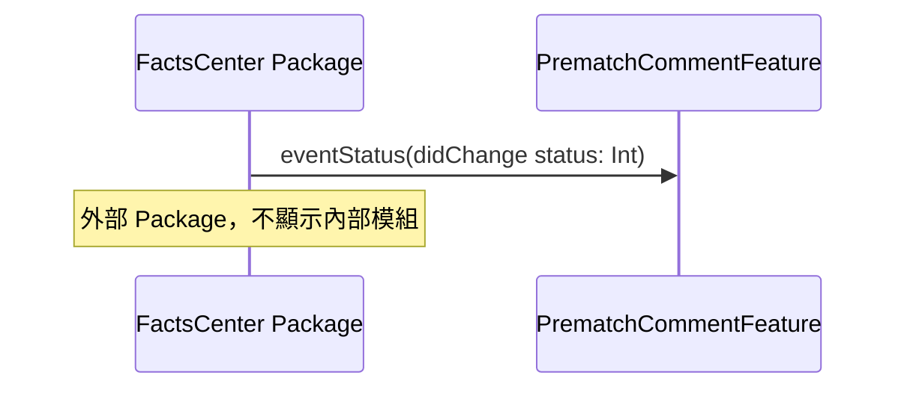
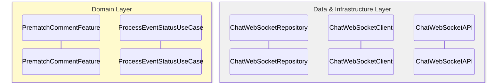
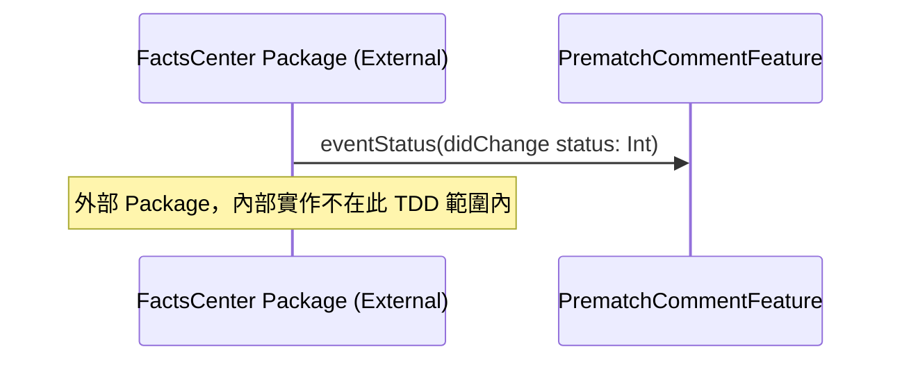
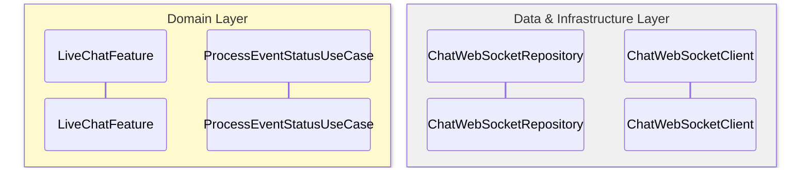

# TDD Input 資料處理規範

本文件定義如何處理 `Input/` 目錄下的資料結構，並將其轉換為 TDD 文件。

---

## 1. Input 目錄結構規範

### 1.1 標準目錄結構

```
Input/
└── {Feature組合名稱}/
    └── Mermaid/
        └── {Feature名稱}/
            ├── README.md              # Feature 說明文件
            └── [流程資料夾]/
                ├── mermaid.md         # Mermaid 流程圖代碼
                ├── description.md     # 自然語言敘述
                └── flow_spec.yaml     # YAML 規格檔
```

### 1.2 文件說明

| 文件 | 說明 | 必填 |
|------|------|------|
| `mermaid.md` | Mermaid 流程圖代碼，包含 `@feature` 和 `@flow` 標註 | ✅ |
| `description.md` | 自然語言敘述，描述業務流程和技術細節 | ✅ |
| `flow_spec.yaml` | 結構化的 YAML 規格檔，包含補充資訊 | ✅ |

---

## 2. Input 資料解析流程

### 2.1 讀取 Input 資料

當使用者要求從 Input 目錄生成 TDD 時，必須：

1. **掃描 Input 目錄結構**
   - 識別所有 Feature 資料夾
   - 識別每個 Feature 下的所有流程資料夾

2. **讀取流程文件**
   - 讀取 `mermaid.md` 提取 Mermaid 代碼
   - 讀取 `description.md` 提取自然語言敘述
   - 讀取 `flow_spec.yaml` 提取結構化補充資訊

3. **建立 Flow 關聯**
   - 根據 `flow_spec.yaml` 中的 `flow_id`、`parent_flow_id` 建立 Flow 關係
   - 識別主流程（`flow_type: Full`）和子流程（`flow_type: Sub`）

### 2.2 資料整合

將多個來源的資料整合：

1. **Mermaid 代碼**（來自 `mermaid.md` 或 `flow_spec.yaml.mermaid_code`）
   - 提取 participants、互動流程、條件分支等

2. **自然語言敘述**（來自 `description.md` 或 `flow_spec.yaml.description`）
   - 提取業務背景、技術備註、使用情境等

3. **結構化補充資訊**（來自 `flow_spec.yaml`）
   - `api_endpoints`：API 端點資訊
   - `scenarios`：情境說明
   - `user_actions`：用戶操作
   - `system_behaviors`：系統行為
   - `notes`：技術備註

---

## 3. Package 層級處理規範

### 3.1 Package 識別

在 Mermaid 代碼中，Package 層級的 participants 使用 `box` 語法分組：

```mermaid
box rgb(255, 248, 220) App
    participant LiveChat as LiveChat Package
    participant FactsCenter as FactsCenter Package
end
```

### 3.2 Package 類型判斷規則

#### 3.2.1 判斷依據

Package 的類型（External 或 Internal）應從以下來源判斷：

1. **YAML metadata（優先）**
   - 在 `flow_spec.yaml` 的 `system_behaviors` 中，如果包含 `package_type: external` 或 `package_type: internal`
   - 在 `flow_spec.yaml` 的頂層，可以添加 `packages` 區塊定義 Package 類型

2. **描述中的關鍵字（次要）**
   - **外部 Package 的關鍵字**：
     - "外部 Package"、"外部 Swift Package"、"external package"
     - "尚未實作"、"無法控制"、"由其他團隊維護"
     - "建議解耦"、"建議透過 Notification Center"
   - **內部 Package 的關鍵字**：
     - "內部 Package"、"internal package"
     - "本專案維護"、"由我們維護"

3. **預設判斷（最後）**
   - 如果無法從上述來源判斷，預設為 **Internal Package**
   - 但應在 TDD 文件中標註為「待確認」

#### 3.2.2 YAML 定義格式（建議）

在 `flow_spec.yaml` 中，建議添加 `packages` 區塊：

```yaml
packages:
  - name: FactsCenter Package
    type: external  # external 或 internal
    description: 外部 Swift Package，由其他團隊維護
  - name: LiveChat Package
    type: external
    description: 外部 Swift Package，由其他團隊維護
```

或在 `system_behaviors` 中標註：

```yaml
system_behaviors:
  - behavior: 訂閱事件狀態
    package: FactsCenter Package
    package_type: external  # 新增欄位
    ...
```

### 3.3 Package 處理規則

#### 3.3.1 外部 Package（External Package）

**特徵**：
- 由其他團隊或第三方維護
- 無法控制其內部實作
- 只能透過公開的 interface 或 API 互動

**在序列圖中的處理**：
- ✅ **只顯示 Package 本身**（作為黑盒）
- ✅ **只顯示公開的 interface 或方法**
- ❌ **不畫出內部模組**（Repository、Client、API 等）
- ❌ **不畫出內部交互流程**

**範例**：


#### 3.3.2 內部 Package（Internal Package）

**特徵**：
- 由本專案維護
- 可以控制其內部實作
- 需要完整展示內部架構

**在序列圖中的處理**：
- ✅ **顯示完整的內部模組**（Feature、UseCase、Repository、Client、API）
- ✅ **顯示完整的內部交互流程**
- ✅ **遵循 Clean Architecture 分層**

**範例**：


### 3.4 Package 轉換為 TDD 模組

當 Package 出現在 Mermaid 中時，需要：

1. **識別 Package 的類型**
   - 從 YAML metadata 或描述中判斷是 External 還是 Internal
   - 如果無法判斷，標註為「待確認」

2. **識別 Package 的職責**
   - 從 `description.md` 和 `flow_spec.yaml` 中提取 Package 的職責說明

3. **映射到 Clean Architecture 層級**
   - **外部 Package**：視為 External Package，在架構圖中標註
   - **內部 Package**：根據 Package 的職責，映射到對應的 Layer（UI / Domain / Data & Infrastructure）

4. **處理 Package 依賴**
   - **外部 Package**：使用 Adapter Pattern，只顯示公開 interface
   - **內部 Package**：直接整合到對應的 Layer，顯示完整架構

### 3.5 序列圖中的 Package 表示規範

#### 3.5.1 外部 Package 表示



**規則**：
- 使用 `(External)` 標註在 participant 名稱中
- 不畫出內部模組
- 只顯示與當前 Feature 的互動
- **不使用 `rect` 語法**：不應使用 `rect` 來標註 External Package 的互動區域
  - External Package 的識別應透過 participant 名稱中的 `(External)` 標註和 Note 說明
  - `rect` 會產生額外的視覺框框，影響序列圖的簡潔性和可讀性

#### 3.5.2 內部 Package 表示



**規則**：
- 展開為完整的 Clean Architecture 分層
- 顯示所有內部模組和交互流程

---

## 4. 跨 Package 通訊規範

### 4.1 Interface 識別

在 Mermaid 和 description 中，跨 Package 通訊通常透過 interface 進行：

```
FactsCenter->>LiveChat: eventStatus(didChange status: Int)
note over FactsCenter,LiveChat: FactsCenter Package 透過 interface 通知 LiveChat Package
```

### 4.2 Interface 處理規則

1. **提取 Interface 定義**
   - 從 Mermaid 訊息中提取 interface method 簽名
   - 從 `description.md` 或 `flow_spec.yaml` 中提取 interface 說明

2. **建立 Protocol 定義**
   - 在 TDD 的 Architecture 章節中定義 Protocol
   - 使用標準 UML 格式標註 Protocol 關係

3. **處理解耦建議**
   - 如果 `flow_spec.yaml` 中有架構建議（如使用 Notification Center），應在 TDD 中標註
   - 在 Architecture 章節中提供解耦方案

### 4.3 Interface 到 Protocol 轉換

```
Mermaid 中的 interface：
FactsCenter->>LiveChat: eventStatus(didChange status: Int)

轉換為 TDD 中的 Protocol：
protocol EventStatusNotifiable {
    func eventStatus(didChange status: Int)
}
```

---

## 5. WebSocket 訂閱處理規範

### 5.1 WebSocket 識別

在 Mermaid 中，WebSocket 訂閱通常表現為：

```
FactsCenter->>Server: WebSocket 訂閱 Event Status
Server-->>FactsCenter: EventStatusChanged
```

### 5.2 WebSocket 處理規則

1. **識別 WebSocket Repository**
   - WebSocket 訂閱應對應到 `ChatWebSocketRepository` 或類似的 Repository
   - 在 Module Responsibility 中標註 WebSocket 相關的職責

2. **處理訂閱流程**
   - 訂閱流程應對應到 UseCase（如 `SubscribeEventStatusUseCase`）
   - 在 Module Sequence Diagram 中詳細描述訂閱流程

3. **處理事件接收**
   - 事件接收應對應到 UseCase（如 `ProcessEventStatusChangeUseCase`）
   - 在 Module Sequence Diagram 中描述事件處理流程

### 5.3 WebSocket 到 TDD 模組映射

```
Mermaid 中的 WebSocket 訂閱：
FactsCenter->>Server: WebSocket 訂閱 Event Status

轉換為 TDD 模組：
- Repository: EventStatusWebSocketRepository
- Client: EventStatusWebSocketClient
- API: EventStatusWebSocketAPI
- UseCase: SubscribeEventStatusUseCase
```

---

## 6. YAML Flow Spec 到 TDD 轉換規範

### 6.1 Flow Spec YAML 結構

```yaml
features:
  {FeatureName}:
    flows:
      - flow_id: {FLOW_ID}
        flow_type: {Full|Sub}
        flow_name: {流程名稱}
        parent_flow_id: {父流程ID|null}
        parent_flow_name: {父流程名稱|null}
        original_annotation: "@flow: {Full|Sub}"
        mermaid_code: |
          [完整的 Mermaid 代碼]
        description: |
          [完整的自然語言敘述]
        api_endpoints: [...]
        notes: [...]
        scenarios: [...]
        user_actions: [...]
        system_behaviors: [...]
```

### 6.2 轉換規則

#### 6.2.1 API Endpoints → API Spec & Mapping

將 `api_endpoints` 轉換為 TDD 的 `08_API Spec & Mapping` 章節：

```yaml
api_endpoints:
  - path: GET /chat/match/comment/popular
    method: GET
    description: 取得熱門留言（按讚數排序）
    response: comments (sorted by like)
```

轉換為：

```markdown
| API | Method | 說明 | Request | Response | 所屬 Repository |
|-----|--------|------|---------|----------|----------------|
| GET /chat/match/comment/popular | GET | 取得熱門留言（按讚數排序） | - | comments (sorted by like) | PrematchCommentRepository |
```

#### 6.2.2 Scenarios → Test Scenarios

將 `scenarios` 轉換為 TDD 的 `10_Test Scenarios` 章節：

```yaml
scenarios:
  - name: 切換至 Newest 標籤
    description: 當用戶切換至 Newest tab 時的行為
    condition: App 判斷目前為 Newest tab
    actions:
      - App 向伺服器發送 GET /chat/match/comment/newest 請求
    response: 回傳按時間排序的留言列表
```

轉換為：

```markdown
### 測試案例：切換至 Newest 標籤

**描述**：當用戶切換至 Newest tab 時的行為

**前置條件**：
- 用戶已進入 Prematch Comment Page
- 目前顯示 Top 標籤

**測試步驟**：
1. 用戶點擊 Newest 標籤
2. App 判斷目前為 Newest tab
3. App 向伺服器發送 GET /chat/match/comment/newest 請求

**預期結果**：
- 回傳按時間排序的留言列表
- UI 更新顯示 Newest 標籤的內容
```

#### 6.2.3 User Actions → UseCase Input & Output Model

將 `user_actions` 轉換為 TDD 的 `07_UseCase Input & Output Model` 章節：

```yaml
user_actions:
  - action: 切換 tab
    description: 用戶在 Top 和 Newest 標籤之間切換
    triggers:
      - 根據當前標籤取得對應的留言列表
```

轉換為：

```markdown
### SwitchCommentTabUseCase

**Input Model**：
- `currentTab: SortMode`（當前標籤：Top 或 Newest）

**Output Model**：
- `comments: [Comment]`（對應標籤的留言列表）
- `sortMode: SortMode`（更新後的標籤）

**觸發條件**：用戶在 Top 和 Newest 標籤之間切換
```

#### 6.2.4 System Behaviors → Module Responsibility

將 `system_behaviors` 轉換為 TDD 的 `03_Module Responsibility` 章節：

```yaml
system_behaviors:
  - behavior: 預設顯示 Top 標籤
    description: 進入 Prematch Comment Page 時預設顯示 Top 標籤
    api: GET /chat/match/comment/popular
    note: 🟢 Default tab is Top
```

轉換為：

```markdown
| 模組名稱 | 層級 | 職責 | 提供方法 |
|---------|------|------|---------|
| PrematchCommentFeature | Domain Layer - Feature Layer | 進入 Prematch Comment Page 時預設顯示 Top 標籤 | `onAppear()` |
| ReloadCommentListUseCase | Domain Layer - UseCase Layer | 載入留言列表，預設使用 Top 模式 | `execute(triggerType: .init, mode: .top, refId: String)` |
```

#### 6.2.5 Notes → Error Handling / Risks & Questions

將 `notes` 轉換為 TDD 的 `09_Error Handling` 或 `11_Risks & Questions` 章節：

```yaml
notes:
  - 個人資訊 API 目前為待定（TBD），需與相關人員確認實際端點
```

轉換為：

```markdown
### Risks & Questions

| 風險/問題 | 影響 | 建議解決方案 |
|----------|------|------------|
| 個人資訊 API 目前為待定（TBD） | 無法確定實際 API 端點 | 需與 Eason 確認實際 API，或確認是否可與 Han 的流程串接 |
```

---

## 7. 多流程整合規範

### 7.1 主流程與子流程整合

當有多個 Flow（主流程和子流程）時，需要：

1. **識別 Flow 關係**
   - 根據 `parent_flow_id` 建立 Flow 樹狀結構
   - 主流程（`flow_type: Full`）為根節點
   - 子流程（`flow_type: Sub`）為子節點

2. **整合到 Integrated Service-Level Sequence Diagram**
   - 將主流程和子流程整合到 ISSD 中
   - 標註 Flow 之間的關係和觸發條件

3. **生成 Module Sequence Diagram**
   - 每個 Flow 生成對應的 Module Sequence Diagram
   - 在 README 中標註 Flow 關係

### 7.2 Flow 關聯處理

在生成 TDD 時，必須：

1. **建立 Flow 索引**
   - 在 `05. Module Sequence Diagram（模組序列圖）/README.md` 中建立 Flow 關係表
   - 標註每個 Flow 的 `flow_id`、`flow_type`、`parent_flow_id`

2. **標註 Flow 資訊**
   - 在每個 Module Sequence Diagram 文件中使用 YAML Front Matter 標註 Flow 資訊：
     ```yaml
     ---
     feature: PrematchComment
     flow_id: PC-SUB-001
     flow_type: Sub
     flow_name: Event Status 訂閱與通知流程
     parent_flow_id: PC-FULL-001
     parent_flow_name: 用戶進入 Upcoming Race Page, Prematch Comment Page 與 Top
     original_annotation: "@flow: Sub"
     ---
     ```

---

## 8. 處理流程總結

### 8.1 標準處理流程

```
1. 讀取 Input 目錄結構
   ↓
2. 解析每個 Flow 的資料（mermaid.md, description.md, flow_spec.yaml）
   ↓
3. 識別 Package 層級和跨 Package 通訊
   ↓
4. 處理 WebSocket 訂閱流程
   ↓
5. 將 YAML Flow Spec 轉換為 TDD 章節
   ↓
6. 整合多個 Flow（主流程和子流程）
   ↓
7. 生成完整的 TDD 文件
```

### 8.2 檢查清單

生成 TDD 前，請確認：

- [ ] 已讀取所有 Input 目錄下的文件
- [ ] 已識別所有 Flow 關係（主流程和子流程）
- [ ] 已處理 Package 層級的 participants
- [ ] 已識別跨 Package 通訊的 interface
- [ ] 已處理 WebSocket 訂閱流程
- [ ] 已將 YAML Flow Spec 轉換為對應的 TDD 章節
- [ ] 已建立 Flow 關係索引
- [ ] 已在 Module Sequence Diagram 中標註 Flow 資訊

---

## 9. 範例

### 9.1 讀取 Input 資料

```
請從 Input/LiveChat&PrematchComment/Mermaid/Prematch Comment/ 目錄下讀取所有 Flow 資料，並生成完整的 TDD 文件。
```

### 9.2 處理特定 Flow

```
請處理 Input/LiveChat&PrematchComment/Mermaid/Prematch Comment/Event Status 訂閱與通知流程/ 目錄下的資料，生成對應的 Module Sequence Diagram。
```

---

## 10. 與其他規範的整合

本規範需與以下規範配合使用：

1. **《TDD Sequence & Mermaid Rules》**
   - Package 層級的 box 語法處理
   - Mermaid 代碼解析規範

2. **《TDD Domain, API, Test & TDD Structure》**
   - TDD 章節結構定義
   - API Spec、Test Scenarios 等章節格式

3. **《TDD Architecture Diagram Rules》**
   - Package 在架構圖中的表示方式
   - Protocol 和 Interface 的標註方式

