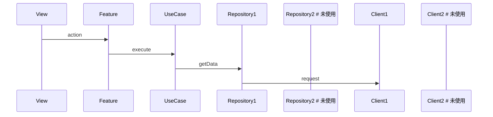
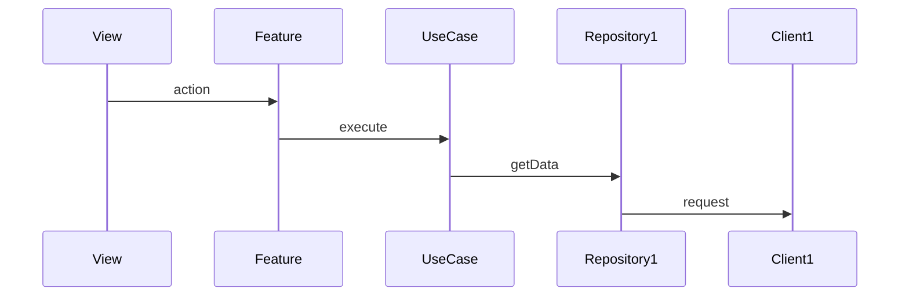
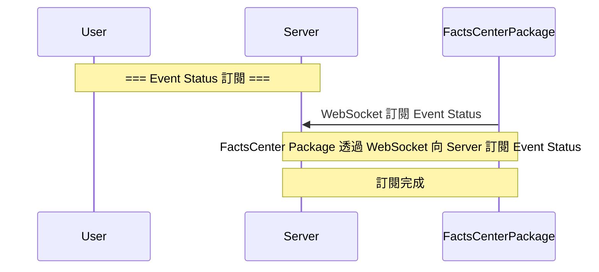
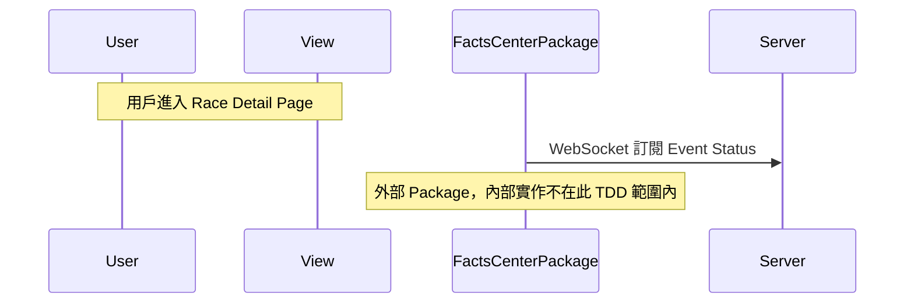
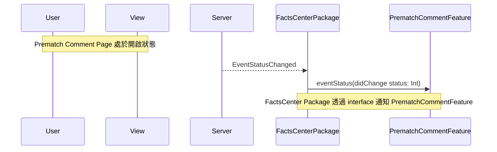

# TDD Sequence & Mermaid Rules

本文件定義：

- 各 View 如何拆出 Use Case 序列圖（View-Level 規範）
- sequenceDiagram 的分層、顏色、Notes 與 User actor 規範
- Mermaid sequenceDiagram 的「安全輸出規範」，確保 mermaid.live 能正常渲染
- Module Sequence Diagram 文件內容呈現規範（表格優先原則）

---

## 1. View-Level Use Case 序列圖產生規範（價值導向）

### 1.1 每個 View 至少應有三類序列圖（若有該行為）

1. **Data Initialization / Refresh**
   - 畫面初始化載入（進入畫面時）
   - 使用者手動 Refresh / Retry

2. **Data Interaction**
   - 任何會變動 Domain 狀態或呼叫 API / WebSocket 的操作  
   - 如：送出留言、載入分頁資料、送出聊天訊息、變更按讚狀態

3. **Structural Navigation**
   - 涉及權限 / Auth / Nickname / Profile 等 Shared Feature 的檢查  
   - 涉及路由跳轉邏輯（如：點擊使用者 → Profile、跳轉到其他 Feature）
   - 如：點擊使用者 → Profile、封鎖用戶、跳轉到個人主頁
   
   **路由跳轉規範**：
   - ✅ 路由跳轉應由 UseCase 處理（如 `NavigateToProfileUseCase`）
   - ✅ UseCase 透過 Adapter Protocol 執行跳轉（如 `<PersonalPageAdapter>`）
   - ❌ Feature 層不應直接處理路由跳轉

若某 View 完全不包含該行為，可省略對應序列圖。

---

### 1.2 必須進行合併的 Use Cases（避免圖量過多）

以下情境應合併為一張圖並使用 `alt`：

- Initial load / Pull-to-refresh（皆屬「載入資料」）
- 多種資料更新流程類似（如 top / newest）
- 多種 Navigation 行為但前置檢查一致

---

### 1.3 可以省略的序列圖

- 純前端 UI 行為，不涉及後端或 Domain 狀態
- 與既有序列圖 90% 相同（可用註記描述差異）
- 純 Domain 計算邏輯（以文字或 test spec 描述）

---

### 1.4 每個 View 理想序列圖數量

建議維持：**2～5 張**  
若涉及 Pagination、WebSocket 或多組 Shared Feature，可能略增。

---

### 1.5 序列圖 Participant 規範

#### 1.5.1 Participant 包含原則

序列圖應包含以下類型的 participants（若該流程中有使用到）：

- User（actor，小人符號，不屬任何 Layer）
- View
- Feature
- UseCase
- Repository
- Client（HTTP / WebSocket）
- API（後端 endpoint）
- Shared Feature（如 AuthFeature）
- External Package（外部 Package，視為黑盒）

資料流固定：

**User → View → Feature → UseCase → Repository → Client → API**

禁止越層呼叫。

#### 1.5.2 未使用模組排除規則（重要）

**原則**：序列圖應只包含**實際參與流程的模組**，不應包含未使用的模組。

**判斷標準**：
- ✅ **應包含**：模組在流程中有訊息互動（有箭頭指向或從該模組發出）
- ❌ **不應包含**：模組在流程中沒有任何訊息互動

**範例**：

❌ **錯誤做法**：


✅ **正確做法**：


**特殊情況**：

1. **External Package（外部 Package）**
   - 即使外部 Package 內部有模組，也不應在序列圖中展示其內部模組
   - 只顯示外部 Package 本身和其公開的 interface 互動

2. **條件分支中的模組**
   - 如果模組只在特定條件分支中使用，應確保該模組在該分支中有實際互動
   - 如果所有分支都不使用該模組，則不應包含

3. **未來可能使用的模組**
   - 不應為了「未來可能使用」而預先加入未使用的模組
   - 序列圖應反映當前流程的實際情況

**檢查清單**：

生成序列圖時，請確認：
- [ ] 每個 participant 都有至少一條訊息箭頭（指向或從該 participant 發出）
- [ ] 沒有「孤立」的 participant（沒有任何互動）
- [ ] External Package 只顯示其本身，不顯示內部模組
- [ ] 模組說明表格中的模組與序列圖中的 participants 一致

---

## 2. Mermaid sequenceDiagram 圖產生與安全輸出規範

所有由系統產生的 Mermaid 序列圖必須遵守以下規則，以避免渲染錯誤。

---

### 2.1 通用限制（mermaid.live 友善）

- 不使用 `classDef`、`class`
- 不使用 `<br/>`、`\n` 手動換行
- 不使用未轉義特殊字元
- 所有 participant ID 必須唯一
- 所有 `box` 宣告必須在任何箭頭訊息之前完成
- **不使用 `rect` 語法**：序列圖中不應使用 `rect` 來標註互動區域或時間段
  - `rect` 會產生額外的視覺框框，影響序列圖的簡潔性
  - External Package 的識別應透過 participant 名稱中的 `(External)` 標註和 Note 說明，而非 `rect` 框框
  - 如需標註流程階段，應使用 Note 而非 `rect`

---

## 2.2 box 使用與分層佈局規則

### 2.2.1 禁止使用巢狀 box（No Nested Box）

- 任何 `box` 內不得再放置另一個 `box`
- 所有 box 必須平行展開
- `box` 內只能包含：
  - `participant`
  - `participant actor`（但 User 不能被放入任何 box）

---

### 2.2.2 Feature Layer 與 UseCase Layer 必須在同一個 box 中

- **Domain Layer**（取代原 Application Layer 名稱）  
  必須使用**單一個 box**包含：
  - Feature participants  
  - UseCase participants  

不得拆解成獨立 box。

---

### 2.2.3 Repository / Client / API 必須在同一個 box 中

- **Data & Infrastructure Layer**  
  使用**單一 box**包含：
  - 所有 Repository participants  
  - 所有 Client participants  
  - 所有 API participants  

不得拆成三個 box。

---

### 2.2.4 Layer box 配置（sequenceDiagram 專用）

在序列圖中僅能使用三個 box：

---

#### **1. User actor（獨立於所有 box 之外）**
- 使用 `actor User`
- **不得放入任何 box**
- 必須置於最左側，在所有 box 之前宣告

---

#### **2. UI Layer（需背景填滿色）**
- 顏色：`rgb(207,232,255)`（淡藍）
- 內含 View participants
- **不包含 User actor**

---

#### **3. Domain Layer（Feature + UseCase，需背景填滿色）**
- 顏色：`rgb(255,250,205)`（淡金色）
- 內含 Feature 與 UseCase participants

---

#### **4. Data & Infrastructure Layer（Repository + Client + API，需背景填滿色）**
- 顏色：`rgb(240,240,240)`（淡灰）
- 內含 Repository / Client / API participants
- **重要：同一組的 Repository、Client、API 必須相鄰排列**
  - 例如：`PrematchCommentRepository`、`PrematchCommentClient`、`PrematchCommentAPI` 應該連續出現
  - 而非所有 Repository 在一起、所有 Client 在一起、所有 API 在一起
- 排列順序建議：按資源分組，每組內為 Repository → Client → API

---

### 註：
flowchart（架構圖）仍允許 Feature / UseCase / Repository / Client / API 各自不同顏色；  
唯 **sequenceDiagram 必須遵守三大 box + 獨立 User actor**，且禁止巢狀。

---

## 2.3 User actor 規範

- 使用 `actor User`
- 顯示小人圖示
- User **不得放入任何 box**
- User 必須置於最左側

---

## 2.4 Note 規範（UI / Feature Layer）

---

### 2.4.0 Note 語言規範（新增）

- 所有 Note 的文字內容必須使用 **中文**。
- 除必要技術名詞外（如 refId、cursor、loadUserInfo），不可混用英文。
- 文案需精簡，描述明確，不使用長段落。
- 仍須遵守 Note 安全字元規範（不得含冒號、尖括號、花括號、分號等）。

範例（正確）：

Note right of View: 使用者進入頁面觸發載入流程
Note right of Feature: Feature 收到載入動作後呼叫 UseCase


範例（錯誤）：

Note right of View: User taps refresh
Note right of Feature: delegates to use case


---

### 2.4.1 Note 安全內容規則

- Note 文案不得包含 `:`（除了語法的第一個冒號）
- Note 文案不得包含：
  - `;`
  - `{ }`
  - `< >`
  - `|`
  - emoji
  - Markdown 特殊字元（`**`, `__`, `~~`）

建議使用中文短句敘述行為，不使用表達式或程式碼片段。

---

### 2.4.2 UI Layer Notes

- 位置：`Note right of View`
- 用途包含：
  - 描述 User 觸發行為
  - 描述 View 派送 Feature action
  - 描述 UI loading 或狀態更新

---

### 2.4.3 Feature Layer Notes

- 位置：`Note right of Feature`
- 用途包含：
  - 描述 Feature 接收 action
  - 描述 Feature 呼叫 UseCase
  - 描述 Feature 更新 state（需為純 UI orchestration）

---

### 2.4.4 Note 使用規範（精簡原則）

**核心原則**：序列圖中的 Note 應**精簡且必要**，只保留無法從訊息箭頭和模組名稱推斷的重要上下文資訊。

#### 2.4.4.1 應保留的 Note（必要）

以下類型的 Note **必須保留**：

1. **前置條件/觸發條件**
   - 說明流程開始的條件或觸發事件
   - 範例：`用戶進入 Race Detail Page`、`用戶點擊 Refresh button`
   - **規則**：這些條件是理解流程的關鍵上下文，無法從訊息箭頭推斷

2. **狀態說明**
   - 說明當前系統狀態或頁面狀態
   - 範例：`Prematch Comment Page 處於開啟狀態`、`Chat Room 已連接`
   - **規則**：這些狀態是理解流程邏輯的重要前提，無法從訊息箭頭推斷

3. **技術細節說明**
   - 說明無法從訊息箭頭推斷的技術實現方式
   - 範例：`FactsCenter Package 透過 interface 通知 PrematchCommentFeature`（訊息箭頭只顯示方法名稱，不顯示是透過 interface）
   - **規則**：只保留關鍵的技術實現細節，有助於理解架構設計

4. **External Package 說明**
   - 說明 External Package 的特殊性質
   - 範例：`外部 Package，內部實作不在此 TDD 範圍內`
   - **規則**：首次出現 External Package 時必須說明

5. **重要的結果狀態說明**
   - 說明重要的業務結果或狀態變化
   - 範例：`下次再打開 Chat Room 時，會是 match ongoing 的 chat room`
   - **規則**：只保留對理解業務邏輯重要的結果說明

#### 2.4.4.2 應移除的 Note（不必要）

以下類型的 Note **應移除**：

1. **流程階段標題**
   - 格式為 `=== 階段名稱 ===` 的標題性 Note
   - ❌ 範例：`=== Event Status 訂閱 ===`、`=== 主流程：進入頁面 ===`
   - **規則**：流程階段可以從序列圖的結構和訊息順序看出來，不需要額外標題

2. **重複說明的 Note**
   - 訊息箭頭已經清楚表達的內容
   - ❌ 範例：`FactsCenter Package（外部 Package）透過 WebSocket 向 Server 訂閱 Event Status`（訊息箭頭 `WebSocket 訂閱 Event Status` 已表達）
   - **規則**：如果訊息箭頭的內容已經清楚表達了行為，不需要重複說明

3. **一般性狀態說明**
   - 可以從訊息推斷的狀態
   - ❌ 範例：`訂閱完成`（Server 回應已表達完成狀態）
   - ❌ 範例：`APP 維持原畫面`（可以從「維持原畫面」訊息推斷）
   - **規則**：如果狀態可以從訊息箭頭或回應推斷，不需要額外說明

4. **過於詳細的說明性 Note**
   - 詳細說明應移到文件說明表格中
   - ❌ 範例：`FactsCenter Package（外部 Package）透過 WebSocket 向 Server 訂閱 Event Status，訂閱完成後會接收事件`（過於詳細，應在文件說明中描述）

#### 2.4.4.3 Note 精簡檢查清單

生成序列圖時，請確認：

- [ ] 已移除所有**流程階段標題**（`=== 階段名稱 ===`）
- [ ] 已移除所有**重複說明**的 Note（訊息箭頭已表達的）
- [ ] 已移除所有**一般性狀態**說明（可從訊息推斷的）
- [ ] 已保留所有**前置條件/觸發條件**（理解流程的關鍵上下文）
- [ ] 已保留所有**狀態說明**（理解流程邏輯的重要前提）
- [ ] 已保留所有**技術細節說明**（無法從訊息推斷的實現方式）
- [ ] 已保留**External Package 說明**（首次出現時）
- [ ] 已保留**重要結果狀態**（對理解業務邏輯重要的）

#### 2.4.4.4 範例對比

❌ **錯誤做法（Note 過多且不必要）**：


✅ **正確做法（精簡必要）**：


✅ **正確做法（保留技術細節）**：


---

## 2.5 box 宣告順序

必須在所有箭頭訊息之前完成 box 宣告。

建議順序：

1. `title`
2. `actor User`（獨立於所有 box 之外）
3. UI Layer box
4. Domain Layer box
5. Data & Infrastructure Layer box
6. 所有 participants（User 已在步驟 2 宣告，此處宣告其他 participants）
7. 互動箭頭  
8. Notes（中文）

**注意：User actor 必須在所有 box 之前宣告，且不屬於任何 box。**

---

## 2.6 避免使用易壞解析的特殊字元

以下字元不可出現在序列圖任何欄位：

- `{ }`
- `< >`
- `|`
- emoji
- Markdown 格式字元（如 `**`, `_`, `~~`）

模式差異需以純文字描述：

- 正確：`comments top mode`
- 不建議：`comments (top)`

---

## 2.7 Title 規則（純文字強制）

- title 必須放在序列圖最上方
- Title 僅能使用純文字
- 不得包含：
  - `[]`
  - `""`
  - 特殊符號（如箭頭 `→`）
  - emoji
  - HTML

建議格式：

title PrematchComment Full Prematch Comment 主流程 RaceDetailView InitialLoad

---

## 3. Module Sequence Diagram 文件內容呈現規範

### 3.1 表格優先原則

**Module Sequence Diagram 文件中的所有說明性內容，應盡可能使用表格呈現**，以便快速查找與比較。

### 3.2 應使用表格的內容類型

以下類型的內容應優先使用表格：

1. **Flow 資訊**：Flow metadata（feature、flow_id、flow_type、flow_name 等）
2. **模組說明**：UI Layer、Domain Layer、Data & Infrastructure Layer 的模組列表
3. **流程說明**：流程步驟和說明

### 3.3 表格格式規範

#### 3.3.1 Flow 資訊表格

**表格欄位**：
- 欄位
- 值

**範例**：

| 欄位 | 值 |
|------|-----|
| **feature** | PrematchComment |
| **flow_id** | PC-FULL-001 |
| **flow_type** | Full |
| **flow_name** | 用戶進入 Upcoming Race Page, Prematch Comment Page 與 Top |
| **parent_flow_id** | null |
| **parent_flow_name** | null |
| **original_annotation** | @flow: Full |

#### 3.3.2 模組說明表格

**表格欄位**：
- 模組名稱
- 職責

**範例**：

| 模組名稱 | 職責 |
|---------|------|
| **RaceDetailView** | 賽事詳情頁面 |
| **PrematchCommentView** | 賽前留言頁面 |

#### 3.3.3 流程說明表格

**表格欄位**：
- 流程步驟
- 說明

**範例**：

| 流程步驟 | 說明 |
|---------|------|
| **1. 進入頁面與取得資訊** | 1. 用戶進入 Race Detail Page<br>2. 自動取得用戶個人資訊<br>3. 自動取得賽事留言統計資訊 |

#### 3.3.4 表格內容格式規範

**重要規則**：所有在表格的欄位中，若有要分行表示的，都用 number list（數字列表）的方式進行分行。

**範例**：
- ❌ 錯誤：使用 bullet point (`•`) 或純文字分行
  ```
  | 說明 | • 用戶進入 Race Detail Page<br>• 自動取得用戶個人資訊 |
  ```
- ✅ 正確：使用 number list
  ```
  | 說明 | 1. 用戶進入 Race Detail Page<br>2. 自動取得用戶個人資訊<br>3. 自動取得賽事留言統計資訊 |
  ```

### 3.4 YAML Front Matter 與表格的關係

Module Sequence Diagram 文件可以同時包含：

1. **YAML Front Matter**（可選，供工具解析）：
   ```yaml
   ---
   feature: PrematchComment
   flow_id: PC-FULL-001
   ...
   ---
   ```

2. **Flow 資訊表格**（必填，供人類閱讀）：
   ```markdown
   ## Flow 資訊
   
   | 欄位 | 值 |
   |------|-----|
   | **feature** | PrematchComment |
   ...
   ```

如果同時存在，表格應放在 YAML Front Matter 之後，作為人類可讀的版本。

### 3.5 檢查清單

生成 Module Sequence Diagram 文件時，請確認：

**序列圖內容**：
- [ ] 每個 participant 都有至少一條訊息箭頭（指向或從該 participant 發出）
- [ ] 沒有「孤立」的 participant（沒有任何互動）
- [ ] External Package 只顯示其本身，不顯示內部模組
- [ ] 未使用的模組已從序列圖中移除

**文件內容**：
- [ ] Flow 資訊使用表格呈現
- [ ] 模組說明使用表格呈現
- [ ] 流程說明使用表格呈現
- [ ] 表格中的多行內容使用 number list（1. 2. 3.）格式
- [ ] 表格中的換行使用 `<br>` 標籤
- [ ] 模組說明表格中的模組與序列圖中的 participants 一致

---
