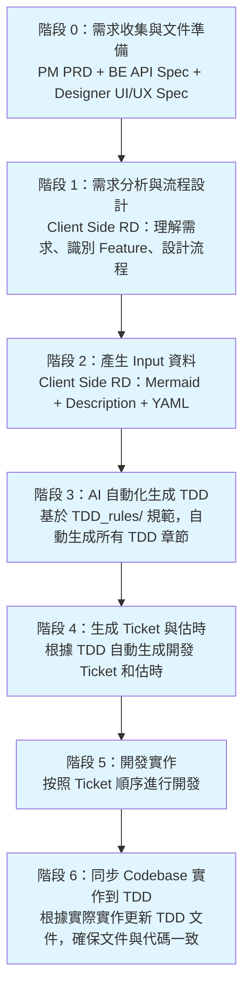
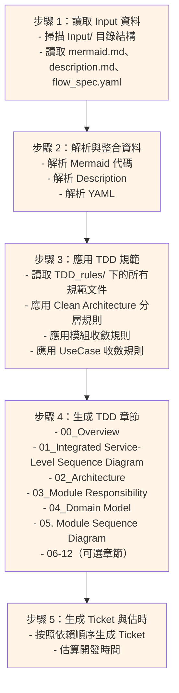

# TDD 生成工作流程

本文檔定義從產品需求到最終 TDD 文件的完整工作流程。

---

## 📋 目錄

1. [完整流程總覽](#完整流程總覽)
2. [Client Side RD 工作流程](#client-side-rd-工作流程)
3. [AI 自動化生成流程](#ai-自動化生成流程)
4. [同步 Codebase 實作到 TDD](#同步-codebase-實作到-tdd)
5. [總估時總結](#總估時總結)
6. [最佳實踐](#最佳實踐)
7. [常見問題與解決方案](#常見問題與解決方案)

---

## 完整流程總覽 {#完整流程總覽}

### 流程圖



### 流程說明

#### 階段 0：需求收集與文件準備

1. PM 提供 PRD
2. BE 提供 API Spec
3. Designer 提供 UI/UX Spec

#### 階段 1：需求分析與流程設計

1. Client Side RD 理解需求
2. 識別 Feature 邊界
3. 設計流程

#### 階段 2：產生 Input 資料

1. Client Side RD 提供自然語言敘述
2. AI 工具生成 Mermaid Sequence Diagram
3. AI 工具生成 Description
4. AI 工具生成 YAML Flow Spec

#### 階段 3：AI 自動化生成 TDD

1. 基於 TDD_rules/ 規範
2. 自動生成所有 TDD 章節

#### 階段 4：生成 Ticket 與估時

1. 根據 TDD 自動生成開發 Ticket
2. 估算開發時間

#### 階段 5：開發實作

1. 按照 Ticket 順序進行開發

#### 階段 6：同步 Codebase 實作到 TDD

1. 根據實際實作更新 TDD 文件
2. 確保文件與代碼一致

---

## Client Side RD 工作流程 {#client-side-rd-工作流程}

### 階段 1：需求分析與流程設計

#### 1.1 輸入資料

| 資料來源 | 格式 | 說明 |
|---------|------|------|
| **PM PRD** | Markdown / Word / Confluence | 產品需求文件 |
| **BE API Spec** | OpenAPI / Swagger / Markdown | 後端 API 規格 |
| **Designer UI/UX Spec** | Figma / Sketch / Markdown | UI/UX 設計規格 |

#### 1.2 工作內容

**負責人**：Client Side RD（可與 PM、BE、Designer 協作）

**步驟**：

1. **閱讀並理解所有文件**
   - 閱讀 PRD，理解業務需求和使用者故事
   - 閱讀 API Spec，理解後端提供的 API 端點和資料結構
   - 閱讀 UI/UX Spec，理解使用者互動流程和 UI 狀態

2. **識別 Feature 邊界**
   - 一個 Feature 對應一個業務功能模組
   - 範例：PrematchComment、LiveChat

3. **識別 Flow 類型**
   - **主流程（Full Flow）**：完整的業務流程，從使用者觸發到完成
   - **子流程（Sub Flow）**：主流程中的特定階段或分支流程

4. **設計 Mermaid Sequence Diagram**
   - 根據 PRD、API Spec、UI/UX Spec 設計流程
   - 識別參與者（Participants）
   - 設計互動流程
   - 標註 Flow 類型（`@feature`、`@flow`）

**產出**：
- Feature 列表
- Flow 列表（flow_id、flow_type、flow_name）
- `mermaid.md`：Mermaid Sequence Diagram 代碼

**估時**：
- Junior：5-8 天
- Mid-level：3-5 天
- Senior：1.5-3 天

---

### 階段 2：產生 Input 資料

**工作流程**：

```
Client Side RD 自然語言敘述
    ↓
[AI 工具] 生成 Mermaid Sequence Diagram
    ↓
[AI 工具] 生成 Description（自然語言敘述）
    ↓
[AI 工具] 生成 YAML Flow Spec
    ↓
產出：mermaid.md、description.md、flow_spec.yaml
```

#### 2.1 Client Side RD 提供自然語言敘述

**負責人**：Client Side RD

**工作內容**：
1. 根據 PRD、API Spec、UI/UX Spec，用自然語言描述業務流程
2. 敘述應包含：
   - 流程概述（Feature 名稱、Flow 類型、主要目的）
   - 參與者說明（User、View、Feature、UseCase、Repository、Client、API、External Package 等）
   - 流程步驟詳述（使用者操作、系統行為、條件分支）
   - 技術備註（特殊邏輯、限制條件、待確認事項）

**敘述範例**：

```
這是一個 PrematchComment Feature 的主流程（Full Flow），
流程名稱是「User 進入 Upcoming Race Page, Prematch Comment Page 與 Top/Newest 切換」。

參與者包括：
- User（用戶）
- PrematchCommentView（UI Layer）
- PrematchCommentFeature（Domain Layer）
- LoadCommentsUseCase（Domain Layer）
- PrematchCommentRepository（Data & Infrastructure Layer）
- PrematchCommentClient（Data & Infrastructure Layer）
- ChatAPI（Data & Infrastructure Layer）
- Server（後端）

流程步驟：
1. User 進入 Upcoming Race Page
2. User 點擊進入 Prematch Comment Page
3. PrematchCommentView 初始化，預設顯示 Top tab
4. PrematchCommentFeature 觸發 LoadCommentsUseCase
5. LoadCommentsUseCase 調用 PrematchCommentRepository
6. PrematchCommentRepository 調用 PrematchCommentClient
7. PrematchCommentClient 發送 GET /chat/match/comment/popular 請求
8. Server 回應評論列表
9. 評論列表顯示在 PrematchCommentView
10. User 可以切換到 Newest tab，流程類似但使用不同的 API endpoint

技術備註：
- Top tab 使用 GET /chat/match/comment/popular API
- Newest tab 使用 GET /chat/match/comment/newest API
- 兩個 tab 的資料需要分別管理狀態
```

**產出**：自然語言敘述（可直接提供給 AI 工具）

**估時**：
- Junior：0.5-1 天（每個 Flow）
- Mid-level：0.25-0.5 天（每個 Flow）
- Senior：0.25 天（每個 Flow）

#### 2.2 AI 工具生成 Mermaid Sequence Diagram

**負責人**：Client Side RD（使用 AI 工具）

**工作內容**：
1. 將自然語言敘述提供給 AI 工具（如 Cursor、Claude、ChatGPT）
2. 要求 AI 工具根據敘述生成 Mermaid Sequence Diagram
3. AI 工具應遵循以下規範：
   - 使用 `@feature: {FeatureName}` 標註 Feature
   - 使用 `@flow: Full` 或 `@flow: Sub` 標註 Flow 類型
   - 遵循 Clean Architecture 分層（User → View → Feature → UseCase → Repository → Client → API）
   - 使用 `box` 語法分組 Package 層級
   - 使用 `alt`、`opt`、`loop` 語法標註條件分支和迴圈
   - 使用 `note` 語法添加技術備註（中文）

**AI 提示詞範例**：

```
請根據以下自然語言敘述，生成 Mermaid Sequence Diagram。

敘述：
[貼上自然語言敘述]

要求：
1. 使用 Mermaid sequenceDiagram 語法
2. 標註 @feature: PrematchComment 和 @flow: Full
3. 遵循 Clean Architecture 分層
4. 使用 box 語法分組 Package
5. 使用 alt/opt/loop 語法標註條件分支
6. Note 使用中文
7. 包含所有參與者和互動流程
```

**產出**：`mermaid.md`（Mermaid Sequence Diagram 代碼）

**估時**：
- 使用 AI 工具：0.1-0.2 天（每個 Flow，主要是審查和調整）
- 手動生成：1-2 天（每個 Flow，不推薦）

#### 2.3 AI 工具生成 Description（自然語言敘述）

**負責人**：Client Side RD（使用 AI 工具）

**工作內容**：
1. 將生成的 Mermaid Sequence Diagram 提供給 AI 工具
2. 要求 AI 工具根據 Mermaid 代碼生成結構化的自然語言敘述
3. Description 應包含：
   - 流程概述
   - 參與者說明
   - 流程步驟詳述
   - 技術備註
   - 前置條件與限制

**AI 提示詞範例**：

```
請根據以下 Mermaid Sequence Diagram，生成結構化的自然語言敘述。

Mermaid 代碼：
[貼上 mermaid.md 內容]

要求：
1. 包含流程概述、參與者說明、流程步驟詳述、技術備註
2. 使用 Markdown 格式
3. 結構清晰，易於閱讀
```

**產出**：`description.md`（結構化的自然語言敘述）

**估時**：
- 使用 AI 工具：0.1 天（每個 Flow，主要是審查和調整）
- 手動生成：0.5-1 天（每個 Flow，不推薦）

#### 2.4 AI 工具生成 YAML Flow Spec

**負責人**：Client Side RD（使用 AI 工具）

**工作內容**：
1. 將 `mermaid.md`、`description.md`、API Spec 提供給 AI 工具
2. 要求 AI 工具根據這些資料生成結構化的 YAML Flow Spec
3. YAML Flow Spec 應包含：
   - Flow 資訊（flow_id、flow_type、flow_name、parent_flow_id）
   - Mermaid 代碼
   - Description
   - API Endpoints（從 API Spec 提取）
   - Scenarios（從 PRD 提取）
   - User Actions（從 UI/UX Spec 提取）
   - System Behaviors
   - Notes

**AI 提示詞範例**：

```
請根據以下資料，生成 YAML Flow Spec。

資料：
1. Mermaid 代碼：[貼上 mermaid.md 內容]
2. Description：[貼上 description.md 內容]
3. API Spec：[貼上相關的 API Spec 內容]
4. PRD：[貼上相關的 PRD 內容]
5. UI/UX Spec：[貼上相關的 UI/UX Spec 內容]

要求：
1. 遵循 YAML Flow Spec 結構
2. 提取所有 API Endpoints
3. 提取所有 Scenarios
4. 提取所有 User Actions
5. 提取所有 System Behaviors
6. 標註 Package 類型（external/internal）
```

**產出**：`flow_spec.yaml`（結構化的 YAML 規格檔）

**估時**：
- 使用 AI 工具：0.2-0.3 天（每個 Flow，主要是審查和調整）
- 手動生成：1-2 天（每個 Flow，不推薦）

#### 2.5 Input 目錄結構

```
Input/
└── {Feature組合名稱}/
    └── {Feature名稱}/
        ├── README.md              # Feature 說明文件
        └── [流程資料夾]/
            ├── mermaid.md         # Mermaid 流程圖代碼（AI 生成）
            ├── description.md     # 自然語言敘述（AI 生成）
            └── flow_spec.yaml     # YAML 規格檔（AI 生成）
```

#### 2.6 階段 2 完整流程總結

**工作流程**：

1. **Client Side RD** 提供自然語言敘述（基於 PRD、API Spec、UI/UX Spec）
2. **AI 工具** 生成 `mermaid.md`（Mermaid Sequence Diagram）
3. **AI 工具** 生成 `description.md`（結構化的自然語言敘述）
4. **AI 工具** 生成 `flow_spec.yaml`（結構化的 YAML 規格檔）
5. **Client Side RD** 審查和調整所有產出

**總估時**（使用 AI 工具）：
- Junior：0.5-1 天（每個 Flow）
- Mid-level：0.25-0.5 天（每個 Flow）
- Senior：0.25 天（每個 Flow）

**總估時**（手動生成，不推薦）：
- Junior：3-5 天（每個 Flow）
- Mid-level：2-3 天（每個 Flow）
- Senior：1-2 天（每個 Flow）

**檢查清單**：
- [ ] `mermaid.md` 包含 `@feature` 和 `@flow` 標註
- [ ] `mermaid.md` 遵循 Clean Architecture 分層
- [ ] `description.md` 包含完整的流程說明
- [ ] `flow_spec.yaml` 包含完整的 Flow 資訊
- [ ] `flow_spec.yaml` 中的 API Endpoints 正確
- [ ] `flow_spec.yaml` 中的 Package 類型標註正確
- [ ] Flow 關係正確（parent_flow_id）

---

### 階段 3：AI 自動化生成 TDD

#### 3.1 輸入資料

- `Input/` 目錄下的所有文件（mermaid.md、description.md、flow_spec.yaml）
- `TDD_rules/` 目錄下的所有規範文件

#### 3.2 AI 自動化生成流程

**負責人**：Client Side RD（使用 AI 輔助）

**工作流程**：

1. **讀取 Input 資料**
   - 掃描 Input 目錄結構
   - 讀取所有 Flow 的資料（mermaid.md、description.md、flow_spec.yaml）

2. **解析與整合**
   - 解析 Mermaid 代碼，提取 participants 和互動流程
   - 解析 Description，提取業務背景和技術備註
   - 解析 YAML，提取 API Endpoints、Scenarios、User Actions

3. **應用 TDD 規範**
   - 根據 `TDD_rules/` 下的規範文件生成 TDD
   - 遵循 Clean Architecture 分層
   - 遵循模組收斂規則
   - 遵循 UseCase 收斂規則

4. **生成 TDD 章節**
   - 按照規範生成所有必要章節
   - 生成可選章節（如需要）

**產出**：完整的 TDD 文件（位於 `output/` 目錄）

**估時**（使用 AI 輔助）：
- Junior：3-5 天（完整 TDD，包含所有章節）
- Mid-level：2-3 天（完整 TDD，包含所有章節）
- Senior：1-2 天（完整 TDD，包含所有章節）

---

### 階段 4：生成 Ticket 與估時

#### 4.1 輸入資料

- TDD 文件（特別是 `03_Module Responsibility`、`04_Domain Model`、`05. Module Sequence Diagram`）

#### 4.2 工作內容

**負責人**：Client Side RD（使用 AI 輔助）

**工作流程**：
1. 根據 Clean Architecture 分層，識別所有需要開發的模組
2. 按照依賴順序生成 Ticket：
   - Domain Model Layer（優先）
   - Data & Infrastructure Layer（次優先）
   - Domain Layer（UseCase → Feature）
   - UI Layer（最後）
3. 為每個 Ticket 估算開發時間（Story Point → 實際工時）

**產出**：所有開發 Ticket（位於 `output/12_Tickets/` 目錄）

**估時**（使用 AI 輔助）：
- Junior：1-2 天
- Mid-level：0.5-1 天
- Senior：0.5 天

---

### 階段 5：開發實作

#### 5.1 開發順序

按照 Ticket 的依賴順序進行開發：
1. Domain Model Layer
2. Data & Infrastructure Layer
3. Domain Layer
4. UI Layer

#### 5.2 開發檢查

每個 Ticket 完成後，檢查：
- [ ] 符合 TDD 文件中的設計
- [ ] 符合 Clean Architecture 分層
- [ ] Unit Test 覆蓋率達標
- [ ] Integration Test 通過
- [ ] Code Review 通過

**估時**：
- 根據 Ticket 的 Story Point 和工程師等級估算
- 參考「總估時總結」章節

---

## 同步 Codebase 實作到 TDD {#同步-codebase-實作到-tdd}

### 階段 6：同步 Codebase 實作到 TDD

#### 6.1 輸入資料

- 實際的 Codebase（已完成的代碼）
- 原始 TDD 文件

#### 6.2 工作內容

**負責人**：Client Side RD（使用 AI 輔助）

**工作流程**：
1. **分析實際實作**
   - 掃描 Codebase，識別實際實作的模組
   - 對比 TDD 文件中的設計與實際實作
   - 識別差異點（設計變更、實作調整）

2. **更新 TDD 文件**
   - 更新 `03_Module Responsibility`：反映實際的模組職責
   - 更新 `04_Domain Model`：反映實際的 Domain Model 結構
   - 更新 `05. Module Sequence Diagram`：反映實際的模組互動流程
   - 更新 `06_Feature State & Action (TCA)`：反映實際的 State 和 Action
   - 更新 `07_UseCase Input & Output Model`：反映實際的 Input/Output
   - 更新 `08_API Spec & Mapping`：反映實際的 API 使用情況
   - 更新 `09_Error Handling`：反映實際的錯誤處理機制
   - 更新 `10_Test Scenarios`：反映實際的測試覆蓋情況

3. **記錄變更原因**
   - 在 `11_Risks & Questions` 中記錄設計變更的原因
   - 說明實作與設計的差異及原因

**AI 輔助方式**：

**提示詞範例**：

```
請根據以下實際 Codebase，更新 TDD 文件，確保文件與代碼一致。

Codebase 位置：
- [提供 Codebase 路徑或代碼片段]

原始 TDD 文件：
- [提供 TDD 文件路徑]

要求：
1. 對比實際實作與 TDD 設計
2. 識別所有差異點
3. 更新 TDD 文件以反映實際實作
4. 記錄變更原因
5. 確保更新後的 TDD 文件符合 TDD_rules/ 下的規範
```

**產出**：更新後的 TDD 文件（與實際 Codebase 一致）

**估時**（使用 AI 輔助）：
- Junior：2-3 天
- Mid-level：1-2 天
- Senior：0.5-1 天

#### 6.3 同步檢查清單

- [ ] 所有實際實作的模組都已更新到 TDD
- [ ] Domain Model 與實際代碼一致
- [ ] 模組互動流程與實際代碼一致
- [ ] API 使用情況與實際代碼一致
- [ ] 錯誤處理機制與實際代碼一致
- [ ] 設計變更原因已記錄
- [ ] 更新後的 TDD 文件符合規範

---

## AI 自動化生成流程 {#ai-自動化生成流程}

### AI 生成 TDD 的完整流程



### AI 提示詞範例

**生成完整 TDD**：

```
請根據 Input/ 目錄下的資料，按照 TDD_rules/ 目錄下的所有規範，生成完整的 TDD 文件。

Input 資料位置：
- Input/LiveChat&PrematchComment/

請包含以下章節：
1. 00_Overview
2. 01_Integrated Service-Level Sequence Diagram
3. 02_Architecture
4. 03_Module Responsibility
5. 04_Domain Model
6. 05. Module Sequence Diagram
7. 06_Feature State & Action (TCA)（可選）
8. 07_UseCase Input & Output Model（可選）
9. 08_API Spec & Mapping（可選）
10. 09_Error Handling（可選）
11. 10_Test Scenarios（可選）
12. 11_Risks & Questions（可選）
13. 12_Tickets（可選）

請確保所有生成內容符合 TDD_rules/ 下的規範。
```

---

## 總估時總結 {#總估時總結}

### 完整流程估時（使用 AI 輔助）

| 階段 | Junior | Mid-level | Senior |
|------|--------|-----------|--------|
| **階段 0：需求收集** | PM/BE/Designer 提供文件 | PM/BE/Designer 提供文件 | PM/BE/Designer 提供文件 |
| **階段 1：需求分析與流程設計** | 5-8 天 | 3-5 天 | 1.5-3 天 |
| **階段 2：產生 Input 資料（AI 輔助）** | 0.5-1 天 | 0.25-0.5 天 | 0.25 天 |
| **階段 3：AI 生成 TDD** | 3-5 天 | 2-3 天 | 1-2 天 |
| **階段 4：生成 Ticket 與估時** | 1-2 天 | 0.5-1 天 | 0.5 天 |
| **階段 5：開發實作** | 根據 Ticket 估算 | 根據 Ticket 估算 | 根據 Ticket 估算 |
| **階段 6：同步 Codebase 實作到 TDD** | 2-3 天 | 1-2 天 | 0.5-1 天 |
| **總計（階段 0-4）** | **9-15 天** | **5.75-9.5 天** | **3-6.75 天** |
| **總計（階段 0-6，含開發與同步）** | **11-18 天 + 開發時間** | **6.75-11.5 天 + 開發時間** | **3.5-7.75 天 + 開發時間** |

### 完整流程估時（手動，不推薦）

| 階段 | Junior | Mid-level | Senior |
|------|--------|-----------|--------|
| **階段 0：需求收集** | PM/BE/Designer 提供文件 | PM/BE/Designer 提供文件 | PM/BE/Designer 提供文件 |
| **階段 1：需求分析與流程設計** | 5-8 天 | 3-5 天 | 1.5-3 天 |
| **階段 2：產生 Input 資料（手動，不推薦）** | 3-5 天 | 2-3 天 | 1-2 天 |
| **階段 3：手動生成 TDD** | 10-15 天 | 7-10 天 | 5-7 天 |
| **階段 4：生成 Ticket 與估時** | 3-5 天 | 2-3 天 | 1-2 天 |
| **階段 5：開發實作** | 根據 Ticket 估算 | 根據 Ticket 估算 | 根據 Ticket 估算 |
| **階段 6：同步 Codebase 實作到 TDD** | 3-5 天 | 2-3 天 | 1-2 天 |
| **總計（階段 0-4）** | **24-38 天** | **16-24 天** | **9.5-15 天** |
| **總計（階段 0-6，含開發與同步）** | **27-43 天 + 開發時間** | **18-27 天 + 開發時間** | **10.5-17 天 + 開發時間** |

---

## 最佳實踐 {#最佳實踐}

### 1. 文件準備階段

- ✅ **PM**：提供詳細的 PRD，包含所有業務規則和驗收條件
- ✅ **BE**：提供完整的 API Spec（OpenAPI 格式最佳），包含所有端點和資料結構
- ✅ **Designer**：提供完整的 UI/UX Spec，包含所有狀態和互動流程
- ✅ **Client Side RD**：與各角色協作，確保文件完整

### 2. Input 資料產生階段

- ✅ **使用 AI 工具自動生成**：大幅提高效率
- ✅ 確保 `mermaid.md` 符合 Mermaid 語法規範和 Clean Architecture 分層
- ✅ 確保 `mermaid.md` 包含 `@feature` 和 `@flow` 標註
- ✅ 確保 `description.md` 包含完整的流程說明
- ✅ 確保 `flow_spec.yaml` 包含所有必要的結構化資訊
- ✅ 審查 AI 生成的內容，確保準確性和完整性

### 3. TDD 生成階段

- ✅ 使用 AI 輔助生成，大幅縮短時間
- ✅ 確保所有生成內容符合 `TDD_rules/` 下的規範
- ✅ 生成後進行 Code Review，確保品質
- ✅ 使用檢查清單驗證 TDD 完整性

### 4. 開發實作階段

- ✅ 按照 Ticket 順序進行開發
- ✅ 確保實作符合 TDD 設計
- ✅ 完成後進行 Code Review

### 5. 同步 Codebase 到 TDD

- ✅ 開發完成後，及時同步實際實作到 TDD
- ✅ 確保 TDD 文件與代碼一致
- ✅ 記錄設計變更原因

### 6. 持續改進

- ✅ 根據實際使用經驗，持續優化規範文件
- ✅ 收集常見問題，更新本文檔
- ✅ 與團隊分享最佳實踐

---

## 常見問題與解決方案 {#常見問題與解決方案}

### Q1：PM PRD 不夠詳細怎麼辦？

**解決方案**：
1. 與 PM 協作，補充缺失的資訊
2. 在 `description.md` 中標註「需與 PM 確認」的項目
3. 在 `flow_spec.yaml` 的 `notes` 中記錄待確認事項

### Q2：BE API Spec 不完整怎麼辦？

**解決方案**：
1. 與 BE 協作，補充缺失的 API 資訊
2. 在 `flow_spec.yaml` 的 `api_endpoints` 中標註「TBD」或「待確認」
3. 在 TDD 的 `11_Risks & Questions` 章節中記錄待確認的 API

### Q3：Designer UI/UX Spec 沒有提供怎麼辦？

**解決方案**：
1. 與 Designer 協作，取得設計稿或規格
2. 根據 PRD 和現有設計系統推導 UI 規格
3. 在 `description.md` 中標註「UI 規格待確認」

### Q4：如何確保 AI 生成的 TDD 符合規範？

**解決方案**：
1. 確保 `TDD_rules/` 目錄下的所有規範文件完整
2. 在 AI 提示詞中明確要求遵循所有規範
3. 生成後進行 Code Review，檢查是否符合規範
4. 使用檢查清單驗證 TDD 完整性

### Q5：多個 Feature 如何整合？

**解決方案**：
1. 在 Input 目錄中，將相關 Feature 放在同一個 Feature 組合目錄下
2. 在 `flow_spec.yaml` 中標註 Feature 關係
3. AI 會自動識別並生成整合的 TDD 文件

### Q6：如何確保 TDD 文件與實際 Codebase 一致？

**解決方案**：
1. 開發完成後，及時執行階段 6：同步 Codebase 實作到 TDD
2. 使用 AI 輔助對比實際實作與 TDD 設計
3. 更新 TDD 文件以反映實際實作
4. 記錄設計變更原因
5. 定期檢查 TDD 文件與代碼的一致性

---

## 相關文件

- [各角色文件規範](./02_各角色文件規範.md)
- [TDD Input 資料處理規範](../TDD_rules/tdd_input_processing_rules.md)
- [TDD Ticket 生成與估時規範](../TDD_rules/tdd_ticket_generation_and_estimation.md)
- [TDD Domain, API, Test & TDD Structure](../TDD_rules/tdd_domain_api_test_and_structure.md)
- [TDD Sequence & Mermaid Rules](../TDD_rules/tdd_sequence_and_mermaid_rules.md)
- [Client Side RD 工作流程](../TDD_rules/tdd_workflow_from_prd_to_tdd.md)

---

**最後更新**：2024-11-21  
**版本**：1.0.0

