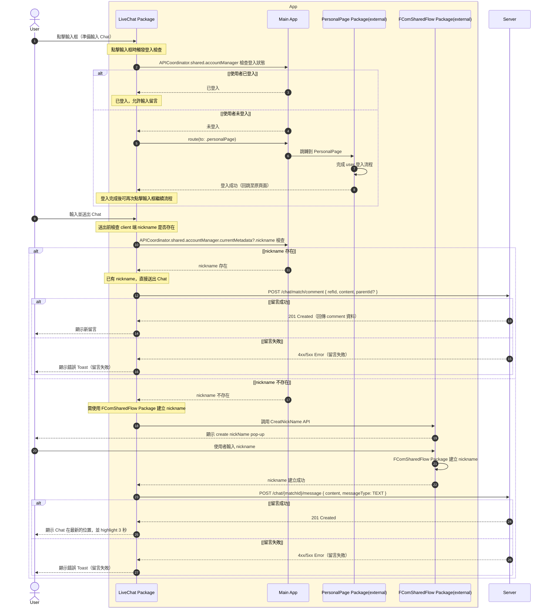
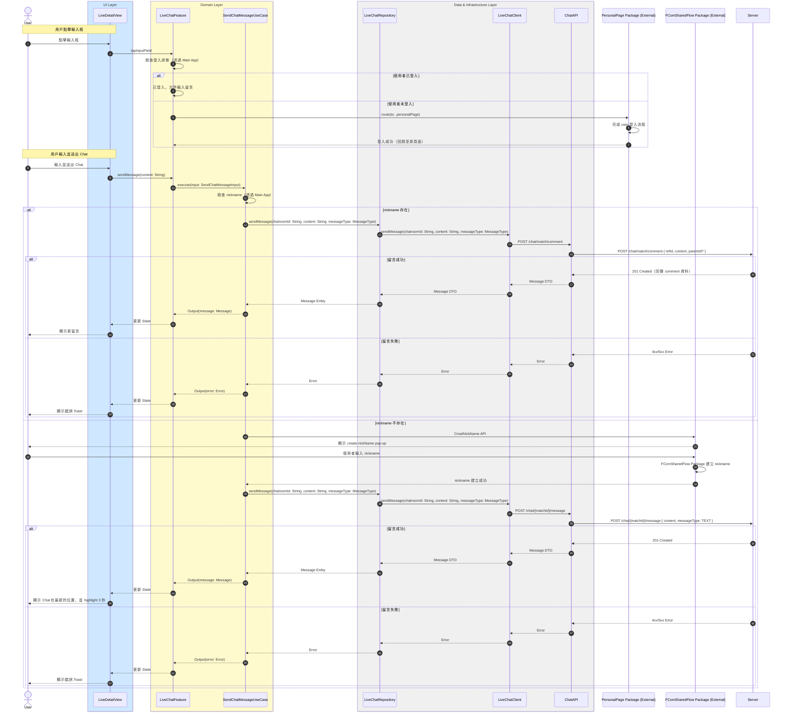

# 發送聊天訊息流程

## Flow 資訊

| 欄位 | 值 |
|------|-----|
| **feature** | LiveChat |
| **flow_id** | LC-SUB-001 |
| **flow_type** | Sub |
| **flow_name** | 用戶留 comment 時登入與 nickname 檢查 |
| **parent_flow_id** | LC-FULL-001 |
| **parent_flow_name** | 用戶進入與離開聊天室（含 WebSocket 相依） |
| **original_annotation** | @flow: Sub |

## 模組說明

| 模組名稱 | 職責 |
|---------|------|
| **LiveDetailView** | 直播詳情頁面 |
| **LiveChatFeature** | TCA Reducer，管理聊天室相關的 State 和 Action |
| **SendChatMessageUseCase** | 發送聊天訊息 |
| **LiveChatRepository** | Domain 資料來源的抽象介面（聊天室相關） |
| **LiveChatClient** | HTTP 通訊（聊天室相關） |
| **ChatAPI** | 後端 endpoint 定義（聊天室相關） |
| **PersonalPage Package (External)** | 登入流程（外部 Package） |
| **FComSharedFlow Package (External)** | Nickname 建立流程（外部 Package） |

## 流程說明

| 流程步驟 | 說明 |
|---------|------|
| **1. 點擊輸入框與登入檢查** | 1. 用戶點擊輸入框準備輸入留言 2. 檢查登入狀態 3. 未登入則跳轉到 PersonalPage 完成登入 |
| **2. 輸入並送出留言** | 1. 用戶輸入並送出 Chat 2. 檢查 nickname 是否存在 |
| **3. 有 nickname 時發送** | 1. 已有 nickname，直接送出留言 2. 顯示新留言 |
| **4. 無 nickname 時發送** | 1. 調用 FComSharedFlow Package 建立 nickname 2. 建立成功後送出留言 3. 顯示 Chat 在最新的位置並 highlight 3 秒 |

## 場景序列圖（原始業務流程）

以下為原始業務流程的序列圖，展示從業務角度的完整流程：

## 模組序列圖（架構設計）

以下為轉換後的模組序列圖，展示 Clean Architecture 各層級的互動：

