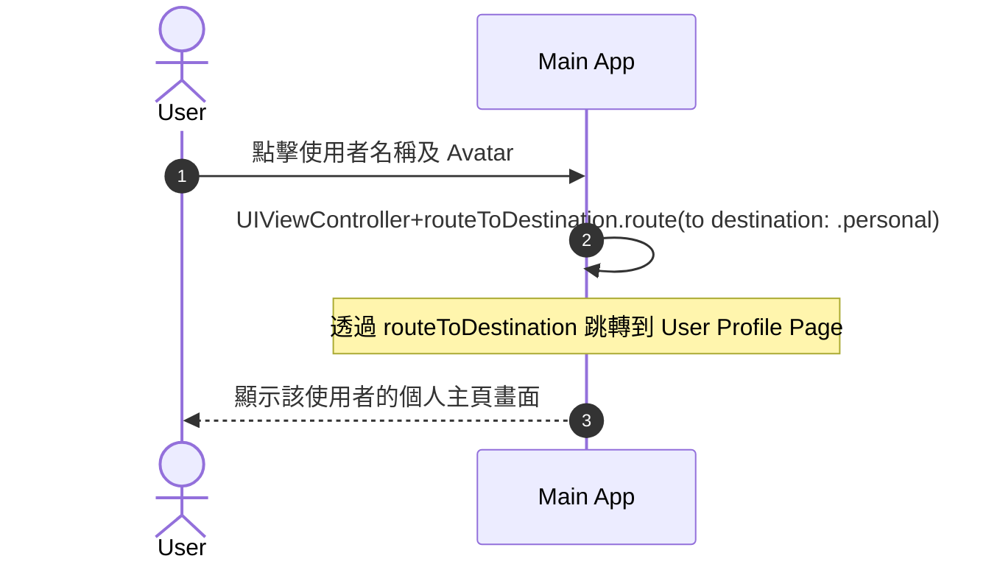
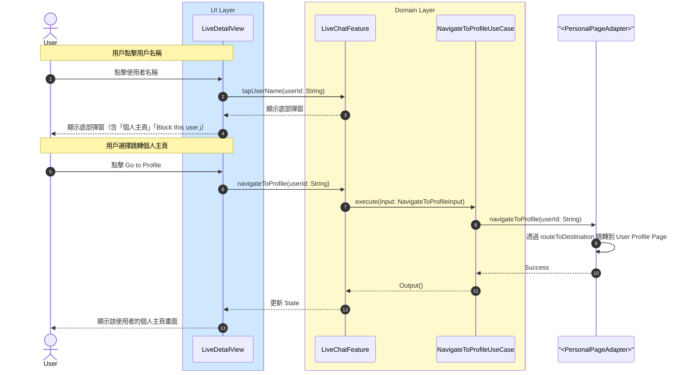

# 跳轉個人主頁流程

## Flow 資訊

| 欄位 | 值 |
|------|-----|
| **feature** | LiveChat |
| **flow_id** | LC-SUB-002 (部分流程) |
| **flow_type** | Sub |
| **flow_name** | 用戶點擊 avatar 與封鎖其他 user 邏輯（跳轉個人主頁部分） |
| **parent_flow_id** | LC-FULL-001 |
| **parent_flow_name** | 用戶進入與離開聊天室（含 WebSocket 相依） |
| **original_annotation** | @flow: Sub |

## 模組說明

| 模組名稱 | 職責 |
|---------|------|
| **LiveDetailView** | 直播詳情頁面 |
| **LiveChatFeature** | TCA Reducer，管理聊天室相關的 State 和 Action |
| **NavigateToProfileUseCase** | 處理跳轉到個人主頁的邏輯 |
| **PersonalPageAdapter Protocol** | 個人主頁路由跳轉的 Protocol（定義在 LiveChat Package 中） |

## 流程說明

| 流程步驟 | 說明 |
|---------|------|
| **1. 點擊用戶名稱** | 1. 用戶點擊聊天室中其他用戶的名稱 2. 顯示操作選單（含「個人主頁」「Block this user」） |
| **2. 跳轉個人主頁** | 1. 用戶選擇「Go to Profile」 2. Feature 呼叫 NavigateToProfileUseCase 3. UseCase 透過 PersonalPageAdapter Protocol 執行路由跳轉 |

## 場景序列圖（原始業務流程）

以下為原始業務流程的序列圖，展示從業務角度的完整流程：

## 模組序列圖（架構設計）

以下為轉換後的模組序列圖，展示 Clean Architecture 各層級的互動：

