# 初始化與刷新留言列表流程

## Flow 資訊

| 欄位 | 值 |
|------|-----|
| **feature** | PrematchComment |
| **flow_id** | PC-FULL-001 |
| **flow_type** | Full |
| **flow_name** | 用戶進入 Upcoming Race Page, Prematch Comment Page 與 Top |
| **parent_flow_id** | null |
| **parent_flow_name** | null |
| **original_annotation** | @flow: Full |

## 模組說明

| 模組名稱 | 職責 |
|---------|------|
| **RaceDetailView** | 賽事詳情頁面 |
| **PrematchCommentView** | 賽前留言頁面 |
| **PrematchCommentFeature** | TCA Reducer，管理評論相關的 State 和 Action |
| **ReloadCommentListUseCase** | 載入評論列表（支援 top/newest 模式） |
| **PrematchCommentRepository** | Domain 資料來源的抽象介面（評論相關） |
| **PrematchCommentClient** | HTTP 通訊（評論相關） |
| **PrematchCommentAPI** | 後端 endpoint 定義（評論相關） |

## 流程說明

| 流程步驟 | 說明 |
|---------|------|
| **1. 進入頁面與取得個人資訊** | 1. 用戶進入 Race Detail Page 2. 自動取得用戶個人資訊 3. 自動取得賽事留言統計資訊 |
| **2. 進入 Prematch Comment Page** | 1. 用戶進入 Prematch Comment Page 2. 預設顯示 Top 標籤 3. 載入熱門留言列表 |
| **3. 切換標籤** | 1. 用戶切換 Top / Newest 標籤 2. 根據當前標籤載入對應的留言列表 |
| **4. 手動刷新** | 1. 用戶點擊 Refresh button 2. 根據當前標籤重新載入最新的留言列表 |

## 場景序列圖（原始業務流程）

以下為原始業務流程的序列圖，展示從業務角度的完整流程：

```mermaid
sequenceDiagram
    autonumber
    actor User
    participant App
    participant Server as Server

    %% 進入頁面 & 取得個人資訊
    User->>App: 進入 Race Detail Page
    App->>Server: GET /{TBD 個人資訊 API}
    note over App,Server: 🚨 需與 Eason 確認實際 API，或確認是否可與 Han 的流程串接
    Server-->>App: userInfo
    note over App: 將 userInfo 儲存在 client side（例如暫存在記憶體 / state）

    %% 取得賽事留言與投注資訊
    App->>Server: GET /chat/match/comment/info/{refId}
    Server-->>App: { commentCount, betCount }

    %% 預設 Top tab
    User->>App: 進入 Prematch Comment Page
    App->>Server: GET /chat/match/comment/popular
    note over App: 🟢 Default tab is Top
    Server-->>App: comments (sorted by like)

    %% 切換 tab
    User->>App: 切換 tab
    alt [App 判斷目前為 Newest tab]
        App->>Server: GET /chat/match/comment/newest
        Server-->>App: comments (sorted by time)
    else [使用者維持在 Top tab]
        App->>Server: GET /chat/match/comment/popular
        Server-->>App: comments
    end

    %% 使用者手動刷新
    User->>App: 點擊「Refresh button」
    alt [目前在 Top tab]
        App->>Server: GET /chat/match/comment/popular
        Server-->>App: 最新 comments (按 Like 數)
    else [目前在 Newest tab]
        App->>Server: GET /chat/match/comment/newest
        Server-->>App: 最新 comments (按時間)
    end
```

## 模組序列圖（架構設計）

以下為轉換後的模組序列圖，展示 Clean Architecture 各層級的互動：

```mermaid
sequenceDiagram
    autonumber
    actor User
    box rgb(207,232,255) UI Layer
        participant RaceDetailView
        participant PrematchCommentView
    end
    box rgb(255,250,205) Domain Layer
        participant PrematchCommentFeature
        participant ReloadCommentListUseCase
    end
    box rgb(240,240,240) Data & Infrastructure Layer
        participant PrematchCommentRepository
        participant PrematchCommentClient
        participant PrematchCommentAPI
    end
    participant Server

    Note over User,RaceDetailView: 用戶進入 Race Detail Page
    User->>RaceDetailView: 進入 Race Detail Page
    RaceDetailView->>PrematchCommentFeature: onAppear
    PrematchCommentFeature->>ReloadCommentListUseCase: execute(triggerType: .init)
    ReloadCommentListUseCase->>PrematchCommentRepository: getUserInfo()
    PrematchCommentRepository->>PrematchCommentClient: getUserInfo()
    PrematchCommentClient->>PrematchCommentAPI: GET /{TBD 個人資訊 API}
    PrematchCommentAPI->>Server: GET /{TBD 個人資訊 API}
    Server-->>PrematchCommentAPI: userInfo
    PrematchCommentAPI-->>PrematchCommentClient: userInfo DTO
    PrematchCommentClient-->>PrematchCommentRepository: userInfo DTO
    PrematchCommentRepository-->>ReloadCommentListUseCase: UserInfo Entity
    ReloadCommentListUseCase->>PrematchCommentRepository: getCommentMeta(refId: String)
    PrematchCommentRepository->>PrematchCommentClient: getCommentMeta(refId: String)
    PrematchCommentClient->>PrematchCommentAPI: GET /chat/match/comment/info/{refId}
    PrematchCommentAPI->>Server: GET /chat/match/comment/info/{refId}
    Server-->>PrematchCommentAPI: { commentCount, betCount }
    PrematchCommentAPI-->>PrematchCommentClient: CommentMeta DTO
    PrematchCommentClient-->>PrematchCommentRepository: CommentMeta DTO
    PrematchCommentRepository-->>ReloadCommentListUseCase: CommentMeta Entity
    ReloadCommentListUseCase-->>PrematchCommentFeature: Output(comments: [], meta: CommentMeta)
    PrematchCommentFeature-->>RaceDetailView: 更新 State

    Note over User,PrematchCommentView: 用戶進入 Prematch Comment Page
    User->>PrematchCommentView: 進入 Prematch Comment Page
    PrematchCommentView->>PrematchCommentFeature: onAppear
    PrematchCommentFeature->>ReloadCommentListUseCase: execute(triggerType: .init, mode: .top)
    ReloadCommentListUseCase->>PrematchCommentRepository: getComments(refId: String, mode: .top)
    PrematchCommentRepository->>PrematchCommentClient: getComments(refId: String, mode: .top)
    PrematchCommentClient->>PrematchCommentAPI: GET /chat/match/comment/popular
    PrematchCommentAPI->>Server: GET /chat/match/comment/popular
    Server-->>PrematchCommentAPI: comments (sorted by like)
    PrematchCommentAPI-->>PrematchCommentClient: [Comment] DTO
    PrematchCommentClient-->>PrematchCommentRepository: [Comment] DTO
    PrematchCommentRepository-->>ReloadCommentListUseCase: [Comment] Entity
    ReloadCommentListUseCase-->>PrematchCommentFeature: Output(comments: [Comment])
    PrematchCommentFeature-->>PrematchCommentView: 更新 State

    Note over User,PrematchCommentView: 用戶切換標籤
    User->>PrematchCommentView: 切換 tab
    PrematchCommentView->>PrematchCommentFeature: switchTab(mode: SortMode)
    alt 切換至 Newest tab
        PrematchCommentFeature->>ReloadCommentListUseCase: execute(triggerType: .switch, mode: .newest)
        ReloadCommentListUseCase->>PrematchCommentRepository: getComments(refId: String, mode: .newest)
        PrematchCommentRepository->>PrematchCommentClient: getComments(refId: String, mode: .newest)
        PrematchCommentClient->>PrematchCommentAPI: GET /chat/match/comment/newest
        PrematchCommentAPI->>Server: GET /chat/match/comment/newest
        Server-->>PrematchCommentAPI: comments (sorted by time)
        PrematchCommentAPI-->>PrematchCommentClient: [Comment] DTO
        PrematchCommentClient-->>PrematchCommentRepository: [Comment] DTO
        PrematchCommentRepository-->>ReloadCommentListUseCase: [Comment] Entity
        ReloadCommentListUseCase-->>PrematchCommentFeature: Output(comments: [Comment])
        PrematchCommentFeature-->>PrematchCommentView: 更新 State
    else 維持在 Top tab
        PrematchCommentFeature->>ReloadCommentListUseCase: execute(triggerType: .switch, mode: .top)
        ReloadCommentListUseCase->>PrematchCommentRepository: getComments(refId: String, mode: .top)
        PrematchCommentRepository->>PrematchCommentClient: getComments(refId: String, mode: .top)
        PrematchCommentClient->>PrematchCommentAPI: GET /chat/match/comment/popular
        PrematchCommentAPI->>Server: GET /chat/match/comment/popular
        Server-->>PrematchCommentAPI: comments
        PrematchCommentAPI-->>PrematchCommentClient: [Comment] DTO
        PrematchCommentClient-->>PrematchCommentRepository: [Comment] DTO
        PrematchCommentRepository-->>ReloadCommentListUseCase: [Comment] Entity
        ReloadCommentListUseCase-->>PrematchCommentFeature: Output(comments: [Comment])
        PrematchCommentFeature-->>PrematchCommentView: 更新 State
    end

    Note over User,PrematchCommentView: 用戶手動刷新
    User->>PrematchCommentView: 點擊 Refresh button
    PrematchCommentView->>PrematchCommentFeature: refresh()
    alt 目前在 Top tab
        PrematchCommentFeature->>ReloadCommentListUseCase: execute(triggerType: .refresh, mode: .top)
        ReloadCommentListUseCase->>PrematchCommentRepository: getComments(refId: String, mode: .top)
        PrematchCommentRepository->>PrematchCommentClient: getComments(refId: String, mode: .top)
        PrematchCommentClient->>PrematchCommentAPI: GET /chat/match/comment/popular
        PrematchCommentAPI->>Server: GET /chat/match/comment/popular
        Server-->>PrematchCommentAPI: 最新 comments (按 Like 數)
        PrematchCommentAPI-->>PrematchCommentClient: [Comment] DTO
        PrematchCommentClient-->>PrematchCommentRepository: [Comment] DTO
        PrematchCommentRepository-->>ReloadCommentListUseCase: [Comment] Entity
        ReloadCommentListUseCase-->>PrematchCommentFeature: Output(comments: [Comment])
        PrematchCommentFeature-->>PrematchCommentView: 更新 State
    else 目前在 Newest tab
        PrematchCommentFeature->>ReloadCommentListUseCase: execute(triggerType: .refresh, mode: .newest)
        ReloadCommentListUseCase->>PrematchCommentRepository: getComments(refId: String, mode: .newest)
        PrematchCommentRepository->>PrematchCommentClient: getComments(refId: String, mode: .newest)
        PrematchCommentClient->>PrematchCommentAPI: GET /chat/match/comment/newest
        PrematchCommentAPI->>Server: GET /chat/match/comment/newest
        Server-->>PrematchCommentAPI: 最新 comments (按時間)
        PrematchCommentAPI-->>PrematchCommentClient: [Comment] DTO
        PrematchCommentClient-->>PrematchCommentRepository: [Comment] DTO
        PrematchCommentRepository-->>ReloadCommentListUseCase: [Comment] Entity
        ReloadCommentListUseCase-->>PrematchCommentFeature: Output(comments: [Comment])
        PrematchCommentFeature-->>PrematchCommentView: 更新 State
    end
```

