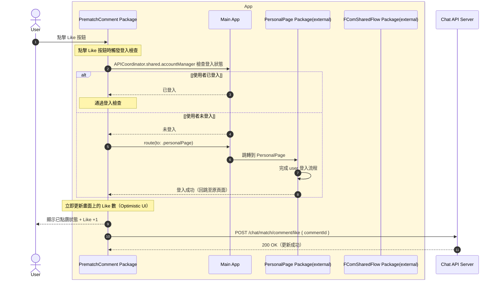
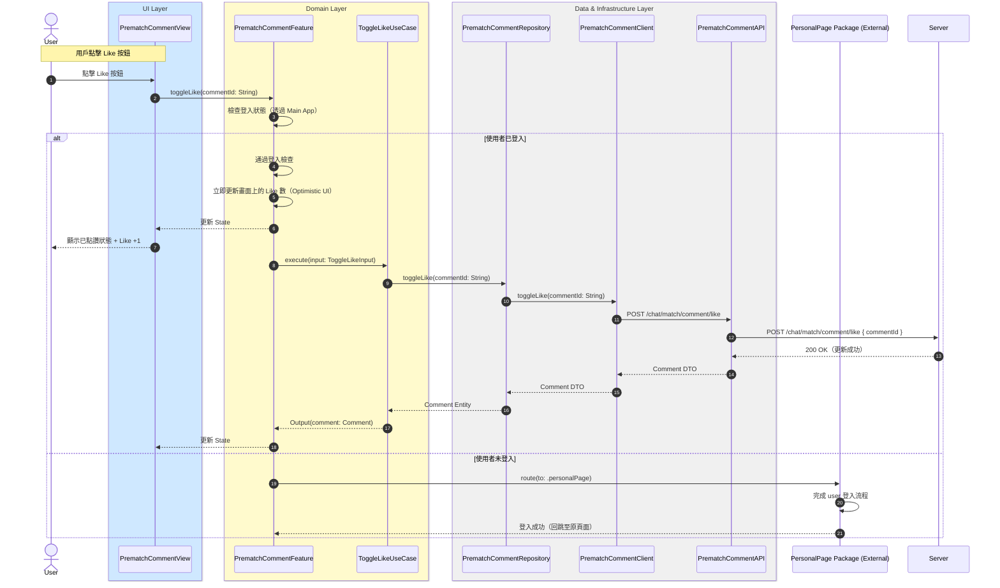

# 切換 Like 狀態流程

## Flow 資訊

| 欄位 | 值 |
|------|-----|
| **feature** | PrematchComment |
| **flow_id** | PC-SUB-004 |
| **flow_type** | Sub |
| **flow_name** | 用戶點擊 Like（含登入檢查） |
| **parent_flow_id** | PC-FULL-001 |
| **parent_flow_name** | 用戶進入 Upcoming Race Page, Prematch Comment Page 與 Top |
| **original_annotation** | @flow: Sub |

## 模組說明

| 模組名稱 | 職責 |
|---------|------|
| **PrematchCommentView** | 賽前留言頁面 |
| **PrematchCommentFeature** | TCA Reducer，管理評論相關的 State 和 Action |
| **ToggleLikeUseCase** | 切換 Like 狀態（Optimistic UI） |
| **PrematchCommentRepository** | Domain 資料來源的抽象介面（評論相關） |
| **PrematchCommentClient** | HTTP 通訊（評論相關） |
| **PrematchCommentAPI** | 後端 endpoint 定義（評論相關） |
| **PersonalPage Package (External)** | 登入流程（外部 Package） |

## 流程說明

| 流程步驟 | 說明 |
|---------|------|
| **1. 點擊 Like 按鈕** | 1. 用戶點擊留言的 Like 按鈕 2. 檢查登入狀態 3. 未登入則跳轉到 PersonalPage 完成登入 |
| **2. Optimistic UI 更新** | 1. 通過登入檢查後立即更新畫面上的 Like 數 2. 顯示已點讚狀態 + Like +1 |
| **3. 同步 Like 狀態** | 1. 向伺服器發送 Like 請求 2. 同步 Like 狀態到伺服器 |

## 場景序列圖（原始業務流程）

以下為原始業務流程的序列圖，展示從業務角度的完整流程：

## 模組序列圖（架構設計）

以下為轉換後的模組序列圖，展示 Clean Architecture 各層級的互動：

